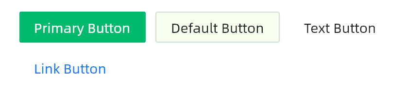
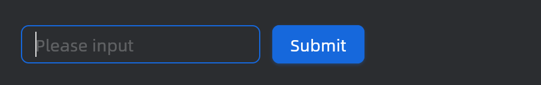
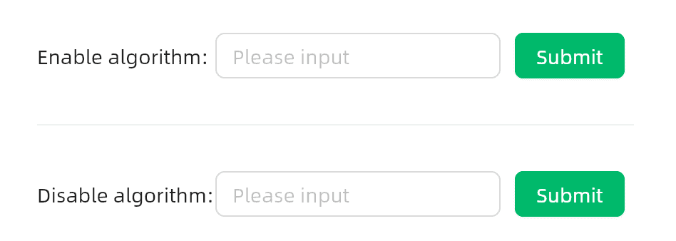
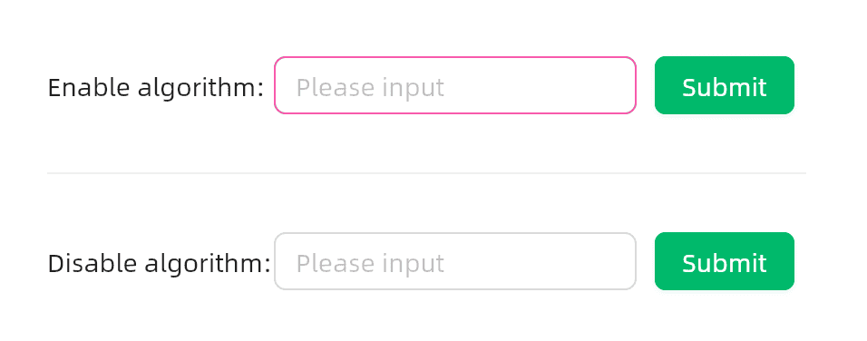
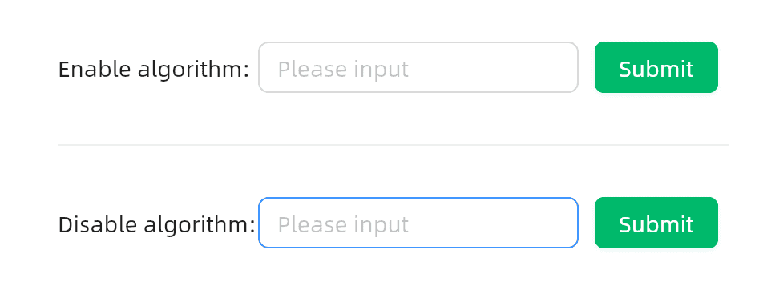
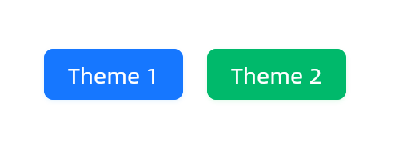
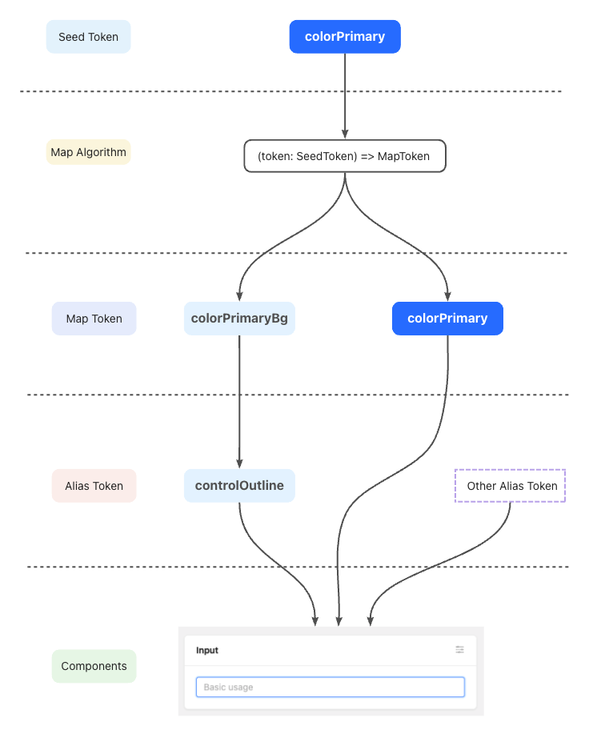

> [!NOTE]
> `AtomUI OSS` 是完全实现 `Ant Design` 的主题系统，所以底层概念是完全一样的，不一样的地方是 `AtomUI OSS` 使用 `C#` 实现，`Ant Design` 基于 `TypeScript` 实现
>
> 对 `Ant Design` 自定义主题原文感兴趣的开发者可以点击此链接学习：[Ant Design 自定义主题](https://ant.design/docs/react/customize-theme-cn)

`AtomUI` 在主题系统上的设计继承了 `Ant Design` 相关设计， 在设计规范和技术上支持灵活的样式定制，以满足业务和品牌上多样化的视觉需求，包括但不限于全局样式（主色、圆角、边框）和指定组件的视觉定制。

在 5.0 版本的 `AtomUI OSS` 中，我们提供了一套可以自由定制主题方案，动态主题的能力也得到了加强，包括但不限于：

1. 支持动态切换主题；
2. 支持同时存在多个主题；
3. 支持针对某个/某些组件修改主题变量；
4. ...

### 修改主题变量

```xaml
<UserControl xmlns="https://github.com/avaloniaui"
             xmlns:x="http://schemas.microsoft.com/winfx/2006/xaml"
             xmlns:atom="https://atomui.net">
    <atom:ThemeConfigProvider>
        <atom:ThemeConfigProvider.SharedTokenSetters>
            <!-- Seed Token，影响范围大 -->
            <atom:TokenSetter Key="ColorPrimary" Value="#00b96b" />
            <atom:TokenSetter Key="BorderRadius" Value="2" />
            <!-- 派生变量，影响范围小 -->
            <atom:TokenSetter Key="ColorBgContainer" Value="#f6ffed" />
        </atom:ThemeConfigProvider.SharedTokenSetters>
        <WrapPanel HorizontalAlignment="Left" Orientation="Horizontal">
            <atom:Button ButtonType="Primary">Primary Button</atom:Button>
            <atom:Button>Default Button</atom:Button>
            <atom:Button ButtonType="Text">Text Button</atom:Button>
            <atom:Button ButtonType="Link">Link Button</atom:Button>
        </WrapPanel>
    </atom:ThemeConfigProvider>
</UserControl>
```
上面代码运行后得到效果如下：



### 使用预设算法

通过修改算法可以快速生成风格迥异的主题，5.0 版本中默认提供三套预设算法，分别是:

- 默认算法 ThemeAlgorithm.Default
- 暗色算法 ThemeAlgorithm.Dark
- 紧凑算法 ThemeAlgorithm.Compact

你可以通过 `ThemeConfigProvider` 中的 `Algorithms` 属性来切换算法，并且支持配置多种算法，将会依次生效。

```xaml
<UserControl xmlns="https://github.com/avaloniaui"
             xmlns:x="http://schemas.microsoft.com/winfx/2006/xaml"
             xmlns:atom="https://atomui.net">
    <atom:ThemeConfigProvider>
        <atom:ThemeConfigProvider.Algorithms>
            <x:String>Dark</x:String>
        </atom:ThemeConfigProvider.Algorithms>
        <Border Background="#2b2d30" Padding="20">
            <StackPanel Orientation="Horizontal" Spacing="5">
                <atom:LineEdit Watermark="Please input" Width="200" />
                <atom:Button ButtonType="Primary">Submit</atom:Button>
            </StackPanel>
        </Border>
    </atom:ThemeConfigProvider>
</UserControl>
```
上面代码运行后得到效果如下：



### 修改控件变量

除了整体的 `Design Token`，各个控件也会开放自己的 `Control Token` 来实现针对控件的样式定制能力，不同的控件之间不会相互影响。同样地，也可以通过这种方式来覆盖控件件的其他 `Design Token`。

> [!IMPORTANT]
> #### 控件级别的主题算法
> 默认情况下，所有控件变量都仅仅是覆盖，不会基于 `Seed Token` 计算派生变量。
> 但是开发者可以指定 `Algorithm` 属性，可以开启派生计算或者传入其他算法。

```xaml
<UserControl xmlns="https://github.com/avaloniaui"
             xmlns:x="http://schemas.microsoft.com/winfx/2006/xaml"
             xmlns:atom="https://atomui.net">
    <Border Padding="20">
        <StackPanel Spacing="10">
            <atom:ThemeConfigProvider>
                <atom:ThemeConfigProvider.ControlTokenInfoSetters>
                    <atom:ControlTokenInfoSetter TokenId="Button" EnableAlgorithm="True">
                        <atom:TokenSetter Key="ColorPrimary" Value="#00b96b" />
                    </atom:ControlTokenInfoSetter>
                    <atom:ControlTokenInfoSetter TokenId="AddOnDecoratedBox" EnableAlgorithm="True">
                        <atom:TokenSetter Key="ColorPrimary" Value="#eb2f96" />
                    </atom:ControlTokenInfoSetter>
                </atom:ThemeConfigProvider.ControlTokenInfoSetters>
                <StackPanel Orientation="Horizontal" Spacing="5">
                    <atom:TextBlock VerticalAlignment="Center" Width="120">Enable algorithm:</atom:TextBlock>
                    <atom:LineEdit Watermark="Please input" Width="200" VerticalAlignment="Center" />
                    <atom:Button ButtonType="Primary" VerticalAlignment="Center">Submit</atom:Button>
                </StackPanel>
            </atom:ThemeConfigProvider>
            <atom:Separator />
            <atom:ThemeConfigProvider>
                <atom:ThemeConfigProvider.ControlTokenInfoSetters>
                    <atom:ControlTokenInfoSetter TokenId="Button">
                        <atom:TokenSetter Key="ColorPrimary" Value="#00b96b" />
                    </atom:ControlTokenInfoSetter>
                    <atom:ControlTokenInfoSetter TokenId="AddOnDecoratedBox">
                        <atom:TokenSetter Key="ColorPrimary" Value="#eb2f96" />
                    </atom:ControlTokenInfoSetter>
                </atom:ThemeConfigProvider.ControlTokenInfoSetters>
                <StackPanel Orientation="Horizontal" Spacing="5">
                    <atom:TextBlock VerticalAlignment="Center" Width="120">Disable algorithm:</atom:TextBlock>
                    <atom:LineEdit Watermark="Please input" Width="200" VerticalAlignment="Center" />
                    <atom:Button ButtonType="Primary" VerticalAlignment="Center">Submit</atom:Button>
                </StackPanel>
            </atom:ThemeConfigProvider>
        </StackPanel>
    </Border>
</UserControl>
```
当鼠标没有进行交互的时候，启用算法和没有启用算法效果一样，但是一旦交互，因为启用算法后一系列的颜色都会跟随调整，所以非常一致，但是没有启用算法只是无脑覆盖，会出现颜色不协调的情况。

正常状态：



启用算法控件鼠标交互效果：



没有启用算法控件鼠标交互效果：



### 修改控件变量

`AtomUI OSS` 默认内置了一些组件交互动效让企业级页面更加富有细节，在一些极端场景可能会影响页面交互性能，如需关闭动画可以使用 `ThemeConfigProvider` 设置相关 `Token` 关闭。

```xaml
<UserControl xmlns="https://github.com/avaloniaui"
             xmlns:x="http://schemas.microsoft.com/winfx/2006/xaml"
             xmlns:atom="https://atomui.net">
    <atom:ThemeConfigProvider>
        <atom:ThemeConfigProvider.SharedTokenSetters>
            <atom:TokenSetter Key="EnableMotion" Value="false" />
        </atom:ThemeConfigProvider.SharedTokenSetters>
    </atom:ThemeConfigProvider>
</UserControl>
```

### 进阶使用
#### 动态切换

在 v5 中，动态切换主题对用户来说是非常简单的，你可以在任何时候通过 `ThemeConfigProvider` 的属性来动态切换主题，而不需要任何额外配置。
```csharp
public class ThemeConfigProvider : Control, IThemeConfigProvider
{
    #region 公共属性定义

    public static readonly StyledProperty<Control?> ContentProperty =
        AvaloniaProperty.Register<ThemeConfigProvider, Control?>(nameof(Content));
    // 设置主题的算法
    public static readonly StyledProperty<List<string>> AlgorithmsProperty =
        AvaloniaProperty.Register<ThemeConfigProvider, List<string>>(nameof(Algorithms));
    
    // 设置全局共享设计变量
    public static readonly StyledProperty<List<TokenSetter>> SharedTokenSettersProperty =
        AvaloniaProperty.Register<ThemeConfigProvider, List<TokenSetter>>(nameof(SharedTokenSetters));

    // 设置控件设计变量
    public static readonly StyledProperty<List<ControlTokenInfoSetter>> ControlTokenInfoSettersProperty =
        AvaloniaProperty.Register<ThemeConfigProvider, List<ControlTokenInfoSetter>>(nameof(ControlTokenInfoSetters));
    // ...
}
```

### 局部主题（嵌套主题）
可以嵌套使用 `ThemeConfigProvider` 来实现局部主题的更换。在子主题中未被改变的 `Design Token` 将会继承父主题。

```xaml
<UserControl xmlns="https://github.com/avaloniaui"
             xmlns:x="http://schemas.microsoft.com/winfx/2006/xaml"
             xmlns:atom="https://atomui.net">
    <atom:ThemeConfigProvider>
        <atom:ThemeConfigProvider.SharedTokenSetters>
            <atom:TokenSetter Key="ColorPrimary" Value="#1677ff" />
        </atom:ThemeConfigProvider.SharedTokenSetters>
        <Border Padding="20">
            <StackPanel Orientation="Horizontal" Spacing="5">
                <atom:Button ButtonType="Primary" VerticalAlignment="Center">Theme 1</atom:Button>
                <atom:ThemeConfigProvider>
                    <atom:ThemeConfigProvider.SharedTokenSetters>
                        <atom:TokenSetter Key="ColorPrimary" Value="#00b96b" />
                    </atom:ThemeConfigProvider.SharedTokenSetters>
                    <atom:Button ButtonType="Primary" VerticalAlignment="Center">Theme 2</atom:Button>
                </atom:ThemeConfigProvider>
            </StackPanel>
        </Border>
    </atom:ThemeConfigProvider>
</UserControl>
```


### 使用 `Design Token`

如果你希望使用当前主题下的 `Design Token`，我们提供了 `atom:SharedTokenKey` 这个资源静态类来获取对应的 `Design Token` 的值。
比如您想给一个 `Border` 的 `Background` 绑定到 `ColorPrimary`，您可以参考下面代码。

```xaml
<UserControl xmlns="https://github.com/avaloniaui"
             xmlns:x="http://schemas.microsoft.com/winfx/2006/xaml"
             xmlns:atom="https://atomui.net">
    <Border Width="300" 
            Height="300"
            Background="{DynamicResource {x:Static atom:SharedTokenKey.ColorPrimary}}"/>
</UserControl>
```

### 基本概念

在 `Design Token` 中我们提供了一套更加贴合设计的三层结构，将 `Design Token` 拆解为 `Seed Token`、`Map Token` 和 `Alias Token ` 三部分。这三组 `Token` 并不是简单的分组，而是一个三层的派生关系，由 `Seed Token` 派生 `Map Token`，再由 `Map Token` 派生 `Alias Token`。在大部分情况下，使用 `Seed Token` 就可以满足定制主题的需要。但如果您需要更高程度的主题定制，您需要了解 `AtomUI OSS` 中 `Design Token` 的生命周期。

#### 演变过程

> [!NOTE]
> 定义来自 `Ant Design` 官方，`AtomUI OSS` 进行了完整的实现
> 




### 基础变量（`Seed Token`）

`Seed Token` 意味着所有设计意图的起源。比如我们可以通过改变 `ColorPrimary` 来改变主题色，`AtomUI OSS` 内部的算法会自动的根据 `Seed Token` 计算出对应的一系列颜色并应用：
例如您可以在 `ThemeConfigProvider` 这样设置使用：

```xaml
<UserControl xmlns="https://github.com/avaloniaui"
             xmlns:x="http://schemas.microsoft.com/winfx/2006/xaml"
             xmlns:atom="https://atomui.net">
    <atom:ThemeConfigProvider>
        <atom:ThemeConfigProvider.SharedTokenSetters>
            <atom:TokenSetter Key="ColorPrimary" Value="#1890ff" />
        </atom:ThemeConfigProvider.SharedTokenSetters>
    </atom:ThemeConfigProvider>
</UserControl>
```

### 梯度变量（`Map Token`）

`Map Token` 是基于 `Seed` 派生的梯度变量。定制 `Map Token` 推荐通过 `ThemeConfigProvider.Algorithms` 来实现，这样可以保证 `Map Token` 之间的梯度关系。也可以通过 `ThemeConfigProvider.SharedTokenSetters` 覆盖，用于单独修改一些 `map token` 的值。

```xaml
<UserControl xmlns="https://github.com/avaloniaui"
             xmlns:x="http://schemas.microsoft.com/winfx/2006/xaml"
             xmlns:atom="https://atomui.net">
    <atom:ThemeConfigProvider>
        <atom:ThemeConfigProvider.SharedTokenSetters>
            <atom:TokenSetter Key="ColorPrimaryBg" Value="#e6f7ff" />
        </atom:ThemeConfigProvider.SharedTokenSetters>
    </atom:ThemeConfigProvider>
</UserControl>
```

### 别名变量（`Alias Token`）

`Alias Token` 用于批量控制某些共性组件的样式，基本上是 `Map Token` 别名，或者特殊处理过的 `Map Token`。

```xaml
<UserControl xmlns="https://github.com/avaloniaui"
             xmlns:x="http://schemas.microsoft.com/winfx/2006/xaml"
             xmlns:atom="https://atomui.net">
    <atom:ThemeConfigProvider>
        <atom:ThemeConfigProvider.SharedTokenSetters>
            <atom:TokenSetter Key="ColorLink" Value="#1890ff" />
        </atom:ThemeConfigProvider.SharedTokenSetters>
    </atom:ThemeConfigProvider>
</UserControl>
```

### 基本算法（`algorithm`)
基本算法用于将 `Seed Token` 展开为 `Map Token`，比如由一个基本色算出一个梯度色板，或者由一个基本的圆角算出各种大小的圆角。算法可以单独使用，也可以任意地组合使用，比如可以将暗色算法和紧凑算法组合使用，得到一个暗色和紧凑相结合的主题。

```xaml
<UserControl xmlns="https://github.com/avaloniaui"
             xmlns:x="http://schemas.microsoft.com/winfx/2006/xaml"
             xmlns:atom="https://atomui.net">
    <atom:ThemeConfigProvider>
        <atom:ThemeConfigProvider.Algorithms>
            <x:String>Dark</x:String>
            <x:String>Compact</x:String>
        </atom:ThemeConfigProvider.Algorithms>
        <atom:ThemeConfigProvider.SharedTokenSetters>
            <atom:TokenSetter Key="ColorLink" Value="#1890ff" />
        </atom:ThemeConfigProvider.SharedTokenSetters>
    </atom:ThemeConfigProvider>
</UserControl>
```

### SeedToken

| Token 名称         | 描述                                                                                                          |      类型      |                                                                          默认值                                                                          |
|:-----------------|:------------------------------------------------------------------------------------------------------------|:------------:|:-----------------------------------------------------------------------------------------------------------------------------------------------------:|
| BorderRadius     | 基础组件的圆角大小，例如按钮、输入框、卡片等                                                                                      | CornerRadius |                                                                  new CornerRadius(6)                                                                  |
| ColorBgBase      | 用于派生背景色梯度的基础变量，v5 中我们添加了一层背景色的派生算法可以产出梯度明确的背景色的梯度变量。但请不要在代码中直接使用该 `Seed Token` ！                            |    Color     |                                                                         #fff                                                                          |
| ColorError       | 用于表示操作失败的 `Token` 序列，如失败按钮、错误状态提示（Result）组件等。                                                               |    Color     |                                                                        #ff4d4f                                                                        |
| ColorInfo        | 用于表示操作信息的 `Token` 序列，如 `Alert` 、`Tag`、 `Progress` 等组件都有用到该组梯度变量。                                            |    Color     |                                                                        #1677ff                                                                        |
| ColorLink        | 控制超链接的颜色。                                                                                                   |    Color     |                                                                        #1677ff                                                                        |
| ColorPrimary     | 品牌色是体现产品特性和传播理念最直观的视觉元素之一。在你完成品牌主色的选取之后，我们会自动帮你生成一套完整的色板，并赋予它们有效的设计语义                                       |    Color     |                                                                        #1677ff                                                                        |
| ColorSuccess     | 用于表示操作成功的 `Token` 序列，如 `Result`、`ProgressBar` 等组件会使用该组梯度变量。                                                 |    Color     |                                                                        #52c41a                                                                        |
| ColorTextBase    | 用于派生文本色梯度的基础变量，v5 中我们添加了一层文本色的派生算法可以产出梯度明确的文本色的梯度变量。但请不要在代码中直接使用该 `Seed Token` ！                            |    Color     |                                                                         #000                                                                          |
| ColorWarning     | 用于表示操作警告的 `Token` 序列，如 `Notification` 、`Alert` 等警告类组件或 `Input` 输入类等组件会使用该组梯度变量。                             |    Color     |                                                                        #faad14                                                                        |
| ControlHeight    | `AtomUI OSS` 中按钮和输入框等基础控件的高度                                                                                |    double    |                                                                          32                                                                           |
| FontFamily       | `AtomUI OSS` 的字体家族中优先使用系统默认的界面字体，同时提供了一套利于屏显的备用字体库，来维护在不同平台以及浏览器的显示下，字体始终保持良好的易读性和可读性，体现了友好、稳定和专业的特性。       |  FontFamily  | fonts:AlibabaSans#Alibaba Sans, Segoe UI, Segoe UI Symbol, Helvetica Neue, Noto Sans, Noto Sans CJK SC, 文泉驿正黑, Microsoft YaHei, PingFang SC, $Default |
| FontFamilyCode   | 代码字体，用于 Typography 内的 code、pre 和 kbd 类型的元素                                                                  |  FontFamily  |                                       'SFMono-Regular', Consolas, 'Liberation Mono', Menlo, Courier, monospace                                        |
| FontSize         | 设计系统中使用最广泛的字体大小，文本梯度也将基于该字号进行派生。                                                                            |    double    |                                                                          14                                                                           |
| LineType         | 用于控制组件边框、分割线等的样式，默认是实线                                                                                      |  LineStyle   |                                                                    LineStyle.Solid                                                                    |
| LineWidth        | 用于控制组件边框、分割线等的宽度                                                                                            |    double    |                                                                           1                                                                           |
| EnableMotion     | 用于配置动画效果，为 `false` 时则关闭动画                                                                                   |   boolean    |                                                                         true                                                                          |
| EnableWaveSpirit | 用于配置波浪动画，为 `false` 时则关闭动画                                                                                   |   boolean    |                                                                         true                                                                          |
| MotionBase       | 动画基础时长。                                                                                                     |    double    |                                                                           0                                                                           |
| MotionUnit       | 用于控制动画时长的变化单位                                                                                               |    double    | 0.1 |
| OpacityImage     | 控制图片不透明度                                                                                                    |    double    | 1 |
| SizePopupArrow   | 组件箭头的尺寸                                                                                                     |    double    | 16 |
| SizeStep         | 用于控制组件尺寸的基础步长，尺寸步长结合尺寸变化单位，就可以派生各种尺寸梯度。通过调整步长即可得到不同的布局模式，例如 V5 紧凑模式下的尺寸步长为 2                                |    double    | 4 |
| SizeUnit         | 用于控制组件尺寸的变化单位，在 `AtomUI OSS` 中我们的基础单位为 4 ，便于更加细致地控制尺寸梯度                                                     |    double    | 4 |
| ZIndexBase       | 所有组件的基础 `Z` 轴值，用于一些悬浮类的组件的可以基于该值 `Z` 轴控制层级，例如 `BackTop`、 `Affix` 等                                              |    double    | 0 |
| ZIndexPopupBase  | 浮层类组件的基础 `Z` 轴值，用于一些悬浮类的组件的可以基于该值 `Z` 轴控制层级，例如 `FloatButton`、 `Affix`、`Modal` 等                                     |    double    | 1000 |
| Blue             | 预设blue颜色                                                                                                    |    Color     | #1677FF |
| Purple           | 预设purple颜色                                                                                                  |    Color     | #722ED1 |
| Cyan             | 预设cyan颜色                                                                                                    |    Color     | #13C2C2 |
| Green            | 预设green颜色                                                                                                   |    Color     | #52C41A |
| Magenta          | 预设magenta颜色                                                                                                 |    Color     | #EB2F96 |
| Pink             | 预设pink颜色                                                                                                    |    Color     | #EB2F96 |
| Red              | 预设red颜色                                                                                                     |    Color     | #F5222D |
| Orange           | 预设orange颜色                                                                                                  |    Color     | #FA8C16 |
| Yellow           | 预设yellow颜色                                                                                                  |    Color     | #FADB14 |
| Volcano          | 预设volcano颜色                                                                                                 |    Color     | #FA541C |
| Geekblue         | 预设geekblue颜色                                                                                                |    Color     | #2F54EB |
| Lime             | 预设lime颜色                                                                                                    |    Color     | #A0D911 |
| Gold             | 预设gold颜色                                                                                                    |    Color     | #FAAD14 |


### MapToken
> [!NOTE]
> 继承所有 `SeedToken` 的属性
>

| Token名称 | 描述                                                                    | 类型 | 默认值 |
|-----------|-----------------------------------------------------------------------|------|---------|
| BorderRadiusLG | LG 号圆角，用于组件中的一些大圆角，如 Card、Modal 等一些组件样式。                              | CornerRadius | 8 |
| BorderRadiusOuter | 外部圆角                                                                  | CornerRadius | 4 |
| BorderRadiusSM | SM 号圆角，用于组件小尺寸下的圆角，如 Button、Input、Select 等输入类控件在 small size 下的圆角      | CornerRadius | 4 |
| BorderRadiusXS | XS 号圆角，用于组件中的一些小圆角，如 Segmented 、Arrow 等一些内部圆角的组件样式中。                  | CornerRadius | 2 |
| ColorBgBlur | 控制毛玻璃容器的背景色，通常为透明色。                                                   | Color | transparent |
| ColorBgContainer | 组件的容器背景色，例如：默认按钮、输入框等。务必不要将其与 `ColorBgElevated` 混淆。                   | Color | #ffffff |
| ColorBgElevated | 浮层容器背景色，在暗色模式下该 token 的色值会比 `ColorBgContainer` 要亮一些。例如：模态框、弹出框、菜单等。   | Color | #ffffff |
| ColorBgLayout | 该色用于页面整体布局的背景色，只有需要在页面中处于 B1 的视觉层级时才会使用该 token，其他用法都是错误的              | Color | #f5f5f5 |
| ColorBgMask | 浮层的背景蒙层颜色，用于遮罩浮层下面的内容，Modal、Drawer 等组件的蒙层使用的是该 token                  | Color | rgba(0,0,0,0.45) |
| ColorBgSolid | 实心的背景颜色，目前只用在默认实心按钮背景色上。                                              | Color | rgb(0,0,0) |
| ColorBgSolidActive | 实心的背景颜色激活态，目前只用在默认实心按钮的 active 效果。                                    | Color | rgba(0,0,0,0.95) |
| ColorBgSolidHover | 实心的背景颜色悬浮态，目前只用在默认实心按钮的 hover 效果。                                     | Color | rgba(0,0,0,0.75) |
| ColorBgSpotlight | 该色用于引起用户强烈关注注意的背景色，目前只用在 Tooltip 的背景色上。                               | Color | rgba(0,0,0,0.85) |
| ColorBorder | 默认使用的边框颜色, 用于分割不同的元素，例如：表单的分割线、卡片的分割线等。                               | Color | #d9d9d9 |
| ColorBorderSecondary | 比默认使用的边框色要浅一级，此颜色和 colorSplit 的颜色一致。使用的是实色。                           | Color | #f0f0f0 |
| ColorErrorActive | 错误色的深色激活态                                                             | Color | #d9363e |
| ColorErrorBg | 错误色的浅色背景颜色                                                            | Color | #fff2f0 |
| ColorErrorBgActive | 错误色的浅色背景色激活态                                                          | Color | #ffccc7 |
| ColorErrorBgFilledHover | 错误色的浅色填充背景色悬浮态，目前只用在危险填充按钮的 hover 效果。                                 | Color | #ffdfdc |
| ColorErrorBgHover | 错误色的浅色背景色悬浮态                                                          | Color | #fff1f0 |
| ColorErrorBorder | 错误色的描边色                                                               | Color | #ffccc7 |
| ColorErrorBorderHover | 错误色的描边色悬浮态                                                            | Color | #ffa39e |
| ColorErrorHover | 错误色的深色悬浮态                                                             | Color | #ff7875 |
| ColorErrorText | 错误色的文本默认态                                                             | Color | #ff4d4f |
| ColorErrorTextActive | 错误色的文本激活态                                                             | Color | #d9363e |
| ColorErrorTextHover | 错误色的文本悬浮态                                                             | Color | #ff7875 |
| ColorFill | 最深的填充色，用于拉开与二、三级填充色的区分度，目前只用在 Slider 的 hover 效果。                      | Color | rgba(0,0,0,0.15) |
| ColorFillQuaternary | 最弱一级的填充色，适用于不易引起注意的色块，例如斑马纹、区分边界的色块等。                                 | Color | rgba(0,0,0,0.02) |
| ColorFillSecondary | 二级填充色可以较为明显地勾勒出元素形体，如 Rate、Skeleton 等。也可以作为三级填充色的 Hover 状态，如 Table 等。 | Color | rgba(0,0,0,0.06) |
| ColorFillTertiary | 三级填充色用于勾勒出元素形体的场景，如 Slider、Segmented 等。如无强调需求的情况下，建议使用三级填色作为默认填色。     | Color | rgba(0,0,0,0.04) |
| ColorInfoActive | 信息色的深色激活态。                                                            | Color | #0958d9 |
| ColorInfoBg | 信息色的浅色背景颜色。                                                           | Color | #e6f4ff |
| ColorInfoBgHover | 信息色的浅色背景色悬浮态。                                                         | Color | #bae0ff |
| ColorInfoBorder | 信息色的描边色。                                                              | Color | #91caff |
| ColorInfoBorderHover | 信息色的描边色悬浮态。                                                           | Color | #69b1ff |
| ColorInfoHover | 信息色的深色悬浮态。                                                            | Color | #69b1ff |
| ColorInfoText | 信息色的文本默认态。                                                            | Color | #1677ff |
| ColorInfoTextActive | 信息色的文本激活态。                                                            | Color | #0958d9 |
| ColorInfoTextHover | 信息色的文本悬浮态。                                                            | Color | #4096ff |
| ColorLinkActive | 控制超链接被点击时的颜色。                                                         | Color | #0958d9 |
| ColorLinkHover | 控制超链接悬浮时的颜色。                                                          | Color | #69b1ff |
| ColorPrimaryActive | 主色梯度下的深色激活态。                                                          | Color | #0958d9 |
| ColorPrimaryBg | 主色浅色背景颜色，一般用于视觉层级较弱的选中状态。                                             | Color | #e6f4ff |
| ColorPrimaryBgHover | 与主色浅色背景颜色相对应的悬浮态颜色。                                                   | Color | #bae0ff |
| ColorPrimaryBorder | 主色梯度下的描边用色，用在 Slider 等组件的描边上。                                         | Color | #91caff |
| ColorPrimaryBorderHover | 主色梯度下的描边用色的悬浮态，Slider 、Button 等组件的描边 Hover 时会使用。                      | Color | #69b1ff |
| ColorPrimaryHover | 主色梯度下的悬浮态。                                                            | Color | #4096ff |
| ColorPrimaryText | 主色梯度下的文本颜色。                                                           | Color | #1677ff |
| ColorPrimaryTextActive | 主色梯度下的文本激活态。                                                          | Color | #0958d9 |
| ColorPrimaryTextHover | 主色梯度下的文本悬浮态。                                                          | Color | #4096ff |
| ColorSuccessActive | 成功色的深色激活态                                                             | Color | #389e0d |
| ColorSuccessBg | 成功色的浅色背景颜色，用于 Tag 和 Alert 的成功态背景色                                     | Color | #f6ffed |
| ColorSuccessBgHover | 成功色浅色背景颜色，一般用于视觉层级较弱的选中状态，不过 `AtomUI OSS` 目前没有使用到该 token              | Color | #d9f7be |
| ColorSuccessBorder | 成功色的描边色，用于 Tag 和 Alert 的成功态描边色                                        | Color | #b7eb8f |
| ColorSuccessBorderHover | 成功色的描边色悬浮态                                                            | Color | #95de64 |
| ColorSuccessHover | 成功色的深色悬浮态                                                             | Color | #95de64 |
| ColorSuccessText | 成功色的文本默认态                                                             | Color | #52c41a |
| ColorSuccessTextActive | 成功色的文本激活态                                                             | Color | #389e0d |
| ColorSuccessTextHover | 成功色的文本悬浮态                                                             | Color | #73d13d |
| ColorText | 最深的文本色。为了符合W3C标准，默认的文本颜色使用了该色，同时这个颜色也是最深的中性色。                         | Color | rgba(0,0,0,0.88) |
| ColorTextQuaternary | 第四级文本色是最浅的文本色，例如表单的输入提示文本、禁用色文本等。                                     | Color | rgba(0,0,0,0.25) |
| ColorTextSecondary | 作为第二梯度的文本色，一般用在不那么需要强化文本颜色的场景，例如 Label 文本、Menu 的文本选中态等场景。             | Color | rgba(0,0,0,0.65) |
| ColorTextTertiary | 第三级文本色一般用于描述性文本，例如表单的中的补充说明文本、列表的描述性文本等场景。                            | Color | rgba(0,0,0,0.45) |
| ColorWarningActive | 警戒色的深色激活态                                                             | Color | #d48806 |
| ColorWarningBg | 警戒色的浅色背景颜色                                                            | Color | #fffbe6 |
| ColorWarningBgHover | 警戒色的浅色背景色悬浮态                                                          | Color | #fff1b8 |
| ColorWarningBorder | 警戒色的描边色                                                               | Color | #ffe58f |
| ColorWarningBorderHover | 警戒色的描边色悬浮态                                                            | Color | #ffd666 |
| ColorWarningHover | 警戒色的深色悬浮态                                                             | Color | #ffd666 |
| ColorWarningText | 警戒色的文本默认态                                                             | Color | #faad14 |
| ColorWarningTextActive | 警戒色的文本激活态                                                             | Color | #d48806 |
| ColorWarningTextHover | 警戒色的文本悬浮态                                                             | Color | #ffc53d |
| ColorWhite | 不随主题变化的纯白色                                                            | Color | #fff |
| ControlHeightLG | 较高的组件高度                                                               | double | 40 |
| ControlHeightSM | 较小的组件高度                                                               | double | 24 |
| ControlHeightXS | 更小的组件高度                                                               | double | 16 |
| FontSizeHeading1 | H1 标签所使用的字号                                                           | double | 38 |
| FontSizeHeading2 | h2 标签所使用的字号                                                           | double | 30 |
| FontSizeHeading3 | h3 标签使用的字号                                                            | double | 24 |
| FontSizeHeading4 | h4 标签使用的字号                                                            | double | 20 |
| FontSizeHeading5 | h5 标签使用的字号                                                            | double | 16 |
| FontSizeLG | 大号字体大小                                                                | double | 16 |
| FontSizeSM | 小号字体大小                                                                | double | 12 |
| FontSizeXL | 超大号字体大小                                                               | double | 20 |
| LineHeight | 文本行高                                                                  | double | 1.5714285714285714 |
| LineHeightHeading1 | H1 标签所使用的行高                                                           | double | 1.2105263157894737 |
| LineHeightHeading2 | h2 标签所使用的行高                                                           | double | 1.2666666666666666 |
| LineHeightHeading3 | h3 标签所使用的行高                                                           | double | 1.3333333333333333 |
| LineHeightHeading4 | h4 标签所使用的行高                                                           | double | 1.4 |
| LineHeightHeading5 | h5 标签所使用的行高                                                           | double | 1.5 |
| LineHeightLG | 大型文本行高                                                                | double | 1.5 |
| LineHeightSM | 小型文本行高                                                                | double | 1.6666666666666667 |
| LineWidthBold | 描边类组件的默认线宽，如 Button、Input、Select 等输入类控件。                              | double | 2 |
| MotionDurationFast | 动效播放速度，快速。用于小型元素动画交互                                                  | TimeSpan | 0.1s |
| MotionDurationMid | 动效播放速度，中速。用于中型元素动画交互                                                  | TimeSpan | 0.2s |
| MotionDurationSlow | 动效播放速度，慢速。用于大型元素如面板动画交互                                               | TimeSpan | 0.3s |
| Size | 中等尺寸                                                                  | double | 16 |
| SizeLG | 大尺寸                                                                   | double | 24 |
| SizeMD | 中大尺寸                                                                  | double | 20 |
| SizeMS | 与size大小相同，但在紧凑模式下可能更大                                                 | double | 16 |
| SizeSM | 中小尺寸                                                                  | double | 12 |
| SizeXL | 超大尺寸                                                                  | double | 32 |
| SizeXS | 小尺寸                                                                   | double | 8 |
| SizeXXL | 最大尺寸                                                                  | double | 48 |
| SizeXXS | 最小尺寸                                                                  | double | 4 |


### AliasToken

> [!NOTE]
> 继承所有 `SeedToken` 和 `MapToken` 的属性
> 

| Token名称 | 描述 | 类型                  | 默认值                                                                                                      |
|-----------|------|---------------------|----------------------------------------------------------------------------------------------------------|
| BoxShadow | 控制元素阴影样式。 | BoxShadows          | 0 6px 16px 0 rgba(0, 0, 0, 0.08), 0 3px 6px -4px rgba(0, 0, 0, 0.12), 0 9px 28px 8px rgba(0, 0, 0, 0.05) |
| BoxShadowSecondary | 控制元素二级阴影样式。 | BoxShadows          | 0 6px 16px 0 rgba(0, 0, 0, 0.08), 0 3px 6px -4px rgba(0, 0, 0, 0.12), 0 9px 28px 8px rgba(0, 0, 0, 0.05) |
| BoxShadowTertiary | 控制元素三级盒子阴影样式。 | BoxShadows          | 0 1px 2px 0 rgba(0, 0, 0, 0.03), 0 1px 6px -1px rgba(0, 0, 0, 0.02), 0 2px 4px 0 rgba(0, 0, 0, 0.02)     |
| ColorBgContainerDisabled | 控制容器在禁用状态下的背景色。 | Color               | rgba(0,0,0,0.04)                                                                                         |
| ColorBgTextActive | 控制文本在激活状态下的背景色。 | Color               | rgba(0,0,0,0.15)                                                                                         |
| ColorBgTextHover | 控制文本在悬停状态下的背景色。 | Color               | rgba(0,0,0,0.06)                                                                                         |
| ColorBorderBg | 控制元素背景边框的颜色。 | Color               | #ffffff                                                                                                  |
| ColorErrorOutline | 控制输入组件错误状态下的外轮廓线颜色。 | Color               | rgba(255,38,5,0.06)                                                                                      |
| ColorFillAlter | 控制元素替代背景色。 | Color               | rgba(0,0,0,0.02)                                                                                         |
| ColorFillContent | 控制内容区域的背景色。 | Color               | rgba(0,0,0,0.06)                                                                                         |
| ColorFillContentHover | 控制内容区域背景色在鼠标悬停时的样式。 | Color               | rgba(0,0,0,0.15)                                                                                         |
| ColorHighlight | 控制页面元素高亮时的颜色。 | Color               | #ff4d4f                                                                                                  |
| ColorIcon | 控制弱操作图标的颜色，例如 allowClear 或 Alert 关闭按钮。 * | Color               | rgba(0,0,0,0.45)                                                                                         |
| ColorIconHover | 控制弱操作图标在悬浮状态下的颜色，例如 allowClear 或 Alert 关闭按钮。 | Color               | rgba(0,0,0,0.88)                                                                                         |
| ColorSplit | 用于作为分割线的颜色，此颜色和 colorBorderSecondary 的颜色一致，但是用的是透明色。 | Color               | rgba(5,5,5,0.06)                                                                                         |
| ColorTextDescription | 控制文本描述字体颜色。 | Color               | rgba(0,0,0,0.45)                                                                                         |
| ColorTextDisabled | 控制禁用状态下的字体颜色。 | Color               | rgba(0,0,0,0.25)                                                                                         |
| ColorTextHeading | 控制标题字体颜色。 | Color               | rgba(0,0,0,0.88)                                                                                         |
| ColorTextLabel | 控制文本标签字体颜色。 | Color               | rgba(0,0,0,0.65)                                                                                         |
| ColorTextLightSolid | 控制带背景色的文本，例如 Primary Button 组件中的文本高亮颜色。 | Color               | #fff                                                                                                     |
| ColorTextPlaceholder | 控制占位文本的颜色。 | Color               | rgba(0,0,0,0.25)                                                                                         |
| ColorWarningOutline | 控制输入组件警告状态下的外轮廓线颜色。 | Color               | rgba(255,215,5,0.1)                                                                                      |
| ControlInteractiveSize | 控制组件的交互大小。 | double              | 16                                                                                                       |
| ControlItemBgActive | 控制组件项在激活状态下的背景颜色。 | Color               | #e6f4ff                                                                                                  |
| ControlItemBgActiveDisabled | 控制组件项在禁用状态下的激活背景颜色。 | Color               | rgba(0,0,0,0.15)                                                                                         |
| ControlItemBgActiveHover | 控制组件项在鼠标悬浮且激活状态下的背景颜色。 | Color               | #bae0ff                                                                                                  |
| ControlItemBgHover | 控制组件项在鼠标悬浮时的背景颜色。 | Color               | rgba(0,0,0,0.04)                                                                                         |
| ControlOutline | 控制输入组件的外轮廓线颜色。 | Color               | rgba(5,145,255,0.1)                                                                                      |
| ControlOutlineWidth | 控制输入组件的外轮廓线宽度。 | double              | 2                                                                                                        |
| ControlPaddingHorizontal | 控制元素水平内间距。 | double              | 12                                                                                                       |
| ControlPaddingHorizontalSM | 控制元素中小尺寸水平内间距。 | double              | 8                                                                                                        |
| FontSizeIcon | 控制选择器、级联选择器等中的操作图标字体大小。正常情况下与 fontSizeSM 相同。 | double              | 12                                                                                                       |
| FontWeightStrong | 控制标题类组件（如 h1、h2、h3）或选中项的字体粗细。 | double              | 600                                                                                                      |
| LineWidthFocus | 控制线条的宽度，当组件处于聚焦态时。 | double              | 3                                                                                                        |
| LinkDecoration | 控制链接文本的装饰样式。 | TextDecorationInfo? | null                                                                                                     |
| LinkFocusDecoration | 控制链接聚焦时文本的装饰样式。 | TextDecorationInfo? | null                                                                                                     |
| LinkHoverDecoration | 控制链接鼠标悬浮时文本的装饰样式。 | TextDecorationInfo? | null                                                                                                     |
| Margin | 控制元素外边距，中等尺寸。 | Thickness           | 16                                                                                                       |
| MarginLG | 控制元素外边距，大尺寸。 | Thickness           | 24                                                                                                       |
| MarginMD | 控制元素外边距，中大尺寸。 | Thickness           | 20                                                                                                       |
| MarginSM | 控制元素外边距，中小尺寸。 | Thickness           | 12                                                                                                       |
| MarginXL | 控制元素外边距，超大尺寸。 | Thickness           | 32                                                                                                       |
| MarginXS | 控制元素外边距，小尺寸。 | Thickness           | 8                                                                                                        |
| MarginXXL | 控制元素外边距，最大尺寸。 | Thickness           | 48                                                                                                       |
| MarginXXS | 控制元素外边距，最小尺寸。 | Thickness           | 4                                                                                                        |
| UniformlyMargin | 控制元素外边距，中等尺寸。 | double              | 16                                                                                                       |
| UniformlyMarginLG | 控制元素外边距，大尺寸。 | double              | 24                                                                                                       |
| UniformlyMarginMD | 控制元素外边距，中大尺寸。 | double              | 20                                                                                                       |
| UniformlyMarginSM | 控制元素外边距，中小尺寸。 | double              | 12                                                                                                       |
| UniformlyMarginXL | 控制元素外边距，超大尺寸。 | double              | 32                                                                                                       |
| UniformlyMarginXS | 控制元素外边距，小尺寸。 | double              | 8                                                                                                        |
| UniformlyMarginXXL | 控制元素外边距，最大尺寸。 | double              | 48                                                                                                       |
| UniformlyMarginXXS | 控制元素外边距，最小尺寸。 | double              | 4                                                                                                        |
| OpacityLoading | 控制加载状态的透明度。 | double              | 0.65                                                                                                     |
| Padding | 控制元素的内间距。 | Thickness           | 16                                                                                                       |
| UniformlyPadding | 控制元素的内间距。 | double              | 16                                                                                                       |
| PaddingContentHorizontal | 控制内容元素水平内间距。 | double              | 16                                                                                                       |
| PaddingContentHorizontalLG | 控制内容元素水平内间距，适用于大屏幕设备。 | double              | 24                                                                                                       |
| PaddingContentHorizontalSM | 控制内容元素水平内间距，适用于小屏幕设备。 | double              | 16                                                                                                       |
| PaddingContentVertical | 控制内容元素垂直内间距。 | double              | 12                                                                                                       |
| PaddingContentVerticalLG | 控制内容元素垂直内间距，适用于大屏幕设备。 | double              | 16                                                                                                       |
| PaddingContentVerticalSM | 控制内容元素垂直内间距，适用于小屏幕设备。 | double              | 8                                                                                                        |
| PaddingLG | 控制元素的大内间距。 | Thickness           | 24                                                                                                       |
| PaddingMD | 控制元素的中等内间距。 | Thickness           | 20                                                                                                       |
| PaddingSM | 控制元素的小内间距。 | Thickness           | 12                                                                                                       |
| PaddingXL | 控制元素的特大内间距。 | Thickness           | 32                                                                                                       |
| PaddingXS | 控制元素的特小内间距。 | Thickness           | 8                                                                                                        |
| PaddingXXS | 控制元素的极小内间距。 | Thickness           | 4                                                                                                        |
| UniformlyPaddingLG | 控制元素的大内间距。 | double              | 24                                                                                                       |
| UniformlyPaddingMD | 控制元素的中等内间距。 | double              | 20                                                                                                       |
| UniformlyPaddingSM | 控制元素的小内间距。 | double              | 12                                                                                                       |
| UniformlyPaddingXL | 控制元素的特大内间距。 | double              | 32                                                                                                       |
| UniformlyPaddingXS | 控制元素的特小内间距。 | double              | 8                                                                                                        |
| UniformlyPaddingXXS | 控制元素的极小内间距。 | double              | 4                                                                                                        |
| ScreenLG | 控制大屏幕的屏幕宽度。 | double              | 992                                                                                                      |
| ScreenLGMax | 控制大屏幕的最大宽度。 | double              | 1199                                                                                                     |
| ScreenLGMin | 控制大屏幕的最小宽度。 | double              | 992                                                                                                      |
| ScreenMD | 控制中等屏幕的屏幕宽度。 | double              | 768                                                                                                      |
| ScreenMDMax | 控制中等屏幕的最大宽度。 | double              | 991                                                                                                      |
| ScreenMDMin | 控制中等屏幕的最小宽度。 | double              | 768                                                                                                      |
| ScreenSM | 控制小屏幕的屏幕宽度。 | double              | 576                                                                                                      |
| ScreenSMMax | 控制小屏幕的最大宽度。 | double              | 767                                                                                                      |
| ScreenSMMin | 控制小屏幕的最小宽度。 | double              | 576                                                                                                      |
| ScreenXL | 控制超大屏幕的屏幕宽度。 | double              | 1200                                                                                                     |
| ScreenXLMax | 控制超大屏幕的最大宽度。 | double              | 1599                                                                                                     |
| ScreenXLMin | 控制超大屏幕的最小宽度。 | double              | 1200                                                                                                     |
| ScreenXS | 控制超小屏幕的屏幕宽度。 | double              | 480                                                                                                      |
| ScreenXSMax | 控制超小屏幕的最大宽度。 | double              | 575                                                                                                      |
| ScreenXSMin | 控制超小屏幕的最小宽度。 | double              | 480                                                                                                      |
| ScreenXXL | 控制超超大屏幕的屏幕宽度。 | double              | 1600                                                                                                     |
| ScreenXXLMin | 控制超超大屏幕的最小宽度。 | double              | 1600                                                                                                     |