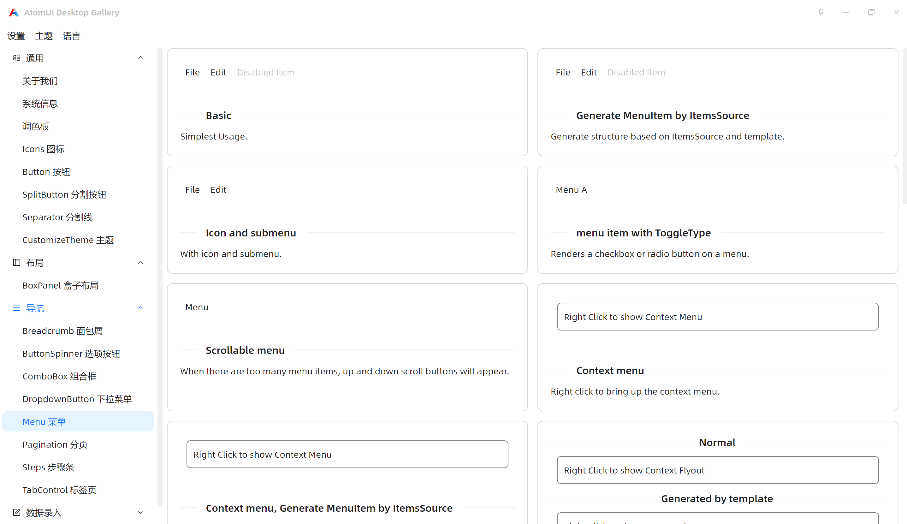
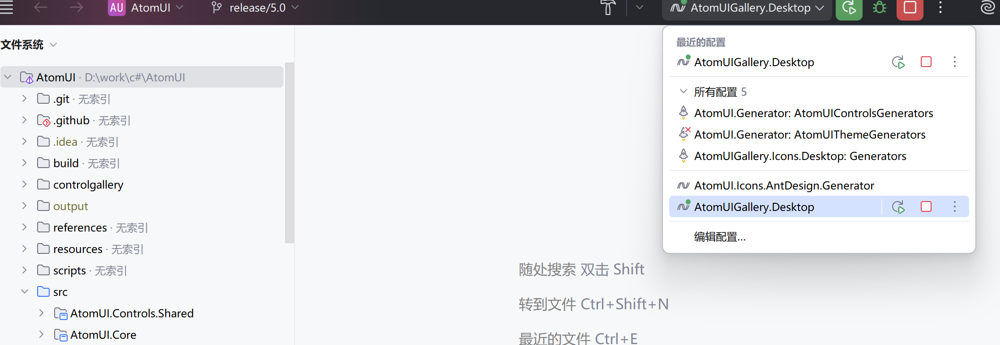

为了大家快速体验 `AtomUI OSS` 里面的控件，我们在发布 `AtomUI OSS` 新版本的时候会同时集成一个 `AtomUI Gallery` 程序。目前 `AtomUI Gallery` 支持在 Windows、macOS 和 Linux (Ubuntu) 上进行体验。


</br>
</br>

开发者有两种方式可以运行体验 `AtomUI Gallery`：
- 方式一：通过 `git clone https://github.com/chinware/AtomUI.git` 或 `git clone https://gitee.com/chinware/atomui.git` 命令获取源码后，直接编译运行
- 方式二：通过 `https://github.com/chinware/AtomUI/releases` 或 `https://gitee.com/chinware/atomui/releases` 下载对应的安装包

下面将分别仔细展开讲讲两种方式如何使用。

#### 方式一：

通过如下两个git仓库之一clone源码：

```shell
git clone https://github.com/chinware/AtomUI.git
git clone https://gitee.com/chinware/atomui.git
```

clone到本地后，通过Rider IDE打开项目，右上角位置的配置列表中选择 `AtomUIGallery.Desktop` 选项，然后运行即可，如下图所示：



成功后即可体验 `AtomUI Gallery`。

#### 方式二：

`AtomUI` 每次版本发布都会在 Github 和 Gitee 上创建版本发布，大家自行去下载即可

> [Gitee releases 下载链接](https://gitee.com/chinware/atomui/releases)
> 
> [Github release 下载链接](https://github.com/chinware/AtomUI/releases)

Windows 和 Mac 系统鉴于其桌面UI与系统 Kernel 的深度整合，所以安装方式比较快速简单，下载后直接双击运行即可。

TIPS：这种release的二进制包一般可以通过如下几个关键字定位：x64/x32/amd64/arm64/win/mac/linux。一般来说，业界在release二进制包的时候，通常都是采用这几个关键字进行组合，比如 `AtomUI.Gallery-Win-x64-5.1.exe` 表示 `AtomUI Gallery` 的 Windows 64位版本。

`Linux` 系统的桌面环境稍微特殊一些，主要如下两点原因：
- `Linux` 发行版较多，桌面环境也分为较多分支，如 `Gnome`、`KDE` 等等，且协议也分为 `Wayland` 和 `X11`
- 桌面环境对于 `Linux` 而言，本质上也是一个应用软件

所以我们目前优先选择使用率较高的 `Ubuntu` 进行体验。（使用率较高这一判断是基于 `StatCounter` 2024年关于桌面 `Linux` 使用率数据：其指出 `Ubuntu` 全球使用占比约为4.03%）

##### Ubuntu 系统体验

`AtomUI Gallery` 在 Ubuntu 发行版上的体验包采用了 AppImage， 这个包格式作为体验程序非常合适。

- **AppImage 介绍：** AppImage 是一种跨平台的软件打包格式，旨在简化 Linux 上的应用程序分发和运行。其主要优点包括：
- **无需安装，开箱即用：** AppImage 将应用及其依赖打包为单个可执行文件，用户无需安装或管理员权限，双击即可运行，避免污染系统目录。
- **跨发行版兼容：** 基于通用运行时（如 Glibc），一个 AppImage 可在大多数 Linux 发行版（Ubuntu、Fedora、Arch 等）上运行，解决依赖冲突问题。
- **便携性与隔离性：** 应用数据通常存储在用户目录中，删除 AppImage 文件即可“卸载”，不留残留。同时，通过容器化技术实现部分隔离，增强安全性。
- **简化开发和分发：** 开发者只需打包一次，无需为不同发行版构建多个版本，降低维护成本。用户也无需添加 PPA 或编译源码。

在 Ubuntu 24.04 下体验需要您再安装一个依赖包

```bash
sudo apt update
sudo apt install fuse libfuse2
```

安装完成之后就可以直接在终端输入命令运行 `AtomUI Gallery` 程序了，我们这里以 `AtomUIGallery-linux-x64-5.0.0.1015.AppImage` 为例，不同的版本请根据情况进行调整

```bash
./AtomUIGallery-linux-x64-5.0.0.1015.AppImage
```

