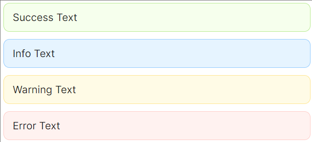
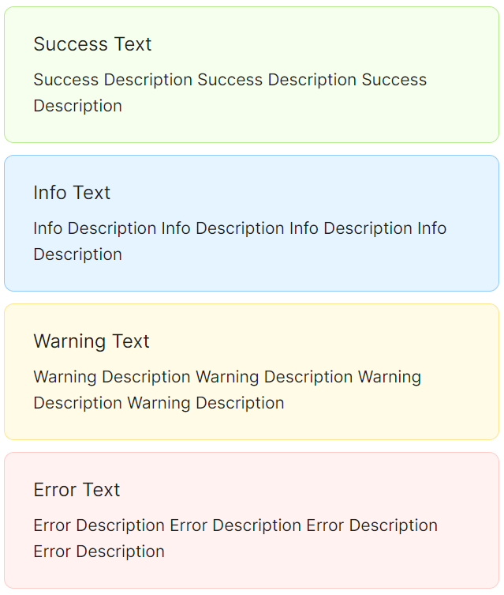

# 基础用法

### 四种样式

`Alert` 组件提供了四种基础样式可供用户选择，分别对应 `success` 、 `info` 、 `warning` 、 `error` 。



```xaml
<StackPanel>
    <atom:Alert Type="Success">Success Text</atom:Alert>
    <atom:Alert Type="Info">Info Text</atom:Alert>
    <atom:Alert Type="Warning">Warning Text</atom:Alert>
    <atom:Alert Type="Error">Error Text</atom:Alert>
</StackPanel>
```

### 关闭按钮

如果允许用户关闭 `Alert` ，可以开启 `Alert` 的 `IsClosable` 选项。


```xaml
<StackPanel>
    <atom:Alert Type="Warning" IsClosable="True">
        Warning Text Warning Text Warning Text Warning Text Warning Text Warning TextWarning Text
    </atom:Alert>
    <atom:Alert Type="Error" IsClosable="True"
                Description="Error Description Error Description Error Description Error Description Error Description Error Description">
        Error Text
    </atom:Alert>
    <atom:Alert Type="Error" IsClosable="True"
                Description="Error Description Error Description Error Description Error Description Error Description Error Description"
                CloseIcon="{atom:IconProvider CloseSquareFilled}">
        Error Text
    </atom:Alert>
</StackPanel>
```

### 描述信息

需要对 `Alert` 进行详细描述时，可以开启 `Description` 特性。



```xaml
<StackPanel Orientation="Vertical" Spacing="10">
    <atom:Alert Type="Success"
                Message="Success Text"
                Description="Success Description Success Description Success Description" />
    <atom:Alert Type="Info"
                Message="Info Text"
                Description="Info Description Info Description Info Description Info Description" />
    <atom:Alert Type="Warning"
                Message="Warning Text"
                Description="Warning Description Warning Description Warning Description Warning Description" />
    <atom:Alert Type="Error"
                Message="Error Text"
                Description="Error Description Error Description Error Description Error Description" />
</StackPanel>
```