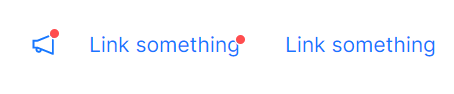

# 红点

最让强迫症讨厌且没有具体的数字的红点徽标。



```xaml
<StackPanel Orientation="Horizontal">
    <atom:DotBadge Offset="-7,8">
        <atom:Button ButtonType="Link" Icon="{atom:IconProvider Kind=NotificationOutlined}" />
    </atom:DotBadge>
    <atom:DotBadge Offset="-14,12">
        <atom:Button ButtonType="Link" Content="Link something" />
    </atom:DotBadge>
    <atom:Button ButtonType="Link" Content="Link something" />
</StackPanel>
```