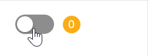

# Standalone 模式

`Badge` 组件不包裹任何child子元素，直接使用即为独立使用模式（有别于其他案例中包裹一个child级的 `Border` 元素）。这种情况下，将会直接显示数字角标本身。



```xaml
// 下面代码中Binding的属性，请自行修改为实际项目中的属性名称
<StackPanel Orientation="Horizontal" Spacing="10">
    <atom:ToggleSwitch IsChecked="{Binding StandaloneSwitchChecked}" />
    <atom:CountBadge BadgeColor="#faad14"
                     Count="{Binding StandaloneBadgeCount1}"
                     ShowZero="True" />
    <atom:CountBadge Count="{Binding StandaloneBadgeCount2}" />
    <atom:CountBadge BadgeColor="#52c41a" Count="{Binding StandaloneBadgeCount3}" />
</StackPanel>
```