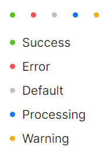

# 状态

### 圆点状态

用于表示状态的小圆点，使用 `Status` 属性用来表达互联网业务中常见的状态，也是一种Standalone用法（即不包括子元素）。



```xaml
<StackPanel>
    <StackPanel Orientation="Horizontal" Spacing="10">
        <atom:DotBadge Status="Success" />
        <atom:DotBadge Status="Error" />
        <atom:DotBadge Status="Default" />
        <atom:DotBadge Status="Processing" />
        <atom:DotBadge Status="Warning" />
    </StackPanel>
    <StackPanel Orientation="Vertical" Spacing="10">
        <atom:DotBadge Status="Success" Text="Success" />
        <atom:DotBadge Status="Error" Text="Error" />
        <atom:DotBadge Status="Default" Text="Default" />
        <atom:DotBadge Status="Processing" Text="Processing" />
        <atom:DotBadge Status="Warning" Text="Warning" />
    </StackPanel>
</StackPanel>
```

### 预设圆点

我们内置了大量预设的、不同颜色的徽标样式用作不同场景使用。如果预设值不能满足你的需求，可以设置为具体的色值。


```xaml
<StackPanel>
    <atom:Separator Title="Presets"
                    FontWeight="SemiBold"
                    TitlePosition="Left" />
    <StackPanel Orientation="Vertical" Spacing="10">
        <atom:DotBadge DotColor="Pink" Text="Pink" />
        <atom:DotBadge DotColor="Red" Text="Red" />
        <atom:DotBadge DotColor="Yellow" Text="Yellow" />
        <atom:DotBadge DotColor="Orange" Text="Orange" />
        <atom:DotBadge DotColor="Cyan" Text="Cyan" />
        <atom:DotBadge DotColor="Green" Text="Green" />
        <atom:DotBadge DotColor="Blue" Text="Blue" />
        <atom:DotBadge DotColor="Purple" Text="Purple" />
        <atom:DotBadge DotColor="GeekBlue" Text="GeekBlue" />
        <atom:DotBadge DotColor="Magenta" Text="Magenta" />
        <atom:DotBadge DotColor="Volcano" Text="Volcano" />
        <atom:DotBadge DotColor="Gold" Text="Gold" />
        <atom:DotBadge DotColor="Lime" Text="Lime" />
    </StackPanel>
    <atom:Separator Title="Custom"
                    FontWeight="SemiBold"
                    TitlePosition="Left" />
    <StackPanel Orientation="Vertical" Spacing="10">
        <atom:DotBadge DotColor="#f50" Text="#f50" />
        <atom:DotBadge DotColor="rgb(45, 183, 245)" Text="rgb(45, 183, 245)" />
        <atom:DotBadge DotColor="hsl(102, 53%, 61%)" Text="hsl(102, 53%, 61%)" />
        <atom:DotBadge DotColor="rgb(15, 141, 230)" Text="rgb(15, 141, 230)" />
    </StackPanel>
</StackPanel>
```