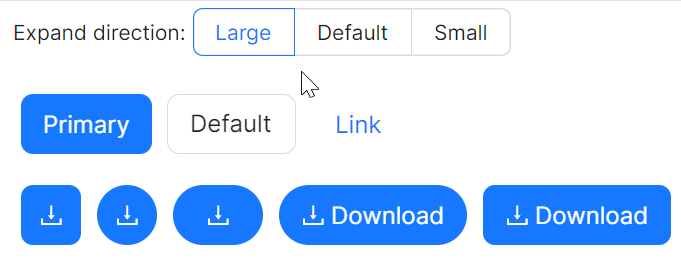

# 快速入门

### 基础配置条件

* Nuget安装Avalonia
* Nuget安装AtomUI

### 基础用法

`ButtonType` 属性控制按钮的样式，可选值有Default、Dashed、Primary、Link、Text。


```xaml
<atom:Button ButtonType="Primary">Primary Button</atom:Button>
<atom:Button>Default Button</atom:Button>
<atom:Button ButtonType="Text">Text Button</atom:Button>
<atom:Button ButtonType="Link">Link Button</atom:Button>
```

### 按钮形状

`Shape` 属性决定了按钮的形状，可选值有Default、Circle、Round。


```xaml
<WrapPanel HorizontalAlignment="Left" Orientation="Horizontal" Margin="0, 0, 0, 20">
    <atom:Button ButtonType="Primary">Primary</atom:Button>
    <atom:Button>Default</atom:Button>
    <atom:Button ButtonType="Text">Text</atom:Button>
    <atom:Button ButtonType="Link">Link</atom:Button>
</WrapPanel>
<WrapPanel HorizontalAlignment="Left" Orientation="Horizontal" Margin="0, 0, 0, 20">
    <atom:Button ButtonType="Primary" Shape="Round">Primary</atom:Button>
    <atom:Button Shape="Round">Default</atom:Button>
    <atom:Button ButtonType="Text" Shape="Round">Text</atom:Button>
    <atom:Button ButtonType="Link" Shape="Round">Link</atom:Button>
</WrapPanel>
<StackPanel HorizontalAlignment="Left" Spacing="10" Orientation="Horizontal" Margin="0, 0, 0, 20">
    <atom:Button ButtonType="Primary" Shape="Circle">AA</atom:Button>
    <atom:Button Shape="Circle">AA</atom:Button>
    <atom:Button ButtonType="Text" Shape="Circle">AA</atom:Button>
    <atom:Button ButtonType="Link" Shape="Circle">AA</atom:Button>
</StackPanel>
```

### 大小尺寸

通过 `SizeType` 属性可以控制按钮的大小，本示例需要集合Code Behind与ViewModel共同实现。



axaml文件：
```xaml
<StackPanel Orientation="Horizontal" Spacing="5" DockPanel.Dock="Top">
    <atom:TextBlock VerticalAlignment="Center">Expand direction:</atom:TextBlock>
    <atom:OptionButtonGroup ButtonStyle="Outline"
                            OptionCheckedChanged="HandleButtonSizeTypeOptionCheckedChanged">
        <atom:OptionButton IsChecked="True">Large</atom:OptionButton>
        <atom:OptionButton>Default</atom:OptionButton>
        <atom:OptionButton>Small</atom:OptionButton>
    </atom:OptionButtonGroup>
</StackPanel>

<StackPanel Orientation="Vertical" Margin="0, 20, 0, 0" Spacing="10">
    <WrapPanel>
        <atom:Button ButtonType="Primary" SizeType="{Binding ButtonSizeType}">Primary</atom:Button>
        <atom:Button ButtonType="Dashed" SizeType="{Binding ButtonSizeType}">Dashed</atom:Button>
        <atom:Button ButtonType="Default" SizeType="{Binding ButtonSizeType}">Default</atom:Button>
        <atom:Button ButtonType="Link" SizeType="{Binding ButtonSizeType}">Link</atom:Button>
    </WrapPanel>
    <WrapPanel>
        <atom:Button ButtonType="Primary" Shape="Default"
                     Icon="{atom:IconProvider Kind=DownloadOutlined}"
                     SizeType="{Binding ButtonSizeType}" />
        <atom:Button ButtonType="Dashed" Shape="Default"
                     Icon="{atom:IconProvider Kind=DownloadOutlined}"
                     SizeType="{Binding ButtonSizeType}" />
        <atom:Button ButtonType="Primary" Shape="Circle"
                     Icon="{atom:IconProvider Kind=DownloadOutlined}"
                     SizeType="{Binding ButtonSizeType}" />
        <atom:Button ButtonType="Primary" Shape="Round"
                     Icon="{atom:IconProvider Kind=DownloadOutlined}"
                     SizeType="{Binding ButtonSizeType}" />
        <atom:Button ButtonType="Primary" Shape="Round"
                     Icon="{atom:IconProvider Kind=DownloadOutlined}"
                     SizeType="{Binding ButtonSizeType}">
            Download
        </atom:Button>
        <atom:Button ButtonType="Primary" Shape="Default"
                     Icon="{atom:IconProvider Kind=DownloadOutlined}"
                     SizeType="{Binding ButtonSizeType}">
            Download
        </atom:Button>
    </WrapPanel>
</StackPanel>
```

code-behind文件：
```csharp
using AtomUI;
using AtomUI.Controls;
using AtomUIGallery.ShowCases.ViewModels;
using Avalonia.Interactivity;
using Avalonia.Threading;
using ReactiveUI;
using ReactiveUI.Avalonia;

public partial class ButtonShowCase : ReactiveUserControl<ButtonViewModel>
{
    private ButtonViewModel? _viewModel;
    public ButtonShowCase()
    {
        this.WhenActivated(disposables =>
        {
            _viewModel = DataContext as ButtonViewModel;
        });
        InitializeComponent();
    }
    
    public void HandleButtonSizeTypeOptionCheckedChanged(object? sender, OptionCheckedChangedEventArgs args)
    {
        if (_viewModel != null)
        {
            if (args.Index == 0)
            {
                _viewModel.ButtonSizeType = SizeType.Large;
            }
            else if (args.Index == 1)
            {
                _viewModel.ButtonSizeType = SizeType.Middle;
            }
            else
            {
                _viewModel.ButtonSizeType = SizeType.Small;
            }
        }
        
    }

    public void HandleLoadingBtnClick(object? sender, RoutedEventArgs args)
    {
        if (sender is Button button)
        {
            button.IsLoading = true;
            Dispatcher.UIThread.InvokeAsync(async () =>
            {
                await Task.Delay(TimeSpan.FromSeconds(3));
                button.IsLoading = false;
            });
        }
    }
}
```

view-model文件：
```csharp
using AtomUI;
using AtomUI.Controls;
using Avalonia.Interactivity;
using Avalonia.Threading;
using ReactiveUI;

public class ButtonViewModel : ReactiveObject, IRoutableViewModel, IActivatableViewModel
{
    public static TreeNodeKey ID = "Button";

    public IScreen HostScreen { get; }
    public ViewModelActivator Activator { get; }

    public string UrlPathSegment { get; } = ID.ToString();

    private SizeType _buttonSizeType;

    public SizeType ButtonSizeType
    {
        get => _buttonSizeType;
        set => this.RaiseAndSetIfChanged(ref _buttonSizeType, value);
    }

    public ButtonViewModel(IScreen screen)
    {
        Activator  = new ViewModelActivator();
        HostScreen = screen;
    }
}
```