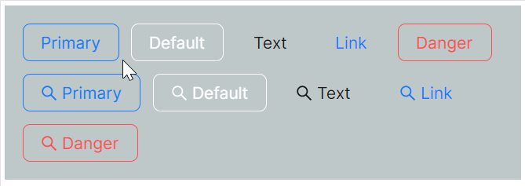

# 幽灵按钮

对于绝大多数时候而言，幽灵按钮是为了解决在深色或彩色背景中，普通按钮可能不够突出或视觉效果不佳的难题。Ghost按钮具有透明背景，能够更好地融入各种背景颜色，同时保持良好的可读性和可见性。



```xaml
<StackPanel Orientation="Vertical">
<WrapPanel HorizontalAlignment="Stretch" Orientation="Horizontal">
    <atom:Button ButtonType="Primary" IsGhost="True">
        Primary
    </atom:Button>
    <atom:Button ButtonType="Default" IsGhost="True">
        Default
    </atom:Button>
    <atom:Button ButtonType="Text" IsGhost="True">
        Text
    </atom:Button>
    <atom:Button ButtonType="Link" IsGhost="True">
        Link
    </atom:Button>
    <atom:Button ButtonType="Primary" IsDanger="True" IsGhost="True">
        Danger
    </atom:Button>
</WrapPanel>
<WrapPanel HorizontalAlignment="Stretch" Orientation="Horizontal">
    <atom:Button ButtonType="Primary" IsGhost="True" Icon="{atom:IconProvider Kind=SearchOutlined}">
        Primary
    </atom:Button>
    <atom:Button ButtonType="Default" IsGhost="True" Icon="{atom:IconProvider Kind=SearchOutlined}">
        Default
    </atom:Button>
    <atom:Button ButtonType="Text" IsGhost="True" Icon="{atom:IconProvider Kind=SearchOutlined}">
        Text
    </atom:Button>
    <atom:Button ButtonType="Link" IsGhost="True" Icon="{atom:IconProvider Kind=SearchOutlined}">
        Link
    </atom:Button>
    <atom:Button ButtonType="Primary" IsDanger="True" IsGhost="True"
                 Icon="{atom:IconProvider Kind=SearchOutlined}">
        Danger
    </atom:Button>
</WrapPanel>
</StackPanel>
```