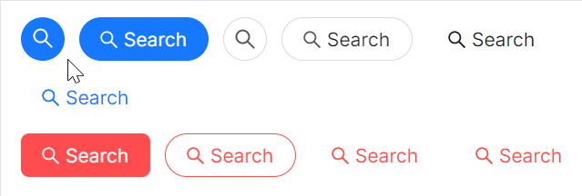

# 携带图标

通过 `Icon` 属性设置图标，图标来源于 `AtomUI` 内置的图标库。



```xaml
<WrapPanel HorizontalAlignment="Left" Orientation="Horizontal">
    <atom:Button ButtonType="Primary" Shape="Circle" Icon="{atom:IconProvider Kind=SearchOutlined}" />
    <atom:Button ButtonType="Primary" Shape="Round"
                 Icon="{atom:IconProvider Kind=SearchOutlined}">
        Search
    </atom:Button>

    <atom:Button ButtonType="Default" Shape="Circle" Icon="{atom:IconProvider Kind=SearchOutlined}" />
    <atom:Button ButtonType="Default" Shape="Round" Icon="{atom:IconProvider Kind=SearchOutlined}">
        Search
    </atom:Button>

    <atom:Button ButtonType="Text" Shape="Default" Icon="{atom:IconProvider Kind=SearchOutlined}">
        Search
    </atom:Button>

    <atom:Button ButtonType="Link" Shape="Default" Icon="{atom:IconProvider Kind=SearchOutlined}">
        Search
    </atom:Button>
    
    <atom:Button ButtonType="Link" Shape="Default" Icon="{atom:IconProvider Kind=SearchOutlined}">
        Search
    </atom:Button>

</WrapPanel>
<WrapPanel HorizontalAlignment="Left" Orientation="Horizontal">
    <atom:Button ButtonType="Primary" IsDanger="True" Icon="{atom:IconProvider Kind=SearchOutlined}">
        Search
    </atom:Button>

    <atom:Button ButtonType="Default" Shape="Round" IsDanger="True"
                 Icon="{atom:IconProvider Kind=SearchOutlined}">
        Search
    </atom:Button>

    <atom:Button ButtonType="Text" Shape="Default" IsDanger="True"
                 Icon="{atom:IconProvider Kind=SearchOutlined}">
        Search
    </atom:Button>

    <atom:Button ButtonType="Link" Shape="Default" IsDanger="True"
                 Icon="{atom:IconProvider Kind=SearchOutlined}">
        Search
    </atom:Button>
</WrapPanel>
```