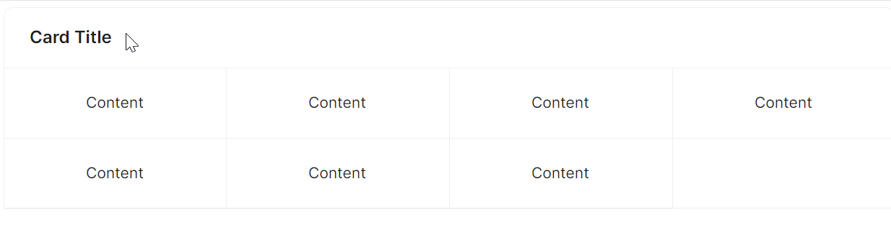

# Grid卡片

通过 `CardGridContent` 与 `CardGridItem` 子组件配合，实现一个网格布局的卡片效果。



```xaml
<atom:Card HorizontalAlignment="Stretch" Header="Card Title" SizeType="Large">
    <atom:CardGridContent ColumnDefinitions="*, *, *, *"
                          RowDefinitions="Auto, Auto">
        <atom:CardGridItem Row="0" Column="0">Content</atom:CardGridItem>
        <atom:CardGridItem Row="0" Column="1" IsHoverable="False">Content</atom:CardGridItem>
        <atom:CardGridItem Row="0" Column="2">Content</atom:CardGridItem>
        <atom:CardGridItem Row="0" Column="3">Content</atom:CardGridItem>
        <atom:CardGridItem Row="1" Column="0">Content</atom:CardGridItem>
        <atom:CardGridItem Row="1" Column="1">Content</atom:CardGridItem>
        <atom:CardGridItem Row="1" Column="2">Content</atom:CardGridItem>
    </atom:CardGridContent>
</atom:Card>
```