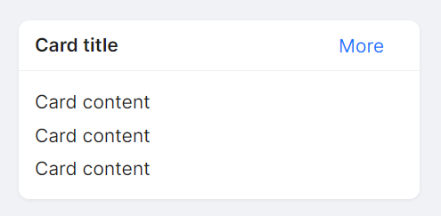

# 无边框

无边框 `Card` 样式，将属性 `StyleVariant` 设定为Borderless即可。无边框 `Card` 更容易与背景色融为一体。



```xaml
// Binding BorderlessFrameBg请自行修改
<Border Padding="20" Background="{Binding BorderlessFrameBg}">
    <atom:Card Header="Card title" Width="300" StyleVariant="Borderless">
        <atom:Card.Extra>
            <atom:HyperLinkButton>More</atom:HyperLinkButton>
        </atom:Card.Extra>
        <StackPanel Orientation="Vertical" Spacing="3">
            <atom:TextBlock>Card content</atom:TextBlock>
            <atom:TextBlock>Card content</atom:TextBlock>
            <atom:TextBlock>Card content</atom:TextBlock>
        </StackPanel>
    </atom:Card>
</Border>
```