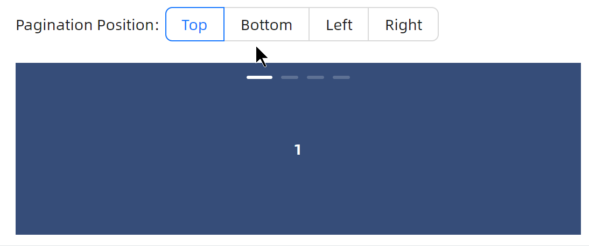
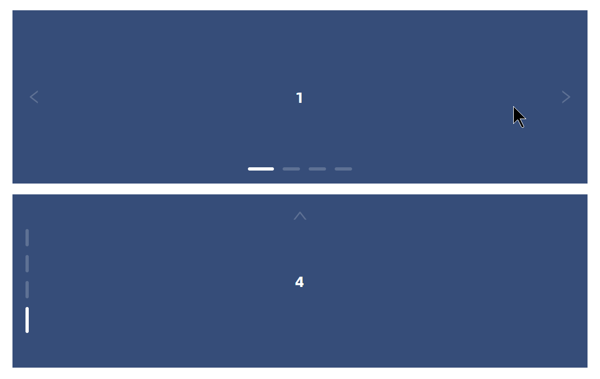

# Carousel 快速入门

### 基础配置条件

* Nuget安装Avalonia
* Nuget安装AtomUI
* 本页文档末尾有公共样式代码与公共code-behind代码

### 基础用法

一个最简单的示例，至于背景颜色，参考本页文档末尾的样式代码。


```xaml
<atom:Carousel SelectedIndex="2">
    <atom:CarouselPage>1</atom:CarouselPage>
    <atom:CarouselPage>2</atom:CarouselPage>
    <atom:CarouselPage>3</atom:CarouselPage>
    <atom:CarouselPage>4</atom:CarouselPage>
</atom:Carousel>
```

### 位置设定

通过 `PaginationPosition` 属性可以指定轮播图索引的位置，目前系统内置的可选值有：`Top`、`Bottom`、`Left`、`Right`。



```xaml
<StackPanel Orientation="Vertical" Spacing="20">
    <StackPanel Orientation="Horizontal" Spacing="5">
        <atom:TextBlock VerticalAlignment="Center">Pagination Position:</atom:TextBlock>
        <atom:OptionButtonGroup ButtonStyle="Outline" Name="PositionOptionGroup">
            <atom:OptionButton>Top</atom:OptionButton>
            <atom:OptionButton IsChecked="True">Bottom</atom:OptionButton>
            <atom:OptionButton>Left</atom:OptionButton>
            <atom:OptionButton>Right</atom:OptionButton>
        </atom:OptionButtonGroup>
    </StackPanel>

    <atom:Carousel PaginationPosition="{Binding PaginationPosition}">
        <atom:CarouselPage>1</atom:CarouselPage>
        <atom:CarouselPage>2</atom:CarouselPage>
        <atom:CarouselPage>3</atom:CarouselPage>
        <atom:CarouselPage>4</atom:CarouselPage>
    </atom:Carousel>

</StackPanel>
```

### 自动轮播

将 `IsAutoPlay` 属性设定为 `True`，即可开启自动轮播功能；`IsInfinite` 默认为 `True`，即轮播到最后一张图片后，会自动跳转到第一张图片继续循环。


```xaml
<atom:Carousel IsAutoPlay="True" IsInfinite="False">
    <atom:CarouselPage>1</atom:CarouselPage>
    <atom:CarouselPage>2</atom:CarouselPage>
    <atom:CarouselPage>3</atom:CarouselPage>
    <atom:CarouselPage>4</atom:CarouselPage>
</atom:Carousel>
```

### 淡入

`TransitionEffect` 属性可以设定轮播图片的淡入效果，目前系统内置的可选值有：`Scroll`、`Fade`。


```xaml
<atom:Carousel TransitionEffect="Fade">
    <atom:CarouselPage Background="#B3001B">1</atom:CarouselPage>
    <atom:CarouselPage Background="#255C99">2</atom:CarouselPage>
    <atom:CarouselPage Background="#262626">3</atom:CarouselPage>
    <atom:CarouselPage Background="#CCAD8F">4</atom:CarouselPage>
</atom:Carousel>
```

### 播放箭头

`IsShowNavButtons` 属性用于显示轮播图片的左右切换箭头。



```xaml
<StackPanel Orientation="Vertical" Spacing="10">
    <atom:Carousel IsShowNavButtons="True">
        <atom:CarouselPage>1</atom:CarouselPage>
        <atom:CarouselPage>2</atom:CarouselPage>
        <atom:CarouselPage>3</atom:CarouselPage>
        <atom:CarouselPage>4</atom:CarouselPage>
    </atom:Carousel>
    <atom:Carousel PaginationPosition="Left" IsShowNavButtons="True" IsInfinite="False">
        <atom:CarouselPage>1</atom:CarouselPage>
        <atom:CarouselPage>2</atom:CarouselPage>
        <atom:CarouselPage>3</atom:CarouselPage>
        <atom:CarouselPage>4</atom:CarouselPage>
    </atom:Carousel>
</StackPanel>
```

### 播放进度条

假设开发者一定设定了4张轮播图，每张轮播图的展示时间长达5秒钟，那么 `IsShowTransitionProgress` 属性可以展示这5秒钟的进度，缓解用户等待焦虑。


```xaml
<StackPanel Orientation="Vertical" Spacing="10">
    <atom:Carousel IsShowTransitionProgress="True" IsAutoPlay="True">
        <atom:CarouselPage>1</atom:CarouselPage>
        <atom:CarouselPage>2</atom:CarouselPage>
        <atom:CarouselPage>3</atom:CarouselPage>
        <atom:CarouselPage>4</atom:CarouselPage>
    </atom:Carousel>
</StackPanel>
```

### 公共文件

样式代码：
```xaml
<gallery:ShowCasePanel.Styles>
    <Style Selector="atom|Carousel">
        <Setter Property="Background" Value="#364d79" />
        <Setter Property="Foreground" Value="#fff" />
        <Setter Property="Height" Value="160" />
    </Style>
    <Style Selector="atom|CarouselPage">
        <Setter Property="HorizontalContentAlignment" Value="Center" />
        <Setter Property="VerticalContentAlignment" Value="Center" />
        <Setter Property="FontWeight" Value="Bold" />
    </Style>
</gallery:ShowCasePanel.Styles>
```

code-behind文件：
```csharp
using System.Reactive.Disposables;
using AtomUI.Desktop.Controls;
using AtomUIGallery.ShowCases.ViewModels;
using ReactiveUI;
using ReactiveUI.Avalonia;

namespace AtomUIGallery.ShowCases.Views;

public partial class CarouselShowCase : ReactiveUserControl<CarouselViewModel>
{
    public CarouselShowCase()
    {
        this.WhenActivated(disposables =>
        {
            PositionOptionGroup.OptionCheckedChanged += HandlePositionOptionChanged;
            disposables.Add(Disposable.Create(() => PositionOptionGroup.OptionCheckedChanged -= HandlePositionOptionChanged));
        });
        InitializeComponent();
    }
    
    public void HandlePositionOptionChanged(object? sender, OptionCheckedChangedEventArgs args)
    {
        if (DataContext is CarouselViewModel viewModel)
        {
            if (args.Index == 0)
            {
                viewModel.PaginationPosition = CarouselPaginationPosition.Top;
            }
            else if (args.Index == 1)
            {
                viewModel.PaginationPosition = CarouselPaginationPosition.Bottom;
            }
            else if (args.Index == 2)
            {
                viewModel.PaginationPosition = CarouselPaginationPosition.Left;
            }
            else
            {
                viewModel.PaginationPosition = CarouselPaginationPosition.Right;
            }   
        }
     
    }
}
```