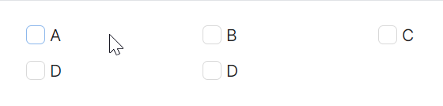

# Grid 布局

通过与 `Avalonia` 原生 `Grid` 配合，实现更加复杂的布局。



```xaml
<Grid ColumnDefinitions="*,*,*" RowDefinitions="Auto,Auto,Auto" Margin="10">
    <atom:CheckBox Grid.Row="0" Grid.Column="0">A</atom:CheckBox>
    <atom:CheckBox Grid.Row="0" Grid.Column="1">B</atom:CheckBox>
    <atom:CheckBox Grid.Row="0" Grid.Column="2">C</atom:CheckBox>
    <atom:CheckBox Grid.Row="1" Grid.Column="0">D</atom:CheckBox>
    <atom:CheckBox Grid.Row="1" Grid.Column="1">D</atom:CheckBox>
</Grid>
```