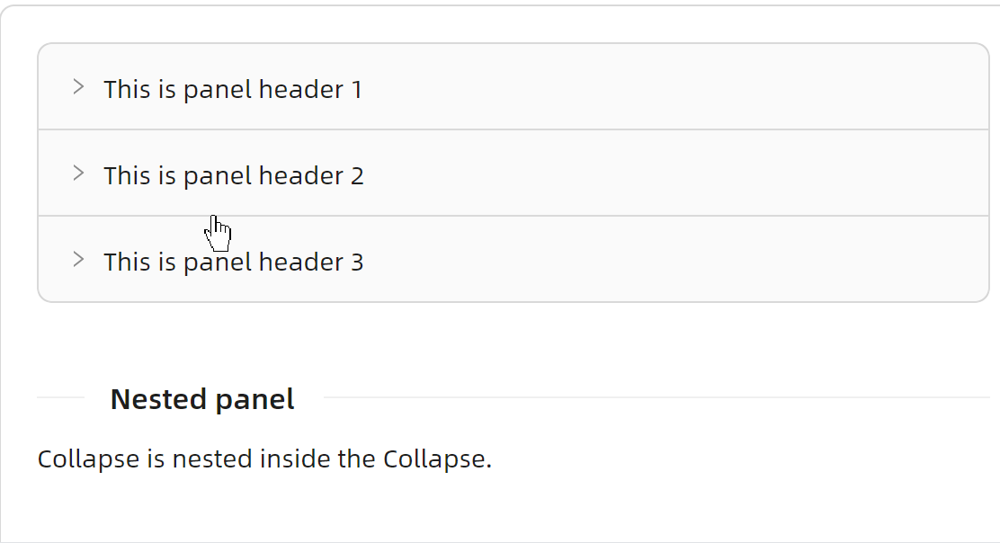
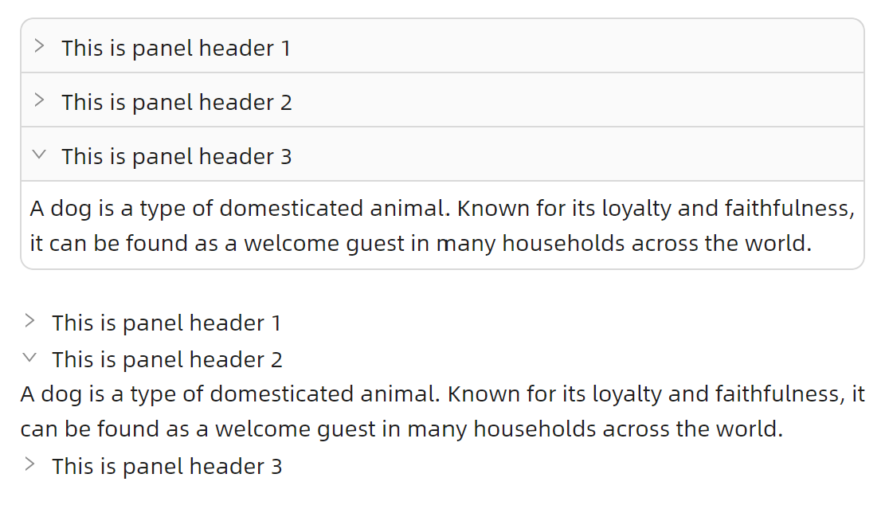

# Collapse 高级用法

### 展示唯一


```xaml
<atom:Collapse IsAccordion="True">
    <atom:CollapseItem Header="This is panel header 1">
        <atom:TextBlock TextWrapping="Wrap">
            A dog is a type of domesticated animal. Known for its loyalty and faithfulness, it can be found as a welcome guest in many households across the world.
        </atom:TextBlock>
    </atom:CollapseItem>
    <atom:CollapseItem Header="This is panel header 2">
        <atom:TextBlock TextWrapping="Wrap">
            A dog is a type of domesticated animal. Known for its loyalty and faithfulness, it can be found as a welcome guest in many households across the world.
        </atom:TextBlock>
    </atom:CollapseItem>
    <atom:CollapseItem Header="This is panel header 3">
        <atom:TextBlock TextWrapping="Wrap">
            A dog is a type of domesticated animal. Known for its loyalty and faithfulness, it can be found as a welcome guest in many households across the world.
        </atom:TextBlock>
    </atom:CollapseItem>
</atom:Collapse>
```

### 嵌套展示



```xaml
<atom:Collapse>
    <atom:CollapseItem Header="This is panel header 1">
        <atom:Collapse>
            <atom:CollapseItem Header="This is panel header 1">
                <atom:TextBlock TextWrapping="Wrap">
                    A dog is a type of domesticated animal. Known for its loyalty and faithfulness, it can be found as a welcome guest in many households across the world.
                </atom:TextBlock>
            </atom:CollapseItem>
        </atom:Collapse>
    </atom:CollapseItem>
    <atom:CollapseItem Header="This is panel header 2">
        <atom:TextBlock TextWrapping="Wrap">
            A dog is a type of domesticated animal. Known for its loyalty and faithfulness, it can be found as a welcome guest in many households across the world.
        </atom:TextBlock>
    </atom:CollapseItem>
    <atom:CollapseItem Header="This is panel header 3">
        <atom:TextBlock TextWrapping="Wrap">
            A dog is a type of domesticated animal. Known for its loyalty and faithfulness, it can be found as a welcome guest in many households across the world.
        </atom:TextBlock>
    </atom:CollapseItem>
</atom:Collapse>
```

### 自定义表头与内容内间距



```xaml
<StackPanel Orientation="Vertical" Spacing="20">
    <atom:Collapse ItemHeaderPadding="5" ItemContentPadding="5">
        <atom:CollapseItem Header="This is panel header 1">
            <atom:TextBlock TextWrapping="Wrap">
                A dog is a type of domesticated animal. Known for its loyalty and faithfulness, it can be found as a welcome guest in many households across the world.
            </atom:TextBlock>
        </atom:CollapseItem>
        <atom:CollapseItem Header="This is panel header 2">
            <atom:TextBlock TextWrapping="Wrap">
                A dog is a type of domesticated animal. Known for its loyalty and faithfulness, it can be found as a welcome guest in many households across the world.
            </atom:TextBlock>
        </atom:CollapseItem>
        <atom:CollapseItem Header="This is panel header 3">
            <atom:TextBlock TextWrapping="Wrap">
                A dog is a type of domesticated animal. Known for its loyalty and faithfulness, it can be found as a welcome guest in many households across the world.
            </atom:TextBlock>
        </atom:CollapseItem>
    </atom:Collapse>
    
    <atom:Collapse ItemHeaderPadding="0" ItemContentPadding="0" IsGhostStyle="True">
        <atom:CollapseItem Header="This is panel header 1">
            <atom:TextBlock TextWrapping="Wrap">
                A dog is a type of domesticated animal. Known for its loyalty and faithfulness, it can be found as a welcome guest in many households across the world.
            </atom:TextBlock>
        </atom:CollapseItem>
        <atom:CollapseItem Header="This is panel header 2">
            <atom:TextBlock TextWrapping="Wrap">
                A dog is a type of domesticated animal. Known for its loyalty and faithfulness, it can be found as a welcome guest in many households across the world.
            </atom:TextBlock>
        </atom:CollapseItem>
        <atom:CollapseItem Header="This is panel header 3">
            <atom:TextBlock TextWrapping="Wrap">
                A dog is a type of domesticated animal. Known for its loyalty and faithfulness, it can be found as a welcome guest in many households across the world.
            </atom:TextBlock>
        </atom:CollapseItem>
    </atom:Collapse>
</StackPanel>
```
