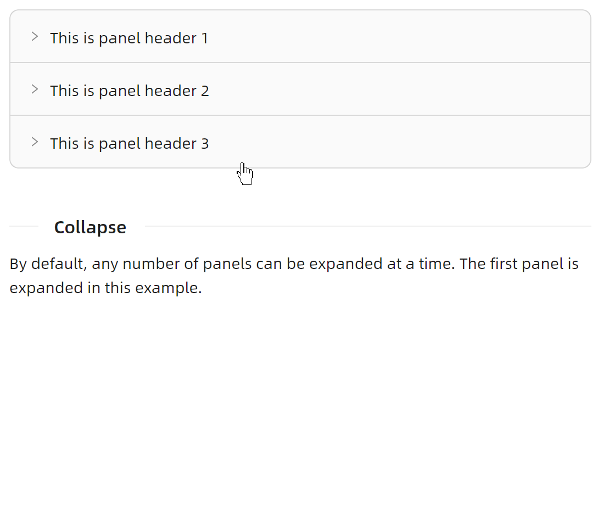
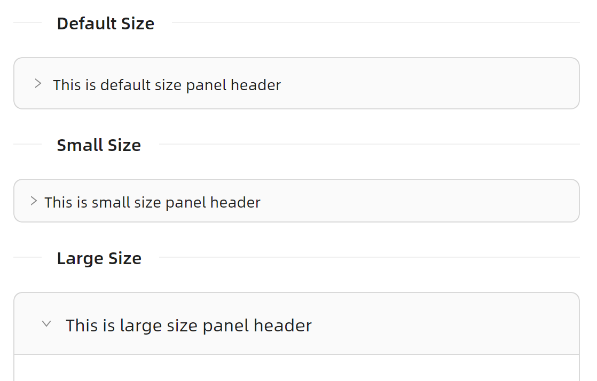
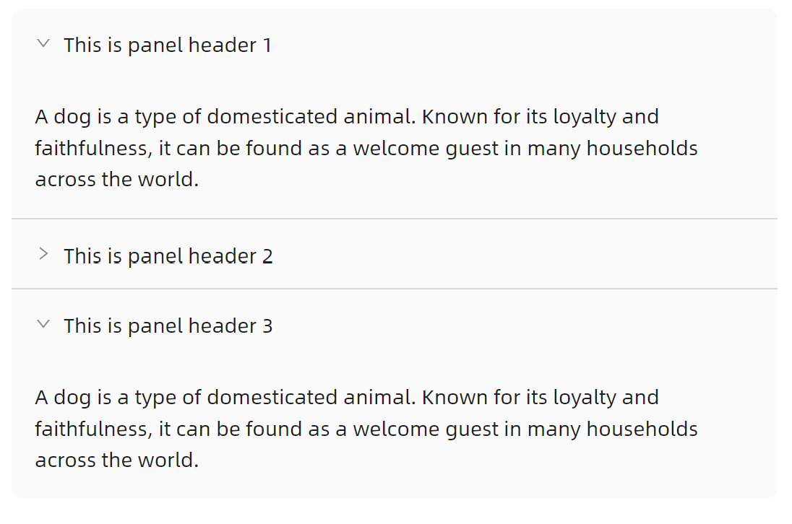

# Collapse 快速入门

### 基础配置条件

* Nuget安装Avalonia
* Nuget安装AtomUI

### 基础用法



```xaml
<atom:Collapse>
    <atom:CollapseItem Header="This is panel header 1">
        <atom:TextBlock TextWrapping="Wrap">
            A dog is a type of domesticated animal. Known for its loyalty and faithfulness, it can be found as a welcome guest in many households across the world.
        </atom:TextBlock>
    </atom:CollapseItem>
    <atom:CollapseItem Header="This is panel header 2">
        <atom:TextBlock TextWrapping="Wrap">
            A dog is a type of domesticated animal. Known for its loyalty and faithfulness, it can be found as a welcome guest in many households across the world.
        </atom:TextBlock>
    </atom:CollapseItem>
    <atom:CollapseItem Header="This is panel header 3">
        <atom:TextBlock TextWrapping="Wrap">
            A dog is a type of domesticated animal. Known for its loyalty and faithfulness, it can be found as a welcome guest in many households across the world.
        </atom:TextBlock>
    </atom:CollapseItem>
</atom:Collapse>
```

### 尺寸大小



```xaml
<StackPanel Orientation="Vertical" Spacing="20" >
    <atom:Separator Title="Default Size" TitlePosition="Left" FontWeight="Bold" />
    <atom:Collapse SizeType="Middle">
        <atom:CollapseItem Header="This is default size panel header">
            <atom:TextBlock TextWrapping="Wrap">
                A dog is a type of domesticated animal. Known for its loyalty and faithfulness, it can be found as a welcome guest in many households across the world.
            </atom:TextBlock>
        </atom:CollapseItem>
    </atom:Collapse>
    <atom:Separator Title="Small Size" TitlePosition="Left" FontWeight="Bold" />
    <atom:Collapse SizeType="Small">
        <atom:CollapseItem Header="This is small size panel header">
            <atom:TextBlock TextWrapping="Wrap">
                A dog is a type of domesticated animal. Known for its loyalty and faithfulness, it can be found as a welcome guest in many households across the world.
            </atom:TextBlock>
        </atom:CollapseItem>
    </atom:Collapse>
    <atom:Separator Title="Large Size" TitlePosition="Left" FontWeight="Bold" />
    <atom:Collapse SizeType="Large">
        <atom:CollapseItem Header="This is large size panel header">
            <atom:TextBlock TextWrapping="Wrap">
                A dog is a type of domesticated animal. Known for its loyalty and faithfulness, it can be found as a welcome guest in many households across the world.
            </atom:TextBlock>
        </atom:CollapseItem>
    </atom:Collapse>
</StackPanel>
```

### 边框设定



```xaml
<atom:Collapse IsBorderless="True">
    <atom:CollapseItem Header="This is panel header 1">
        <atom:TextBlock TextWrapping="Wrap">
            A dog is a type of domesticated animal. Known for its loyalty and faithfulness, it can be found as a welcome guest in many households across the world.
        </atom:TextBlock>
    </atom:CollapseItem>
    <atom:CollapseItem Header="This is panel header 2">
        <atom:TextBlock TextWrapping="Wrap">
            A dog is a type of domesticated animal. Known for its loyalty and faithfulness, it can be found as a welcome guest in many households across the world.
        </atom:TextBlock>
    </atom:CollapseItem>
    <atom:CollapseItem Header="This is panel header 3">
        <atom:TextBlock TextWrapping="Wrap">
            A dog is a type of domesticated animal. Known for its loyalty and faithfulness, it can be found as a welcome guest in many households across the world.
        </atom:TextBlock>
    </atom:CollapseItem>
</atom:Collapse>
```

### 箭头


```xaml
<atom:Collapse>
    <atom:CollapseItem Header="This is panel header 1">
        <atom:TextBlock TextWrapping="Wrap">
            A dog is a type of domesticated animal. Known for its loyalty and faithfulness, it can be found as a welcome guest in many households across the world.
        </atom:TextBlock>
    </atom:CollapseItem>
    <atom:CollapseItem Header="This is panel header 2" IsShowExpandIcon="False">
        <atom:TextBlock TextWrapping="Wrap">
            A dog is a type of domesticated animal. Known for its loyalty and faithfulness, it can be found as a welcome guest in many households across the world.
        </atom:TextBlock>
    </atom:CollapseItem>
</atom:Collapse>
```
