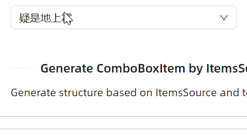
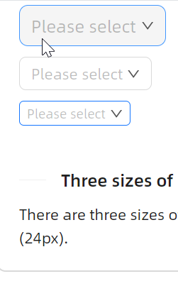
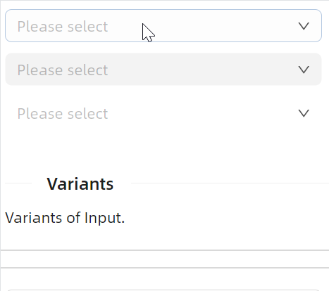
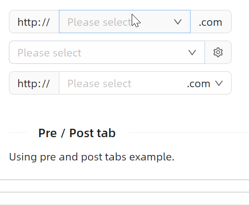
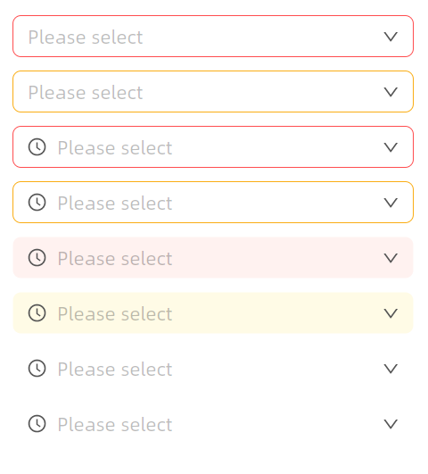

# 快速入门

### 基础配置条件

* Nuget安装Avalonia
* Nuget安装AtomUI

### 基础用法

一眼就懂的使用方式。


```xaml
<atom:ComboBox PlaceholderText="Please select" Width="300">
    <atom:ComboBoxItem>床前明月光</atom:ComboBoxItem>
    <atom:ComboBoxItem>疑是地上霜</atom:ComboBoxItem>
    <atom:ComboBoxItem>举头望明月</atom:ComboBoxItem>
    <atom:ComboBoxItem>低头思故乡</atom:ComboBoxItem>
    <atom:ComboBoxItem>床前明月光</atom:ComboBoxItem>
    <atom:ComboBoxItem>疑是地上霜</atom:ComboBoxItem>
    <atom:ComboBoxItem>举头望明月</atom:ComboBoxItem>
    <atom:ComboBoxItem>低头思故乡</atom:ComboBoxItem>
    <atom:ComboBoxItem>床前明月光</atom:ComboBoxItem>
    <atom:ComboBoxItem>疑是地上霜</atom:ComboBoxItem>
    <atom:ComboBoxItem>举头望明月</atom:ComboBoxItem>
    <atom:ComboBoxItem>低头思故乡</atom:ComboBoxItem>
    <atom:ComboBoxItem>床前明月光</atom:ComboBoxItem>
    <atom:ComboBoxItem>疑是地上霜</atom:ComboBoxItem>
    <atom:ComboBoxItem>举头望明月</atom:ComboBoxItem>
    <atom:ComboBoxItem>低头思故乡</atom:ComboBoxItem>
    <atom:ComboBoxItem>床前明月光</atom:ComboBoxItem>
    <atom:ComboBoxItem>疑是地上霜</atom:ComboBoxItem>
    <atom:ComboBoxItem>举头望明月</atom:ComboBoxItem>
    <atom:ComboBoxItem>低头思故乡</atom:ComboBoxItem>
    <atom:ComboBoxItem>床前明月光</atom:ComboBoxItem>
    <atom:ComboBoxItem>疑是地上霜</atom:ComboBoxItem>
    <atom:ComboBoxItem>举头望明月</atom:ComboBoxItem>
    <atom:ComboBoxItem>低头思故乡</atom:ComboBoxItem>
    <atom:ComboBoxItem>床前明月光</atom:ComboBoxItem>
    <atom:ComboBoxItem>疑是地上霜</atom:ComboBoxItem>
    <atom:ComboBoxItem>举头望明月</atom:ComboBoxItem>
    <atom:ComboBoxItem>低头思故乡</atom:ComboBoxItem>
    <atom:ComboBoxItem>床前明月光</atom:ComboBoxItem>
    <atom:ComboBoxItem>疑是地上霜</atom:ComboBoxItem>
    <atom:ComboBoxItem>举头望明月</atom:ComboBoxItem>
    <atom:ComboBoxItem>低头思故乡</atom:ComboBoxItem>
    <atom:ComboBoxItem>床前明月光</atom:ComboBoxItem>
    <atom:ComboBoxItem>疑是地上霜</atom:ComboBoxItem>
    <atom:ComboBoxItem>举头望明月</atom:ComboBoxItem>
    <atom:ComboBoxItem>低头思故乡</atom:ComboBoxItem>
    <atom:ComboBoxItem>床前明月光</atom:ComboBoxItem>
    <atom:ComboBoxItem>疑是地上霜</atom:ComboBoxItem>
    <atom:ComboBoxItem>举头望明月</atom:ComboBoxItem>
    <atom:ComboBoxItem>低头思故乡</atom:ComboBoxItem>
</atom:ComboBox>
```

### ItemsSource

正常来说，这种 `ItemsSource` 方式才是最常见的使用方式。

这本质上是 `Avalonia` 中的典型用法，先通过 `ItemsSource` 绑定数据来源，再通过 `ItemTemplate` 绑定数据项的显示方式。



```xaml
<atom:ComboBox PlaceholderText="Please select" Width="300"
               x:DataType="viewModels:ComboBoxViewModel"
               ItemsSource="{Binding ComboBoxItems}">
    <atom:ComboBox.ItemTemplate>
        <DataTemplate>
            <atom:TextBlock Text="{Binding Text}" VerticalAlignment="Center"/>
        </DataTemplate>
    </atom:ComboBox.ItemTemplate>
</atom:ComboBox>
```

### 禁用

一眼就懂的 `IsEnabled` 属性。


```xaml
<atom:ComboBox PlaceholderText="Please select" Width="300" IsEnabled="False">
    <atom:ComboBoxItem>床前明月光</atom:ComboBoxItem>
    <atom:ComboBoxItem>疑是地上霜</atom:ComboBoxItem>
    <atom:ComboBoxItem>举头望明月</atom:ComboBoxItem>
    <atom:ComboBoxItem>低头思故乡</atom:ComboBoxItem>
</atom:ComboBox>
```

### 大小尺寸

`SizeType` 属性可选值有Large、Middle、Small三个。



```xaml
<StackPanel Orientation="Vertical" Spacing="10" Margin="0, 0, 20, 0">
    <atom:ComboBox SizeType="Large" PlaceholderText="Please select">
        <atom:ComboBoxItem>床前明月光</atom:ComboBoxItem>
        <atom:ComboBoxItem>疑是地上霜</atom:ComboBoxItem>
        <atom:ComboBoxItem>举头望明月</atom:ComboBoxItem>
        <atom:ComboBoxItem>低头思故乡</atom:ComboBoxItem>
    </atom:ComboBox>
    <atom:ComboBox SizeType="Middle" PlaceholderText="Please select">
        <atom:ComboBoxItem>床前明月光</atom:ComboBoxItem>
        <atom:ComboBoxItem>疑是地上霜</atom:ComboBoxItem>
        <atom:ComboBoxItem>举头望明月</atom:ComboBoxItem>
        <atom:ComboBoxItem>低头思故乡</atom:ComboBoxItem>
    </atom:ComboBox>
    <atom:ComboBox SizeType="Small" PlaceholderText="Please select">
        <atom:ComboBoxItem>床前明月光</atom:ComboBoxItem>
        <atom:ComboBoxItem>疑是地上霜</atom:ComboBoxItem>
        <atom:ComboBoxItem>举头望明月</atom:ComboBoxItem>
        <atom:ComboBoxItem>低头思故乡</atom:ComboBoxItem>
    </atom:ComboBox>
</StackPanel>
```

### 多种变体

变体的作用在于更好的融于不同的UI设计风格，是视觉方向的属性。其属性名为 `StyleVariant`，可选值有Outline、Filled、Borderless。



```xaml
<StackPanel Orientation="Vertical" Spacing="10">
    <atom:ComboBox StyleVariant="Outline" PlaceholderText="Please select" Width="300">
        <atom:ComboBoxItem>床前明月光</atom:ComboBoxItem>
        <atom:ComboBoxItem>疑是地上霜</atom:ComboBoxItem>
        <atom:ComboBoxItem>举头望明月</atom:ComboBoxItem>
        <atom:ComboBoxItem>低头思故乡</atom:ComboBoxItem>
    </atom:ComboBox>

    <atom:ComboBox StyleVariant="Filled" PlaceholderText="Please select" Width="300">
        <atom:ComboBoxItem>床前明月光</atom:ComboBoxItem>
        <atom:ComboBoxItem>疑是地上霜</atom:ComboBoxItem>
        <atom:ComboBoxItem>举头望明月</atom:ComboBoxItem>
        <atom:ComboBoxItem>低头思故乡</atom:ComboBoxItem>
    </atom:ComboBox>

    <atom:ComboBox StyleVariant="Borderless" PlaceholderText="Please select" Width="300">
        <atom:ComboBoxItem>床前明月光</atom:ComboBoxItem>
        <atom:ComboBoxItem>疑是地上霜</atom:ComboBoxItem>
        <atom:ComboBoxItem>举头望明月</atom:ComboBoxItem>
        <atom:ComboBoxItem>低头思故乡</atom:ComboBoxItem>
    </atom:ComboBox>
</StackPanel>
```

### Pre/Post tab

有时候需要在输入框的左侧或者右侧添加一些内容，这时就可以使用 `LeftAddOn` 和 `RightAddOn` 属性。
* `LeftAddOn` 表示输入框左侧位置的Pre Tab，其值可以是一个图标，也可以是字符串。
* `RightAddOn` 表示输入框右侧位置的Pre Tab，其值可以是一个图标，也可以是字符串。



```xaml
<StackPanel Orientation="Vertical" Spacing="10">
    <atom:ComboBox PlaceholderText="Please select" Width="300"
                   LeftAddOn="http://"
                   RightAddOn=".com">
        <atom:ComboBoxItem>床前明月光</atom:ComboBoxItem>
        <atom:ComboBoxItem>疑是地上霜</atom:ComboBoxItem>
        <atom:ComboBoxItem>举头望明月</atom:ComboBoxItem>
        <atom:ComboBoxItem>低头思故乡</atom:ComboBoxItem>
    </atom:ComboBox>

    <atom:ComboBox PlaceholderText="Please select" Width="300"
                   RightAddOn="{atom:IconProvider Kind=SettingOutlined}">
        <atom:ComboBoxItem>床前明月光</atom:ComboBoxItem>
        <atom:ComboBoxItem>疑是地上霜</atom:ComboBoxItem>
        <atom:ComboBoxItem>举头望明月</atom:ComboBoxItem>
        <atom:ComboBoxItem>低头思故乡</atom:ComboBoxItem>
    </atom:ComboBox>

    <atom:ComboBox PlaceholderText="Please select" Width="300"
                   LeftAddOn="http://"
                   InnerRightContent=".com">
        <atom:ComboBoxItem>床前明月光</atom:ComboBoxItem>
        <atom:ComboBoxItem>疑是地上霜</atom:ComboBoxItem>
        <atom:ComboBoxItem>举头望明月</atom:ComboBoxItem>
        <atom:ComboBoxItem>低头思故乡</atom:ComboBoxItem>
    </atom:ComboBox>

</StackPanel>
```

### 前缀/后缀

前后缀和前面刚展示过的Pre/Post Tab略不太一样，

* `InnerLeftContent` 则作为内部内容，位于输入框内部的左侧，是输入框的一部分。
* `InnerRightContent` 则作为内部内容，位于输入框内部的右侧，是输入框的一部分。

`InnerRightContent` 与 `RightAddOn` 区别是：前者更趋向于为输入框内部的补充，而后者更趋向于为输入框外部的装饰。


```xaml
<StackPanel Orientation="Vertical" Spacing="10">
    <atom:ComboBox PlaceholderText="Please select" Width="300"
                   InnerLeftContent="{atom:IconProvider Kind=UserOutlined, NormalFilledColor=#D7D7D7}"
                   InnerRightContent="{atom:IconProvider Kind=InfoCircleOutlined, NormalFilledColor=#8C8C8C}">
        <atom:ComboBoxItem>床前明月光</atom:ComboBoxItem>
        <atom:ComboBoxItem>疑是地上霜</atom:ComboBoxItem>
        <atom:ComboBoxItem>举头望明月</atom:ComboBoxItem>
        <atom:ComboBoxItem>低头思故乡</atom:ComboBoxItem>
    </atom:ComboBox>

    <atom:ComboBox PlaceholderText="Please select" Width="300"
                   InnerLeftContent="￥"
                   InnerRightContent="RMB">
        <atom:ComboBoxItem>床前明月光</atom:ComboBoxItem>
        <atom:ComboBoxItem>疑是地上霜</atom:ComboBoxItem>
        <atom:ComboBoxItem>举头望明月</atom:ComboBoxItem>
        <atom:ComboBoxItem>低头思故乡</atom:ComboBoxItem>
    </atom:ComboBox>

    <atom:ComboBox PlaceholderText="Please select" Width="300"
                   InnerLeftContent="￥"
                   InnerRightContent="RMB" IsEnabled="False">
        <atom:ComboBoxItem>床前明月光</atom:ComboBoxItem>
        <atom:ComboBoxItem>疑是地上霜</atom:ComboBoxItem>
        <atom:ComboBoxItem>举头望明月</atom:ComboBoxItem>
        <atom:ComboBoxItem>低头思故乡</atom:ComboBoxItem>
    </atom:ComboBox>

</StackPanel>
```

### 状态色

`Status` 属性可以一键设定组件的状态色，用于向用户传达一种明确的意图。可选值有Default、Error、Warning。



```xaml
<StackPanel Orientation="Vertical" Spacing="10" Margin="0, 0, 20, 0">
    <atom:ComboBox PlaceholderText="Please select" Width="300"
                   Status="Error">
        <atom:ComboBoxItem>床前明月光</atom:ComboBoxItem>
        <atom:ComboBoxItem>疑是地上霜</atom:ComboBoxItem>
        <atom:ComboBoxItem>举头望明月</atom:ComboBoxItem>
        <atom:ComboBoxItem>低头思故乡</atom:ComboBoxItem>
    </atom:ComboBox>

    <atom:ComboBox PlaceholderText="Please select" Width="300"
                   Status="Warning">
        <atom:ComboBoxItem>床前明月光</atom:ComboBoxItem>
        <atom:ComboBoxItem>疑是地上霜</atom:ComboBoxItem>
        <atom:ComboBoxItem>举头望明月</atom:ComboBoxItem>
        <atom:ComboBoxItem>低头思故乡</atom:ComboBoxItem>
    </atom:ComboBox>

    <atom:ComboBox PlaceholderText="Please select" Width="300"
                   Status="Error"
                   InnerLeftContent="{atom:IconProvider Kind=ClockCircleOutlined}">
        <atom:ComboBoxItem>床前明月光</atom:ComboBoxItem>
        <atom:ComboBoxItem>疑是地上霜</atom:ComboBoxItem>
        <atom:ComboBoxItem>举头望明月</atom:ComboBoxItem>
        <atom:ComboBoxItem>低头思故乡</atom:ComboBoxItem>
    </atom:ComboBox>

    <atom:ComboBox PlaceholderText="Please select" Width="300"
                   Status="Warning"
                   InnerLeftContent="{atom:IconProvider Kind=ClockCircleOutlined}">
        <atom:ComboBoxItem>床前明月光</atom:ComboBoxItem>
        <atom:ComboBoxItem>疑是地上霜</atom:ComboBoxItem>
        <atom:ComboBoxItem>举头望明月</atom:ComboBoxItem>
        <atom:ComboBoxItem>低头思故乡</atom:ComboBoxItem>
    </atom:ComboBox>

    <atom:ComboBox PlaceholderText="Please select" Width="300"
                   Status="Error"
                   StyleVariant="Filled"
                   InnerLeftContent="{atom:IconProvider Kind=ClockCircleOutlined}">
        <atom:ComboBoxItem>床前明月光</atom:ComboBoxItem>
        <atom:ComboBoxItem>疑是地上霜</atom:ComboBoxItem>
        <atom:ComboBoxItem>举头望明月</atom:ComboBoxItem>
        <atom:ComboBoxItem>低头思故乡</atom:ComboBoxItem>
    </atom:ComboBox>

    <atom:ComboBox PlaceholderText="Please select" Width="300"
                   Status="Warning"
                   StyleVariant="Filled"
                   InnerLeftContent="{atom:IconProvider Kind=ClockCircleOutlined}">
        <atom:ComboBoxItem>床前明月光</atom:ComboBoxItem>
        <atom:ComboBoxItem>疑是地上霜</atom:ComboBoxItem>
        <atom:ComboBoxItem>举头望明月</atom:ComboBoxItem>
        <atom:ComboBoxItem>低头思故乡</atom:ComboBoxItem>
    </atom:ComboBox>

    <atom:ComboBox PlaceholderText="Please select" Width="300"
                   Status="Error"
                   StyleVariant="Borderless"
                   InnerLeftContent="{atom:IconProvider Kind=ClockCircleOutlined}">
        <atom:ComboBoxItem>床前明月光</atom:ComboBoxItem>
        <atom:ComboBoxItem>疑是地上霜</atom:ComboBoxItem>
        <atom:ComboBoxItem>举头望明月</atom:ComboBoxItem>
        <atom:ComboBoxItem>低头思故乡</atom:ComboBoxItem>
    </atom:ComboBox>

    <atom:ComboBox PlaceholderText="Please select" Width="300"
                   Status="Warning"
                   StyleVariant="Borderless"
                   InnerLeftContent="{atom:IconProvider Kind=ClockCircleOutlined}">
        <atom:ComboBoxItem>床前明月光</atom:ComboBoxItem>
        <atom:ComboBoxItem>疑是地上霜</atom:ComboBoxItem>
        <atom:ComboBoxItem>举头望明月</atom:ComboBoxItem>
        <atom:ComboBoxItem>低头思故乡</atom:ComboBoxItem>
    </atom:ComboBox>

</StackPanel>
```