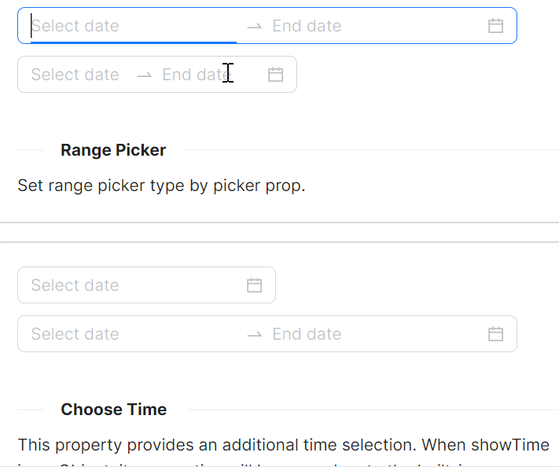
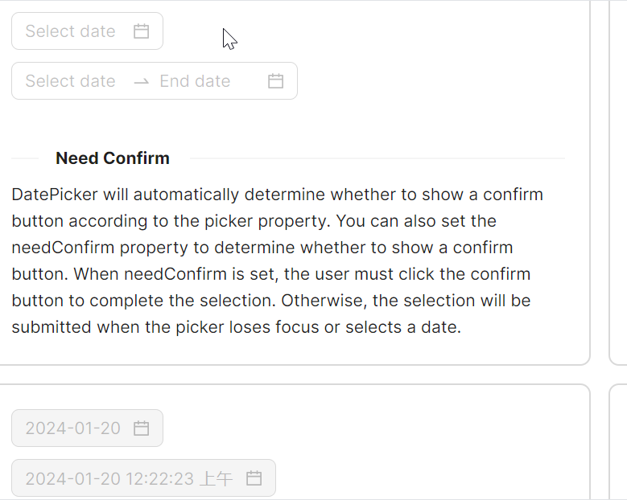
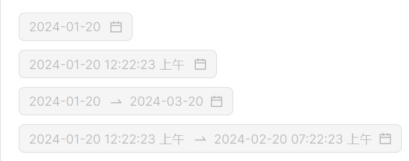
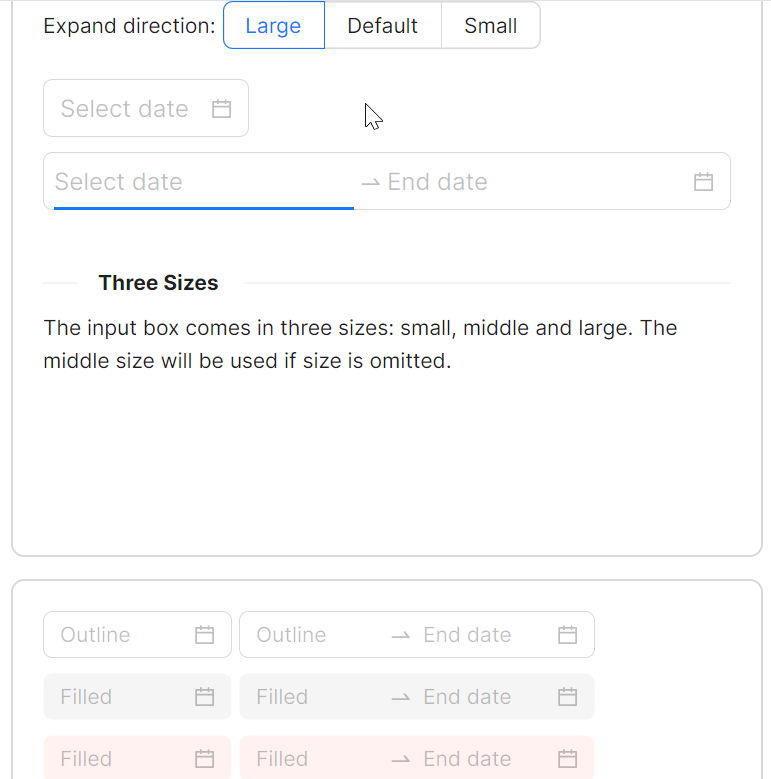
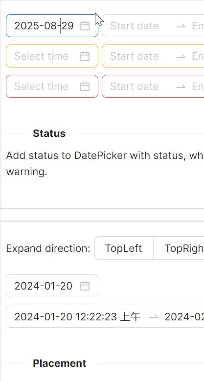
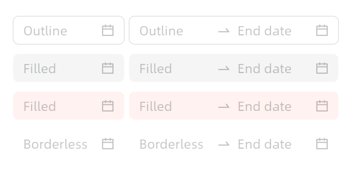
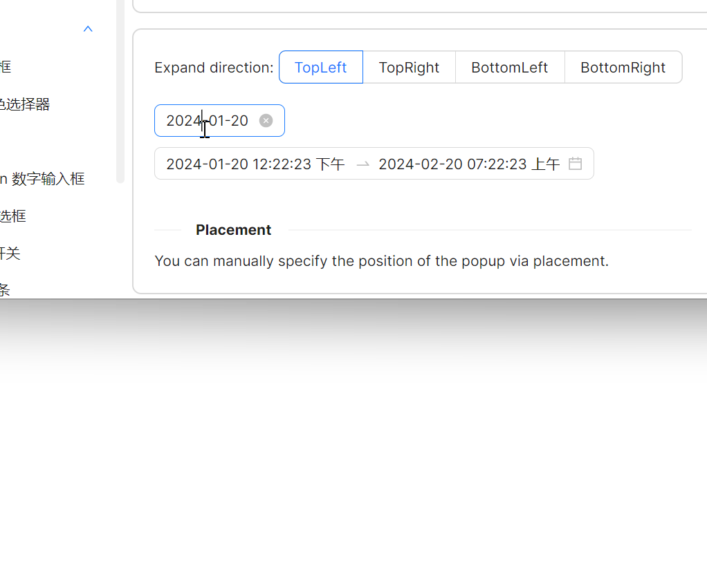

# 快速入门

### 基础配置条件

* Nuget安装Avalonia
* Nuget安装AtomUI

### 基础用法

`Watermark` 属性类似于HTML中的Placeholder，起到一种占位符的作用。


```xaml
<atom:DatePicker Watermark="Select date"/>
```

### 日期范围选择

在需要选择范围类型日期时，使用 `RangeDatePicker` 组件， `IsShowTime` 设定为True则可以将选择精确到时分秒。



```xaml
<StackPanel Orientation="Vertical" Spacing="10">
    <atom:RangeDatePicker IsShowTime="true" Watermark="Select date" SecondaryWatermark="End date"/>
    <atom:RangeDatePicker IsShowTime="False" Watermark="Select date" SecondaryWatermark="End date"/>
</StackPanel>
```

### 带有确认按钮的日期选择器

一些业务场景需要让用户确认选择的日期，将 `IsNeedConfirm` 属性设置为True。



```xaml
<StackPanel Orientation="Vertical" Spacing="10">
    <atom:DatePicker IsNeedConfirm="True" Watermark="Select date" />
    <atom:RangeDatePicker IsNeedConfirm="True" IsShowTime="False" Watermark="Select date" SecondaryWatermark="End date" />
</StackPanel>
```

### 禁用

老面孔了，`IsEnabled` 属性用于决定组件是否可用。



```xaml
<StackPanel Orientation="Vertical" Spacing="10">
    <atom:DatePicker IsNeedConfirm="True" Watermark="Select date" SelectedDateTime="2024-01-20"
                     IsEnabled="False" />
    <atom:DatePicker IsNeedConfirm="True" Watermark="Select date" IsShowTime="True"
                     SelectedDateTime="2024-01-20 12:22:23 AM" IsEnabled="False" />
    <atom:RangeDatePicker IsNeedConfirm="True" 
                          Watermark="Select date" 
                          SecondaryWatermark="End date"
                          RangeStartDefaultDate="2024-01-20"
                          RangeEndDefaultDate="2024-03-20" 
                          IsEnabled="False" />
    <atom:RangeDatePicker IsNeedConfirm="True" 
                          Watermark="Select date" 
                          SecondaryWatermark="End date"
                          IsShowTime="True"
                          RangeStartDefaultDate="2024-01-20 12:22:23 AM"
                          RangeEndDefaultDate="2024-02-20 07:22:23 AM"
                          IsEnabled="False" />
    <atom:RangeDatePicker IsNeedConfirm="True"
                          Watermark="Select date"
                          SecondaryWatermark="End date"
                          IsShowTime="True"
                          RangeStartDefaultDate="2024-01-20 12:22:23 AM"
                          RangeEndDefaultDate="2024-02-20 07:22:23 AM" />
    <atom:DatePicker IsNeedConfirm="True" Watermark="Select date" SelectedDateTime="2024-01-20" />
</StackPanel>
```

### 大小尺寸

`SizeType` 属性用于设置组件的大小，可选值有Large、Middle、Small。



```xaml
<DockPanel Margin="0, 0, 0, 0">
    <StackPanel Orientation="Horizontal" Spacing="5" DockPanel.Dock="Top">
        <atom:TextBlock VerticalAlignment="Center">Expand direction:</atom:TextBlock>
        <atom:OptionButtonGroup ButtonStyle="Outline" Name="PickerSizeTypeOptionGroup">
            <atom:OptionButton>Large</atom:OptionButton>
            <atom:OptionButton IsChecked="True">Default</atom:OptionButton>
            <atom:OptionButton>Small</atom:OptionButton>
        </atom:OptionButtonGroup>
    </StackPanel>

    <StackPanel Orientation="Vertical" Margin="0, 20, 0, 0" Spacing="10">
        <atom:DatePicker IsNeedConfirm="True" Watermark="Select date" SelectedDateTime="2024-01-20"
                         SizeType="{Binding PickerSizeType}" />
        <atom:RangeDatePicker IsNeedConfirm="True" 
                              Watermark="Select date" 
                              SecondaryWatermark="End date"
                              IsShowTime="True"
                              RangeStartDefaultDate="2024-01-20 12:22:23 AM"
                              RangeEndDefaultDate="2024-02-20 07:22:23 AM"
                              SizeType="{Binding PickerSizeType}" />
    </StackPanel>
</DockPanel>
```

### 状态色

状态色可以向用户传递一种明确的信息，比如错误、警告、成功等。用 `Status` 属性即可快速设置组件的状态色。



```xaml
<StackPanel Orientation="Vertical" Spacing="10">
    <StackPanel Orientation="Horizontal" Spacing="5">
        <atom:DatePicker Status="Default"
                         Watermark="Select time" />
        <atom:RangeDatePicker StyleVariant="Outline"
                              Status="Default"
                              Watermark="Start date"
                              SecondaryWatermark="End date"
                              IsNeedConfirm="True"
                              ClockIdentifier="HourClock24" />
    </StackPanel>
    <StackPanel Orientation="Horizontal" Spacing="5">
        <atom:DatePicker Status="Warning"
                         Watermark="Select time" />
        <atom:RangeDatePicker StyleVariant="Outline"
                              Status="Warning"
                              Watermark="Start date"
                              SecondaryWatermark="End date"
                              IsNeedConfirm="True"
                              ClockIdentifier="HourClock24" />
    </StackPanel>
    <StackPanel Orientation="Horizontal" Spacing="5">
        <atom:DatePicker Status="Error"
                         Watermark="Select time" />
        <atom:RangeDatePicker StyleVariant="Outline"
                              Status="Error"
                              Watermark="Start date"
                              SecondaryWatermark="End date"
                              IsNeedConfirm="True"
                              ClockIdentifier="HourClock24" />
    </StackPanel>
</StackPanel>
```

### 变体

`StyleVariant` 属性的值可选参考如下列表：
* Outline（轮廓样式）：具有明显的边框，适合需要强调输入控件边界的设计，常用于表单填写等需要明确指示用户输入区域的场景
* Filled（填充样式）：背景有填充色，通常用于Material Design风格的界面，提供更好的视觉层次感
* Borderless（无边框样式）：简洁的外观，适合在工具栏或需要紧凑布局的地方使用



```xaml
<StackPanel Orientation="Vertical" Spacing="10">
    <StackPanel Orientation="Horizontal" Spacing="5">
        <atom:DatePicker Status="Default"
                         Watermark="Select time" />
        <atom:RangeDatePicker StyleVariant="Outline"
                              Status="Default"
                              Watermark="Start date"
                              SecondaryWatermark="End date"
                              IsNeedConfirm="True"
                              ClockIdentifier="HourClock24" />
    </StackPanel>
    <StackPanel Orientation="Horizontal" Spacing="5">
        <atom:DatePicker Status="Warning"
                         Watermark="Select time" />
        <atom:RangeDatePicker StyleVariant="Outline"
                              Status="Warning"
                              Watermark="Start date"
                              SecondaryWatermark="End date"
                              IsNeedConfirm="True"
                              ClockIdentifier="HourClock24" />
    </StackPanel>
    <StackPanel Orientation="Horizontal" Spacing="5">
        <atom:DatePicker Status="Error"
                         Watermark="Select time" />
        <atom:RangeDatePicker StyleVariant="Outline"
                              Status="Error"
                              Watermark="Start date"
                              SecondaryWatermark="End date"
                              IsNeedConfirm="True"
                              ClockIdentifier="HourClock24" />
    </StackPanel>
</StackPanel>
```

### 位置

用于设定组件的弹出位置。



```xaml
<DockPanel Margin="0, 0, 0, 0">
    <StackPanel Orientation="Horizontal" Spacing="5" DockPanel.Dock="Top">
        <atom:TextBlock VerticalAlignment="Center">Expand direction:</atom:TextBlock>
        <atom:OptionButtonGroup ButtonStyle="Outline" Name="PickerPlacementOptionGroup">
            <atom:OptionButton>TopLeft</atom:OptionButton>
            <atom:OptionButton>TopRight</atom:OptionButton>
            <atom:OptionButton IsChecked="true">BottomLeft</atom:OptionButton>
            <atom:OptionButton>BottomRight</atom:OptionButton>
        </atom:OptionButtonGroup>
    </StackPanel>

    <StackPanel Orientation="Vertical" Margin="0, 20, 0, 0" Spacing="10">
        <atom:DatePicker IsNeedConfirm="True" Watermark="Select date" SelectedDateTime="2024-01-20"
                         PickerPlacement="{Binding PickerPlacement}" />
        <atom:RangeDatePicker IsNeedConfirm="True" Watermark="Select date" IsShowTime="True"
                              RangeStartDefaultDate="2024-01-20 12:22:23 AM"
                              RangeEndDefaultDate="2024-02-20 07:22:23 AM"
                              PickerPlacement="{Binding PickerPlacement}" />
    </StackPanel>
</DockPanel>
```