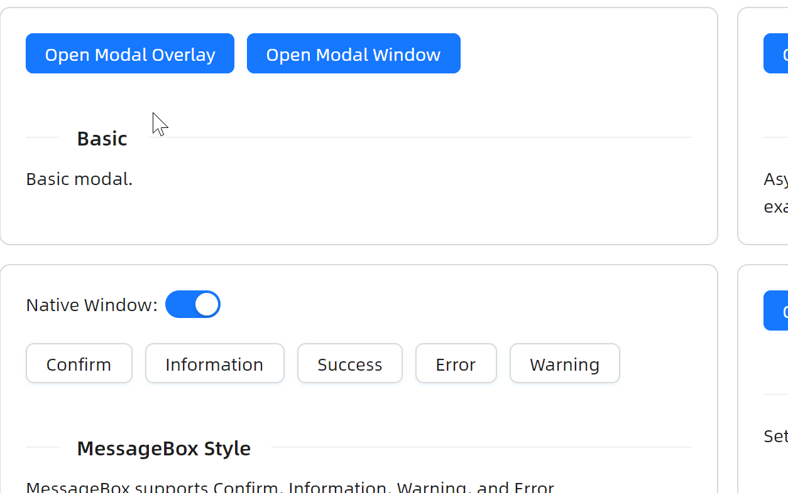

# Dialog 概述

### 简介

`Dialog` 组件为开发者提供了一个非常优质的弹出式对话框组件，有些地方叫做 `Modal`。在 `AtomUI` 中， `Modal` 模态窗是由 `Dialog` 组件驱动实现的，所以在下文中我们统一称之为 `Dialog`。

### 主要功能
* 支持 `Overlay` 和 `Window` 两种模式
* 支持多种状态样式
* 支持倒计时关闭
* 支持设定回调、支持设定异步逻辑