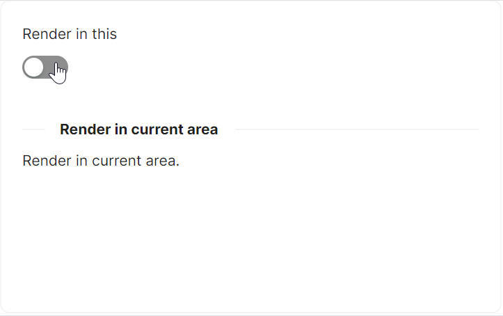

# 内部区域展示

局部渲染模式是通过 `OpenOn` 属性指定抽屉渲染的目标容器，而全局渲染的默认情况下抽屉渲染在屏幕根级，此处指定渲染在特定容器内。

其他代码部分请参考getting-started中code-behind代码。



```xaml
<Panel>
    <StackPanel Orientation="Vertical" Spacing="10">
        <atom:TextBlock>Render in this</atom:TextBlock>
        <atom:ToggleSwitch/>
    </StackPanel>

    <atom:Drawer IsOpen="{Binding $parent[Panel].((Panel)Children[0]).((atom:ToggleSwitch)Children[1]).IsChecked}"
                  Title="Basic Drawer"
                  OpenOn="{Binding $parent[gallerycontrols:ShowCaseItem]}">
        <StackPanel Orientation="Vertical" Spacing="5">
            <atom:TextBlock Text="Some contents..." />
            <atom:TextBlock Text="Some contents..." />
            <atom:TextBlock Text="Some contents..." />
        </StackPanel>
    </atom:Drawer>
</Panel>
```