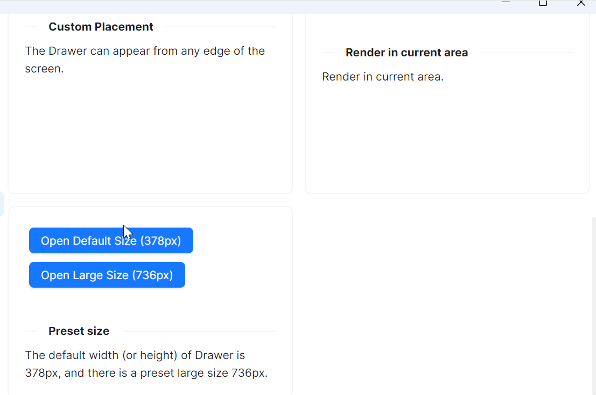

# 内置预设

`Drawer` 组件提供两种预设尺寸：默认尺寸(378px)和大尺寸(736px)，通过按钮点击事件控制不同尺寸的抽屉打开。

通过 `Name` 属性（值为"PresetSizeDrawer"） 为抽屉命名，在 `HandleOpenDefaultSizeDrawer` 和 `HandleOpenLargeSizeDrawer` 方法中通过名称引用该抽屉实例，两个事件处理方法应该会设置抽屉的不同尺寸属性。



```xaml
<Panel>
    <WrapPanel>
        <WrapPanel.Styles>
            <Style Selector="atom|Button">
                <Setter Property="Margin" Value="5"></Setter>
            </Style>
        </WrapPanel.Styles>
        <atom:Button ButtonType="Primary"
                     Click="HandleOpenDefaultSizeDrawer">
            Open Default Size (378px)
        </atom:Button>
        <atom:Button ButtonType="Primary"
                     Click="HandleOpenLargeSizeDrawer">
            Open Large Size (736px)
        </atom:Button>
    </WrapPanel>

    <atom:Drawer Title="Basic Drawer"
                  Name="PresetSizeDrawer">
        <StackPanel Orientation="Vertical" Spacing="5">
            <atom:TextBlock Text="Some contents..." />
            <atom:TextBlock Text="Some contents..." />
            <atom:TextBlock Text="Some contents..." />
        </StackPanel>
    </atom:Drawer>
</Panel>
```