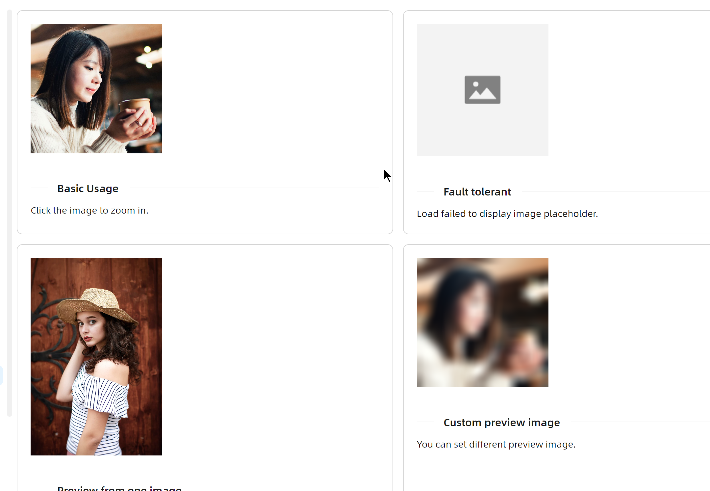

# ImagePreview 快速入门

### 基础配置条件

* Nuget安装Avalonia
* Nuget安装AtomUI
* 本页文档末尾有公用的code-behind源码

### 基础用法

使用 `Sources` 属性绑定图片源。


```xaml
<atom:ImagePreviewer Width="200" Sources="{Binding DefaultImages}" />
```

### 兜底图片

有时候难免手抖或遇到预料外的业务情况，导致无法获取真正的图片文件，此时可以通过 `FallbackImageSrc` 属性设置一个兜底图片，避免应用故障。



```xaml
<atom:ImagePreviewer Width="200" FallbackImageSrc="{Binding FallbackImage}"/>
```

### 单张图->画廊

当 `Sources` 属性绑定的是多张图片时，会自动进入画廊模式，此时 `Sources` 绑定的图片源会作为画廊的图片源。


```xaml
<atom:ImagePreviewer Width="200" Sources="{Binding ThreeImages}"/>
```

### 自定义预览图

默认情况下 `ImagePreviewer` 会将实际要加载的图片作为预览图；开发者可以通过 `CoverImageSrc` 属性设置一个自定义的预览图。


```xaml
<atom:ImagePreviewer Width="200" Sources="{Binding DefaultImages}" CoverImageSrc="{Binding BlurImage}"/>
```

### 多图浏览

`atom:ImageGroupPreviewer` 组件可以预览多张图片，在预览时就可以形成一个左右横向的画廊。


```xaml
<atom:ImageGroupPreviewer Sources="{Binding TwoImages}" CoverWidth="200" CoverHeight="200"/>
```

### 公共文件

code-behind文件：
```csharp
using AtomUIGallery.ShowCases.ViewModels;
using ReactiveUI;
using ReactiveUI.Avalonia;

namespace AtomUIGallery.ShowCases.Views;

public partial class ImagePreviewerShowCase : ReactiveUserControl<ImagePreviewerViewModel>
{
    public ImagePreviewerShowCase()
    {
        this.WhenActivated(disposables =>
        {
            if (DataContext is ImagePreviewerViewModel viewModel)
            {
                viewModel.DefaultImages = [
                    "avares://AtomUIGallery/Assets/ImagePreviewerShowCase/1.png"
                ];
                viewModel.ThreeImages = [
                    "avares://AtomUIGallery/Assets/ImagePreviewerShowCase/4.webp",
                    "avares://AtomUIGallery/Assets/ImagePreviewerShowCase/5.webp",
                    "avares://AtomUIGallery/Assets/ImagePreviewerShowCase/6.webp"
                ];
                viewModel.TwoImages = [
                    "avares://AtomUIGallery/Assets/ImagePreviewerShowCase/2.svg",
                    "avares://AtomUIGallery/Assets/ImagePreviewerShowCase/3.svg",
                ];
                viewModel.FallbackImage = "avares://AtomUIGallery/Assets/ImagePreviewerShowCase/Fallback.png";
                viewModel.BlurImage = "avares://AtomUIGallery/Assets/ImagePreviewerShowCase/Blur.png";
            }
        });
        InitializeComponent();
    }
}
```