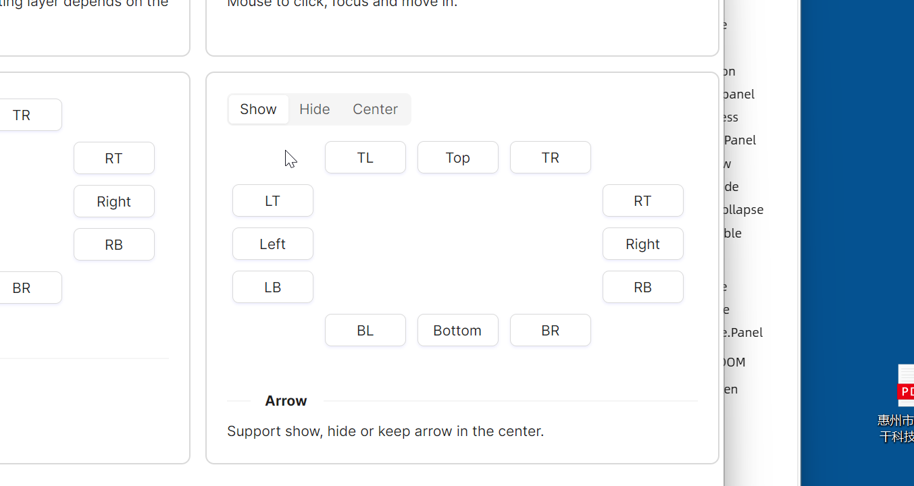

# 箭头选项

本示例展示了 `Flyout` 组件的箭头控制功能，通过 `Segmented` 控件来控制飞出层的箭头显示行为。

`IsShowArrow` 控制是否显示箭头，可选值为 `True/False`；`IsPointAtCenter` 控制箭头是否指向中心，可选值为 `True/False`。



```xaml
<StackPanel Orientation="Vertical" Spacing="10">
    <atom:Segmented x:Name="ArrowSegmented">
        <atom:SegmentedItem>Show</atom:SegmentedItem>
        <atom:SegmentedItem>Hide</atom:SegmentedItem>
        <atom:SegmentedItem>Center</atom:SegmentedItem>
    </atom:Segmented>
    <Grid>
        <Grid.Styles>
            <Style Selector="atom|Button">
                <Setter Property="Margin" Value="5" />
                <Setter Property="Width" Value="80" />
            </Style>
        </Grid.Styles>
        <Grid.RowDefinitions>
            <RowDefinition Height="Auto" />
            <RowDefinition Height="Auto" />
            <RowDefinition Height="Auto" />
            <RowDefinition Height="Auto" />
            <RowDefinition Height="Auto" />
        </Grid.RowDefinitions>
        <Grid.ColumnDefinitions>
            <ColumnDefinition Width="Auto" />
            <ColumnDefinition Width="Auto" />
            <ColumnDefinition Width="Auto" />
            <ColumnDefinition Width="Auto" />
            <ColumnDefinition Width="Auto" />
        </Grid.ColumnDefinitions>


        <atom:FlyoutHost Grid.Row="1" Grid.Column="0"
                         Trigger="Hover"
                         Placement="LeftEdgeAlignedTop"
                         IsShowArrow="{Binding  ShowArrow}"
                         IsPointAtCenter="{Binding  IsPointAtCenter}">
            <atom:FlyoutHost.Flyout>
                <atom:Flyout>
                    <TextBlock Width="200" Height="100" Padding="20">The most basic example.</TextBlock>
                </atom:Flyout>
            </atom:FlyoutHost.Flyout>
            <atom:Button Content="LT" />
        </atom:FlyoutHost>

        <atom:FlyoutHost Grid.Row="2" Grid.Column="0"
                         Trigger="Hover"
                         Placement="Left"
                         IsShowArrow="{Binding  ShowArrow}"
                         IsPointAtCenter="{Binding  IsPointAtCenter}">
            <atom:FlyoutHost.Flyout>
                <atom:Flyout>
                    <TextBlock Width="200" Height="100" Padding="20">The most basic example.</TextBlock>
                </atom:Flyout>
            </atom:FlyoutHost.Flyout>
            <atom:Button Content="Left" />
        </atom:FlyoutHost>

        <atom:FlyoutHost Grid.Row="3" Grid.Column="0"
                         Trigger="Hover"
                         Placement="LeftEdgeAlignedBottom"
                         IsShowArrow="{Binding  ShowArrow}"
                         IsPointAtCenter="{Binding  IsPointAtCenter}">
            <atom:FlyoutHost.Flyout>
                <atom:Flyout>
                    <TextBlock Width="200" Height="100" Padding="20">The most basic example.</TextBlock>
                </atom:Flyout>
            </atom:FlyoutHost.Flyout>
            <atom:Button Content="LB" />
        </atom:FlyoutHost>

        <atom:FlyoutHost Grid.Row="0" Grid.Column="1"
                         Trigger="Hover"
                         Placement="TopEdgeAlignedLeft"
                         IsShowArrow="{Binding  ShowArrow}"
                         IsPointAtCenter="{Binding  IsPointAtCenter}">
            <atom:FlyoutHost.Flyout>
                <atom:Flyout>
                    <TextBlock Width="200" Height="100" Padding="20">The most basic example.</TextBlock>
                </atom:Flyout>
            </atom:FlyoutHost.Flyout>
            <atom:Button Content="TL" />
        </atom:FlyoutHost>

        <atom:FlyoutHost Grid.Row="0" Grid.Column="2"
                         Trigger="Hover"
                         Placement="Top"
                         IsShowArrow="{Binding  ShowArrow}"
                         IsPointAtCenter="{Binding  IsPointAtCenter}">
            <atom:FlyoutHost.Flyout>
                <atom:Flyout>
                    <TextBlock Width="200" Height="100" Padding="20">The most basic example.</TextBlock>
                </atom:Flyout>
            </atom:FlyoutHost.Flyout>
            <atom:Button Content="Top" />
        </atom:FlyoutHost>

        <atom:FlyoutHost Grid.Row="0" Grid.Column="3"
                         Trigger="Hover"
                         Placement="TopEdgeAlignedRight"
                         IsShowArrow="{Binding  ShowArrow}"
                         IsPointAtCenter="{Binding  IsPointAtCenter}">
            <atom:FlyoutHost.Flyout>
                <atom:Flyout>
                    <TextBlock Width="200" Height="100" Padding="20">The most basic example.</TextBlock>
                </atom:Flyout>
            </atom:FlyoutHost.Flyout>
            <atom:Button Content="TR" />
        </atom:FlyoutHost>

        <atom:FlyoutHost Grid.Row="1" Grid.Column="4"
                         Trigger="Hover"
                         Placement="RightEdgeAlignedTop"
                         IsShowArrow="{Binding  ShowArrow}"
                         IsPointAtCenter="{Binding  IsPointAtCenter}">
            <atom:FlyoutHost.Flyout>
                <atom:Flyout>
                    <TextBlock Width="200" Height="100" Padding="20">The most basic example.</TextBlock>
                </atom:Flyout>
            </atom:FlyoutHost.Flyout>
            <atom:Button Content="RT" />
        </atom:FlyoutHost>

        <atom:FlyoutHost Grid.Row="2" Grid.Column="4"
                         Trigger="Hover"
                         Placement="Right"
                         IsShowArrow="{Binding  ShowArrow}"
                         IsPointAtCenter="{Binding  IsPointAtCenter}">
            <atom:FlyoutHost.Flyout>
                <atom:Flyout>
                    <TextBlock Width="200" Height="100" Padding="20">The most basic example.</TextBlock>
                </atom:Flyout>
            </atom:FlyoutHost.Flyout>
            <atom:Button Content="Right" />
        </atom:FlyoutHost>

        <atom:FlyoutHost Grid.Row="3" Grid.Column="4"
                         Trigger="Hover"
                         Placement="RightEdgeAlignedBottom"
                         IsShowArrow="{Binding  ShowArrow}"
                         IsPointAtCenter="{Binding  IsPointAtCenter}">
            <atom:FlyoutHost.Flyout>
                <atom:Flyout>
                    <TextBlock Width="200" Height="100" Padding="20">The most basic example.</TextBlock>
                </atom:Flyout>
            </atom:FlyoutHost.Flyout>
            <atom:Button Content="RB" />
        </atom:FlyoutHost>

        <atom:FlyoutHost Grid.Row="4" Grid.Column="1"
                         Trigger="Hover"
                         Placement="BottomEdgeAlignedLeft"
                         IsShowArrow="{Binding  ShowArrow}"
                         IsPointAtCenter="{Binding  IsPointAtCenter}">
            <atom:FlyoutHost.Flyout>
                <atom:Flyout>
                    <TextBlock Width="200" Height="100" Padding="20">The most basic example.</TextBlock>
                </atom:Flyout>
            </atom:FlyoutHost.Flyout>
            <atom:Button Content="BL" />
        </atom:FlyoutHost>

        <atom:FlyoutHost Grid.Row="4" Grid.Column="2"
                         Trigger="Hover"
                         Placement="Bottom"
                         IsShowArrow="{Binding  ShowArrow}"
                         IsPointAtCenter="{Binding  IsPointAtCenter}">
            <atom:FlyoutHost.Flyout>
                <atom:Flyout>
                    <TextBlock Width="200" Height="100" Padding="20">The most basic example.</TextBlock>
                </atom:Flyout>
            </atom:FlyoutHost.Flyout>
            <atom:Button Content="Bottom" />
        </atom:FlyoutHost>

        <atom:FlyoutHost Grid.Row="4" Grid.Column="3"
                         Trigger="Hover"
                         Placement="BottomEdgeAlignedRight"
                         IsShowArrow="{Binding  ShowArrow}"
                         IsPointAtCenter="{Binding  IsPointAtCenter}">
            <atom:FlyoutHost.Flyout>
                <atom:Flyout>
                    <TextBlock Width="200" Height="100" Padding="20">The most basic example.</TextBlock>
                </atom:Flyout>
            </atom:FlyoutHost.Flyout>
            <atom:Button Content="BR" />
        </atom:FlyoutHost>

    </Grid>
</StackPanel>
```

