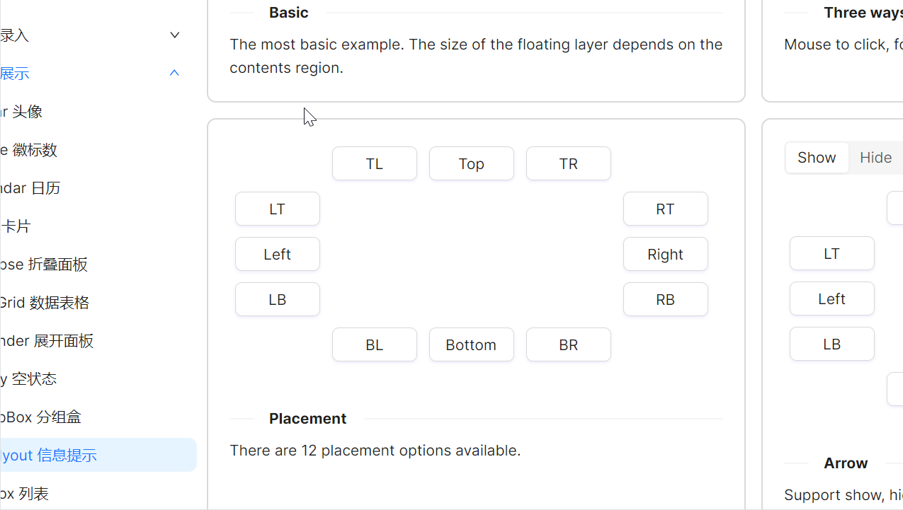

# 飞出位置

通过 `Placement` 属性控制飞出层相对于触发元素的位置，本示例中展示了12种位置方向。



```xaml
<Grid>
    <Grid.Styles>
        <Style Selector="atom|Button">
            <Setter Property="Margin" Value="5" />
            <Setter Property="Width" Value="80" />
        </Style>
    </Grid.Styles>
    <Grid.RowDefinitions>
        <RowDefinition Height="Auto" />
        <RowDefinition Height="Auto" />
        <RowDefinition Height="Auto" />
        <RowDefinition Height="Auto" />
        <RowDefinition Height="Auto" />
    </Grid.RowDefinitions>
    <Grid.ColumnDefinitions>
        <ColumnDefinition Width="Auto" />
        <ColumnDefinition Width="Auto" />
        <ColumnDefinition Width="Auto" />
        <ColumnDefinition Width="Auto" />
        <ColumnDefinition Width="Auto" />
    </Grid.ColumnDefinitions>

    <atom:FlyoutHost Grid.Row="1" Grid.Column="0" Trigger="Hover" Placement="LeftEdgeAlignedTop">
        <atom:FlyoutHost.Flyout>
            <atom:Flyout>
                <TextBlock Width="200" Height="100" Padding="20">The most basic example.</TextBlock>
            </atom:Flyout>
        </atom:FlyoutHost.Flyout>
        <atom:Button Content="LT" />
    </atom:FlyoutHost>

    <atom:FlyoutHost Grid.Row="2" Grid.Column="0" Trigger="Hover" Placement="Left">
        <atom:FlyoutHost.Flyout>
            <atom:Flyout>
                <TextBlock Width="200" Height="100" Padding="20">The most basic example.</TextBlock>
            </atom:Flyout>
        </atom:FlyoutHost.Flyout>
        <atom:Button Content="Left" />
    </atom:FlyoutHost>

    <atom:FlyoutHost Grid.Row="3" Grid.Column="0" Trigger="Hover" Placement="LeftEdgeAlignedBottom">
        <atom:FlyoutHost.Flyout>
            <atom:Flyout>
                <TextBlock Width="200" Height="100" Padding="20">The most basic example.</TextBlock>
            </atom:Flyout>
        </atom:FlyoutHost.Flyout>
        <atom:Button Content="LB" />
    </atom:FlyoutHost>

    <atom:FlyoutHost Grid.Row="0" Grid.Column="1" Trigger="Hover" Placement="TopEdgeAlignedLeft">
        <atom:FlyoutHost.Flyout>
            <atom:Flyout>
                <TextBlock Width="200" Height="100" Padding="20">The most basic example.</TextBlock>
            </atom:Flyout>
        </atom:FlyoutHost.Flyout>
        <atom:Button Content="TL" />
    </atom:FlyoutHost>

    <atom:FlyoutHost Grid.Row="0" Grid.Column="2" Trigger="Hover" Placement="Top">
        <atom:FlyoutHost.Flyout>
            <atom:Flyout>
                <TextBlock Width="200" Height="100" Padding="20">The most basic example.</TextBlock>
            </atom:Flyout>
        </atom:FlyoutHost.Flyout>
        <atom:Button Content="Top" />
    </atom:FlyoutHost>

    <atom:FlyoutHost Grid.Row="0" Grid.Column="3" Trigger="Hover" Placement="TopEdgeAlignedRight">
        <atom:FlyoutHost.Flyout>
            <atom:Flyout>
                <TextBlock Width="200" Height="100" Padding="20">The most basic example.</TextBlock>
            </atom:Flyout>
        </atom:FlyoutHost.Flyout>
        <atom:Button Content="TR" />
    </atom:FlyoutHost>

    <atom:FlyoutHost Grid.Row="1" Grid.Column="4" Trigger="Hover" Placement="RightEdgeAlignedTop">
        <atom:FlyoutHost.Flyout>
            <atom:Flyout>
                <TextBlock Width="200" Height="100" Padding="20">The most basic example.</TextBlock>
            </atom:Flyout>
        </atom:FlyoutHost.Flyout>
        <atom:Button Content="RT" />
    </atom:FlyoutHost>

    <atom:FlyoutHost Grid.Row="2" Grid.Column="4" Trigger="Hover" Placement="Right">
        <atom:FlyoutHost.Flyout>
            <atom:Flyout>
                <TextBlock Width="200" Height="100" Padding="20">The most basic example.</TextBlock>
            </atom:Flyout>
        </atom:FlyoutHost.Flyout>
        <atom:Button Content="Right" />
    </atom:FlyoutHost>

    <atom:FlyoutHost Grid.Row="3" Grid.Column="4" Trigger="Hover" Placement="RightEdgeAlignedBottom">
        <atom:FlyoutHost.Flyout>
            <atom:Flyout>
                <TextBlock Width="200" Height="100" Padding="20">The most basic example.</TextBlock>
            </atom:Flyout>
        </atom:FlyoutHost.Flyout>
        <atom:Button Content="RB" />
    </atom:FlyoutHost>

    <atom:FlyoutHost Grid.Row="4" Grid.Column="1" Trigger="Hover" Placement="BottomEdgeAlignedLeft">
        <atom:FlyoutHost.Flyout>
            <atom:Flyout>
                <TextBlock Width="200" Height="100" Padding="20">The most basic example.</TextBlock>
            </atom:Flyout>
        </atom:FlyoutHost.Flyout>
        <atom:Button Content="BL" />
    </atom:FlyoutHost>

    <atom:FlyoutHost Grid.Row="4" Grid.Column="2" Trigger="Hover" Placement="Bottom">
        <atom:FlyoutHost.Flyout>
            <atom:Flyout>
                <TextBlock Width="200" Height="100" Padding="20">The most basic example.</TextBlock>
            </atom:Flyout>
        </atom:FlyoutHost.Flyout>
        <atom:Button Content="Bottom" />
    </atom:FlyoutHost>

    <atom:FlyoutHost Grid.Row="4" Grid.Column="3" Trigger="Hover" Placement="BottomEdgeAlignedRight">
        <atom:FlyoutHost.Flyout>
            <atom:Flyout>
                <TextBlock Width="200" Height="100" Padding="20">The most basic example.</TextBlock>
            </atom:Flyout>
        </atom:FlyoutHost.Flyout>
        <atom:Button Content="BR" />
    </atom:FlyoutHost>

</Grid>
```

