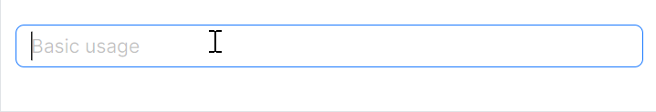
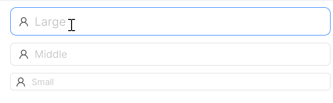
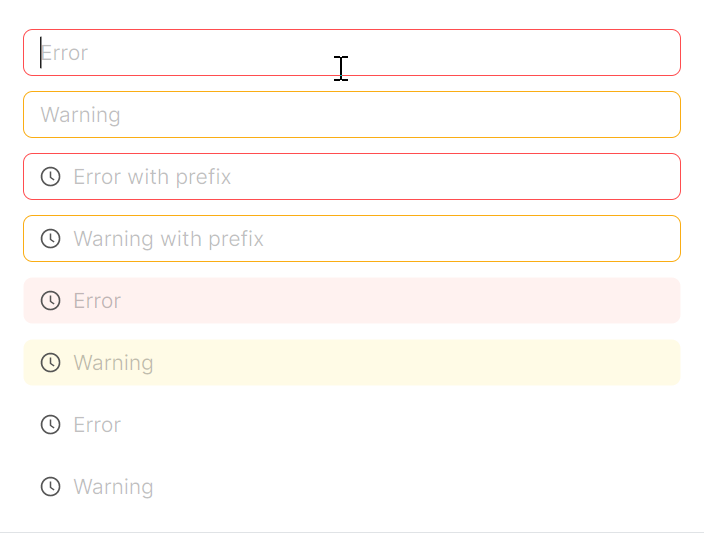

# LineEdit 快速入门

### 基础配置条件

* Nuget安装Avalonia
* Nuget安装AtomUI

### 基础用法

这个示例是最简单的基础用法，开发者将会得到一个最基础的 `LineEdit` 组件。



axaml文件：
```xaml
<atom:LineEdit Watermark="Basic usage" />
```

### 大小尺寸

`SizeType` 决定了控件大小，内置了三种不同的大小：Small、Middle、Large。

`Watermark` 类似于 `Placeholder` 的功能，当输入框为空无内容时则默认会显示 `Watermark` 属性的值。



```xaml
<StackPanel Orientation="Vertical" Spacing="10" Margin="0, 0, 20, 0">
    <atom:LineEdit Watermark="Large" SizeType="Large"
                   InnerLeftContent="{atom:IconProvider Kind=UserOutlined}" />
    <atom:LineEdit Watermark="Middle" SizeType="Middle"
                   InnerLeftContent="{atom:IconProvider Kind=UserOutlined}" />
    <atom:LineEdit Watermark="Small" SizeType="Small"
                   InnerLeftContent="{atom:IconProvider Kind=UserOutlined}" />
</StackPanel>
```

### 变体

`StyleVariant` 改变组件的变体样式，内置三种变体：Outline、Filled、Borderless。


```xaml
<StackPanel Orientation="Vertical" Spacing="10">
    <atom:LineEdit Watermark="Outlined" StyleVariant="Outline" />
    <atom:LineEdit Watermark="Filled" StyleVariant="Filled" />
    <atom:LineEdit Watermark="Borderless" StyleVariant="Borderless" />
</StackPanel>
```

### 禁用

`IsEnabled` 用来操作组件的禁用/启用状态。


```xaml
<StackPanel Orientation="Vertical" Spacing="10">
    <atom:LineEdit Watermark="Outlined" StyleVariant="Outline" IsEnabled="False" />
    <atom:LineEdit Watermark="Filled" StyleVariant="Filled" IsEnabled="False" />
    <atom:LineEdit Watermark="Borderless" StyleVariant="Borderless" IsEnabled="False" />
</StackPanel>
```

### 状态色

`Status` 属性用来给组件设定不同的状态色，内置三种状态色：Error、Warning、Default。



```xaml
<StackPanel Orientation="Vertical" Spacing="10" Margin="0, 0, 20, 0">
    <atom:LineEdit Watermark="Error" Status="Error" />
    <atom:LineEdit Watermark="Warning" Status="Warning" />
    <atom:LineEdit Watermark="Error with prefix"
                   InnerLeftContent="{atom:IconProvider Kind=ClockCircleOutlined}" Status="Error" />
    <atom:LineEdit Watermark="Warning with prefix"
                   InnerLeftContent="{atom:IconProvider Kind=ClockCircleOutlined}" Status="Warning" />

    <atom:LineEdit Watermark="Error" Status="Error"
                   InnerLeftContent="{atom:IconProvider Kind=ClockCircleOutlined}" StyleVariant="Filled" />
    <atom:LineEdit Watermark="Warning" Status="Warning"
                   InnerLeftContent="{atom:IconProvider Kind=ClockCircleOutlined}" StyleVariant="Filled" />

    <atom:LineEdit Watermark="Error" Status="Error"
                   InnerLeftContent="{atom:IconProvider Kind=ClockCircleOutlined}"
                   StyleVariant="Borderless" />
    <atom:LineEdit Watermark="Warning" Status="Warning"
                   InnerLeftContent="{atom:IconProvider Kind=ClockCircleOutlined}"
                   StyleVariant="Borderless" />
</StackPanel>
```