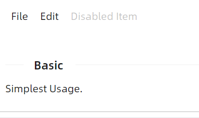

# 快速入门

### 基础配置条件

* Nuget安装Avalonia
* Nuget安装AtomUI

### 基础用法



axaml文件：
```xaml
<atom:Menu>
    <atom:MenuItem Header="_File">
        <atom:MenuItem Header="New Text File" InputGesture="Ctrl+N" />
        <atom:MenuItem Header="New File" InputGesture="Ctrl+Alt+N" />
        <atom:MenuItem Header="New Window" InputGesture="Ctrl+Shift+N" />
    </atom:MenuItem>
    <atom:MenuItem Header="_Edit">
        <atom:MenuItem Header="Undo" InputGesture="Ctrl+Shift+Z" />
        <atom:MenuSeparator />
        <atom:MenuItem Header="Cut" InputGesture="Ctrl+X" />
    </atom:MenuItem>
    <atom:MenuItem Header="Disabled Item" IsEnabled="False" />
</atom:Menu>
```

### ItemsSource


axaml文件：
```xaml
<atom:Menu ItemsSource="{Binding MenuItems}"
           x:DataType="viewModels:MenuViewModel">
    <atom:Menu.ItemTemplate>
        <TreeDataTemplate ItemsSource="{Binding Children}">
            <atom:TextBlock Text="{Binding Header}" />
        </TreeDataTemplate>
    </atom:Menu.ItemTemplate>
</atom:Menu>
```
