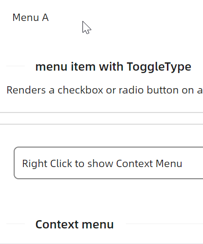

# 单选与多选



axaml文件：
```xaml
<atom:Menu>
    <atom:MenuItem Header="_Menu A">
        <atom:MenuItem Header="New Text File" InputGesture="Ctrl+N" ToggleType="Radio" GroupName="Group1" />
        <atom:MenuItem Header="New File" InputGesture="Ctrl+Alt+N" ToggleType="Radio" GroupName="Group1" />
        <atom:MenuItem Header="New Window" InputGesture="Ctrl+Shift+N" ToggleType="Radio"
                       GroupName="Group1" />
        <atom:MenuSeparator />
        <atom:MenuItem Header="Save" InputGesture="Ctrl+S" ToggleType="CheckBox" />
        <atom:MenuItem Header="Save As..." InputGesture="Ctrl+Shift+S" ToggleType="CheckBox"
                       Icon="{atom:IconProvider Kind=GithubOutlined}" />
        <atom:MenuItem Header="Save All" InputGesture="Ctrl+K" ToggleType="CheckBox"
                       Icon="{atom:IconProvider Kind=CheckOutlined}" />
        <atom:MenuSeparator />
        <atom:MenuItem Header="Exit" />
        <atom:MenuItem Header="Disabled" IsEnabled="False" Icon="{atom:IconProvider Kind=DeleteOutlined}"/>
    </atom:MenuItem>
</atom:Menu>
```
