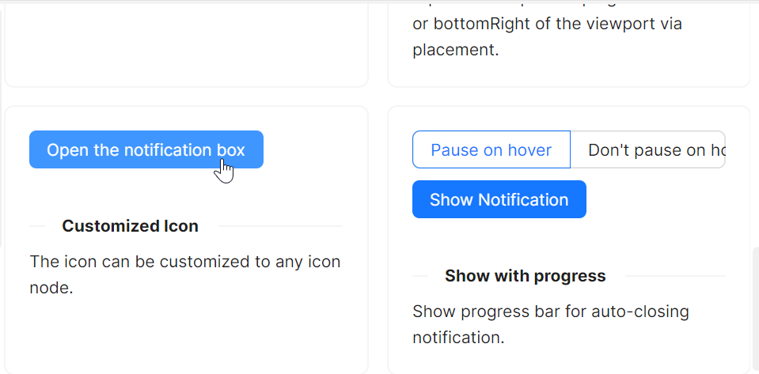

# 图标特性

### 内置图标

如果开发者需要带有明确提示意义的图标用来加强提醒，那么可以通过 `Notification` 的 `type` 属性来设置图标。

本示例中，我们分别将 `type` 设定为NotificationType.Success、NotificationType.Information、NotificationType.Warning、NotificationType.Error，分别对应成功、信息、警告、错误。


axaml文件：
```xaml
<StackPanel Orientation="Horizontal" Spacing="10">
    <atom:Button ButtonType="Default" Click="ShowSuccessNotification">
        Success
    </atom:Button>
    <atom:Button ButtonType="Default" Click="ShowInfoNotification">
        Info
    </atom:Button>
    <atom:Button ButtonType="Default" Click="ShowWarningNotification">
        Warning
    </atom:Button>
    <atom:Button ButtonType="Default" Click="ShowErrorNotification">
        Error
    </atom:Button>
</StackPanel>
```

code-behind文件：
```csharp
using AtomUI.Controls;
using AtomUI.IconPkg.AntDesign;
using AtomUIGallery.ShowCases.ViewModels;
using Avalonia;
using Avalonia.Controls;
using Avalonia.Interactivity;
using Avalonia.ReactiveUI;
using ReactiveUI;

public partial class NotificationShowCase : ReactiveUserControl<NotificationViewModel>
{
    private WindowNotificationManager? _basicManager;
    
    public NotificationShowCase()
    {
        this.WhenActivated(disposables => { });
        InitializeComponent();
        HoverOptionGroup.OptionCheckedChanged += HandleHoverOptionGroupCheckedChanged;
    }
    
    private void HandleHoverOptionGroupCheckedChanged(object? sender, OptionCheckedChangedEventArgs args)
    {
        if (_basicManager is not null)
        {
            if (args.Index == 0)
            {
                _basicManager.IsPauseOnHover = true;
            }
            else
            {
                _basicManager.IsPauseOnHover = false;
            }
        }
    }
    
    protected override void OnAttachedToVisualTree(VisualTreeAttachmentEventArgs e)
    {
        base.OnAttachedToVisualTree(e);
        var topLevel = TopLevel.GetTopLevel(this);
        _basicManager = new WindowNotificationManager(topLevel)
        {
            MaxItems = 3
        };
    }
    
    private void ShowSuccessNotification(object? sender, RoutedEventArgs e)
    {
        _basicManager?.Show(new Notification(
            type: NotificationType.Success,
            title: "Notification Title",
            content:
            "This is the content of the notification. This is the content of the notification. This is the content of the notification."
        ));
    }

    private void ShowInfoNotification(object? sender, RoutedEventArgs e)
    {
        _basicManager?.Show(new Notification(
            type: NotificationType.Information,
            title: "Notification Title",
            content:
            "This is the content of the notification. This is the content of the notification. This is the content of the notification."
        ));
    }

    private void ShowWarningNotification(object? sender, RoutedEventArgs e)
    {
        _basicManager?.Show(new Notification(
            type: NotificationType.Warning,
            title: "Notification Title",
            content:
            "This is the content of the notification. This is the content of the notification. This is the content of the notification."
        ));
    }

    private void ShowErrorNotification(object? sender, RoutedEventArgs e)
    {
        _basicManager?.Show(new Notification(
            type: NotificationType.Error,
            title: "Notification Title",
            content:
            "This is the content of the notification. This is the content of the notification. This is the content of the notification."
        ));
    }
}
```

### 自定义图标

有时 `AtomUI` 内置的图标无法满足需求，那么可以通过 `Notification` 的 `icon` 属性来自定义图标，图标具体可以参考 `AtomUI` 图标库（`AntDesignIconPackage`）。



axaml文件：
```xaml
<atom:Button ButtonType="Primary" Click="ShowCustomIconNotification">
    Open the notification box
</atom:Button>
```

code-behind文件：
```csharp
using AtomUI.Controls;
using AtomUI.IconPkg.AntDesign;
using AtomUIGallery.ShowCases.ViewModels;
using Avalonia;
using Avalonia.Controls;
using Avalonia.Interactivity;
using Avalonia.ReactiveUI;
using ReactiveUI;

public partial class NotificationShowCase : ReactiveUserControl<NotificationViewModel>
{
    private WindowNotificationManager? _basicManager;
    
    public NotificationShowCase()
    {
        this.WhenActivated(disposables => { });
        InitializeComponent();
        HoverOptionGroup.OptionCheckedChanged += HandleHoverOptionGroupCheckedChanged;
    }
    
    private void HandleHoverOptionGroupCheckedChanged(object? sender, OptionCheckedChangedEventArgs args)
    {
        if (_basicManager is not null)
        {
            if (args.Index == 0)
            {
                _basicManager.IsPauseOnHover = true;
            }
            else
            {
                _basicManager.IsPauseOnHover = false;
            }
        }
    }
    
    protected override void OnAttachedToVisualTree(VisualTreeAttachmentEventArgs e)
    {
        base.OnAttachedToVisualTree(e);
        var topLevel = TopLevel.GetTopLevel(this);
        _basicManager = new WindowNotificationManager(topLevel)
        {
            MaxItems = 3
        };
    }
    
    private void ShowCustomIconNotification(object? sender, RoutedEventArgs e)
    {
        _basicManager?.Show(new Notification(
            "Notification Title",
            "This is the content of the notification. This is the content of the notification. This is the content of the notification.",
            icon: AntDesignIconPackage.SettingOutlined()
        ));
    }
}
```