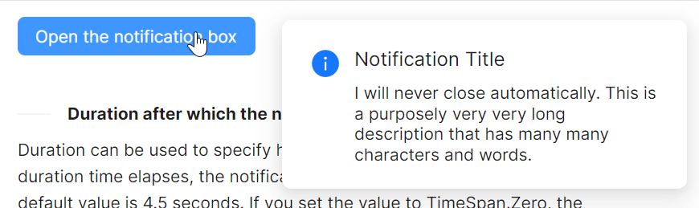

# Never Close Notification

在一些业务场景中，我们并不希望弹出的 `Notification` 自动关闭，因此我们需要Never close notification。

我们可以看到，这个特性是通过初始化时传入一个expiration为0的 `Notification` 对象，来达到never close的目的。



axaml文件：
```xaml
<atom:Button ButtonType="Primary" Click="ShowNeverCloseNotification">
    Open the notification box
</atom:Button>
```

code-behind文件：
```csharp
using AtomUI.Controls;
using AtomUI.IconPkg.AntDesign;
using AtomUIGallery.ShowCases.ViewModels;
using Avalonia;
using Avalonia.Controls;
using Avalonia.Interactivity;
using Avalonia.ReactiveUI;
using ReactiveUI;

public partial class NotificationShowCase : ReactiveUserControl<NotificationViewModel>
{
    private WindowNotificationManager? _basicManager;
    
    public NotificationShowCase()
    {
        this.WhenActivated(disposables => { });
        InitializeComponent();
        HoverOptionGroup.OptionCheckedChanged += HandleHoverOptionGroupCheckedChanged;
    }
    
    private void HandleHoverOptionGroupCheckedChanged(object? sender, OptionCheckedChangedEventArgs args)
    {
        if (_basicManager is not null)
        {
            if (args.Index == 0)
            {
                _basicManager.IsPauseOnHover = true;
            }
            else
            {
                _basicManager.IsPauseOnHover = false;
            }
        }
    }
    
    protected override void OnAttachedToVisualTree(VisualTreeAttachmentEventArgs e)
    {
        base.OnAttachedToVisualTree(e);
        var topLevel = TopLevel.GetTopLevel(this);
        _basicManager = new WindowNotificationManager(topLevel)
        {
            MaxItems = 3
        };
    }
    
    private void ShowNeverCloseNotification(object? sender, RoutedEventArgs e)
    {
        _basicManager?.Show(new Notification(
            expiration: TimeSpan.Zero,
            title: "Notification Title",
            content:
            "I will never close automatically. This is a purposely very very long description that has many many characters and words."
        ));
    }
}
```
