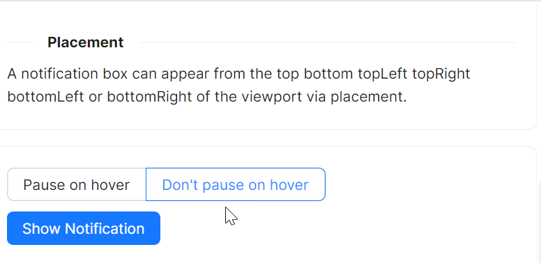

# Pause on hover

在一些业务场景中，开发者通常希望使用一个进度条来显示 `Notification` 窗口关闭倒计时进度，同时也希望当鼠标悬停 `Notification` 窗口时，暂停倒计时进度。

本示例中，我们通过如下逻辑来实现以上特性：
* 在UI上设定Name为HoverOptionGroup的 `OptionButtonGroup`组件，用于切换是否暂停倒计时进度
* 在code-behind代码中读取HoverOptionGroup选中的值，将该值赋给 `WindowNotificationManager` 的 `IsPauseOnHover` 属性，从而实现暂停倒计时进度



axaml文件：
```xaml
<StackPanel Orientation="Vertical" Spacing="10">
    <atom:OptionButtonGroup Name="HoverOptionGroup" ButtonStyle="Outline">
        <atom:OptionButton IsChecked="True">Pause on hover</atom:OptionButton>
        <atom:OptionButton>Don&apos;t pause on hover</atom:OptionButton>
    </atom:OptionButtonGroup>
    <atom:Button ButtonType="Primary" Click="ShowProgressNotification">
        Show Notification
    </atom:Button>
</StackPanel>
```

code-behind文件：
```csharp
using AtomUI.Controls;
using AtomUI.IconPkg.AntDesign;
using AtomUIGallery.ShowCases.ViewModels;
using Avalonia;
using Avalonia.Controls;
using Avalonia.Interactivity;
using Avalonia.ReactiveUI;
using ReactiveUI;

public partial class NotificationShowCase : ReactiveUserControl<NotificationViewModel>
{
    private WindowNotificationManager? _basicManager;
    
    public NotificationShowCase()
    {
        this.WhenActivated(disposables => { });
        InitializeComponent();
        HoverOptionGroup.OptionCheckedChanged += HandleHoverOptionGroupCheckedChanged;
    }
    
    private void HandleHoverOptionGroupCheckedChanged(object? sender, OptionCheckedChangedEventArgs args)
    {
        if (_basicManager is not null)
        {
            if (args.Index == 0)
            {
                _basicManager.IsPauseOnHover = true;
            }
            else
            {
                _basicManager.IsPauseOnHover = false;
            }
        }
    }
    
    protected override void OnAttachedToVisualTree(VisualTreeAttachmentEventArgs e)
    {
        base.OnAttachedToVisualTree(e);
        var topLevel = TopLevel.GetTopLevel(this);
        _basicManager = new WindowNotificationManager(topLevel)
        {
            MaxItems = 3
        };
    }
    
    private void ShowProgressNotification(object? sender, RoutedEventArgs e)
    {
        _basicManager?.Show(new Notification(
            type: NotificationType.Information,
            title: "Notification Title",
            content:
            "This is the content of the notification. This is the content of the notification. This is the content of the notification.",
            showProgress: true
        ));
    }

}
```
