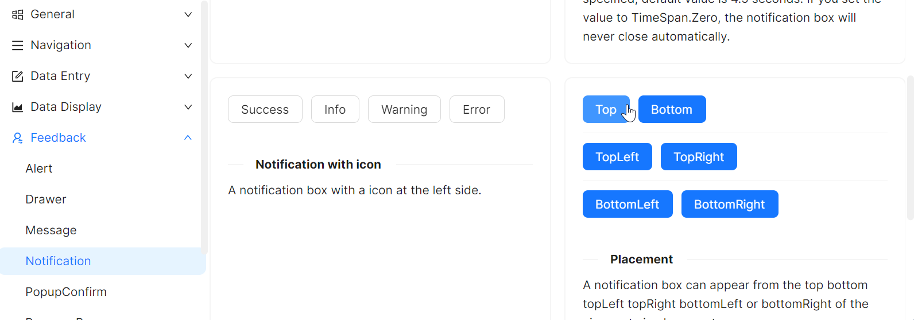

# 位置

为了满足更多开发者的业务场景，`Notification` 可以出现在多个位置。

这个示例将通过设定 `WindowNotificationManager` 对象的 `Position` 属性来设置 `Notification` 组件的位置，具体值可以参考code-behind代码。



axaml文件：
```xaml
<StackPanel Orientation="Vertical" Spacing="10">
    <StackPanel Orientation="Horizontal" Spacing="10">
        <atom:Button ButtonType="Primary" Click="ShowTopNotification">
            Top
        </atom:Button>
        <atom:Button ButtonType="Primary" Click="ShowBottomNotification">
            Bottom
        </atom:Button>
    </StackPanel>
    <atom:Separator />
    <StackPanel Orientation="Horizontal" Spacing="10">
        <atom:Button ButtonType="Primary" Click="ShowTopLeftNotification">
            TopLeft
        </atom:Button>
        <atom:Button ButtonType="Primary" Click="ShowTopRightNotification">
            TopRight
        </atom:Button>
    </StackPanel>
    <atom:Separator />
    <StackPanel Orientation="Horizontal" Spacing="10">
        <atom:Button ButtonType="Primary" Click="ShowBottomLeftNotification">
            BottomLeft
        </atom:Button>
        <atom:Button ButtonType="Primary" Click="ShowBottomRightNotification">
            BottomRight
        </atom:Button>
    </StackPanel>
</StackPanel>
```

code-behind文件：
```csharp
using AtomUI.Controls;
using AtomUI.IconPkg.AntDesign;
using AtomUIGallery.ShowCases.ViewModels;
using Avalonia;
using Avalonia.Controls;
using Avalonia.Interactivity;
using Avalonia.ReactiveUI;
using ReactiveUI;

public partial class NotificationShowCase : ReactiveUserControl<NotificationViewModel>
{
    private WindowNotificationManager? _basicManager;
    private WindowNotificationManager? _topLeftManager;
    private WindowNotificationManager? _topManager;
    private WindowNotificationManager? _topRightManager;

    private WindowNotificationManager? _bottomLeftManager;
    private WindowNotificationManager? _bottomManager;
    private WindowNotificationManager? _bottomRightManager;
    
    public NotificationShowCase()
    {
        this.WhenActivated(disposables => { });
        InitializeComponent();
        HoverOptionGroup.OptionCheckedChanged += HandleHoverOptionGroupCheckedChanged;
    }
    
    private void HandleHoverOptionGroupCheckedChanged(object? sender, OptionCheckedChangedEventArgs args)
    {
        if (_basicManager is not null)
        {
            if (args.Index == 0)
            {
                _basicManager.IsPauseOnHover = true;
            }
            else
            {
                _basicManager.IsPauseOnHover = false;
            }
        }
    }
    
    protected override void OnAttachedToVisualTree(VisualTreeAttachmentEventArgs e)
    {
        base.OnAttachedToVisualTree(e);
        var topLevel = TopLevel.GetTopLevel(this);
        _basicManager = new WindowNotificationManager(topLevel)
        {
            MaxItems = 3
        };
        
        _topLeftManager = new WindowNotificationManager(topLevel)
        {
            MaxItems = 3,
            Position = NotificationPosition.TopLeft
        };

        _topManager = new WindowNotificationManager(topLevel)
        {
            Position = NotificationPosition.TopCenter,
            MaxItems = 3
        };

        _topRightManager = new WindowNotificationManager(topLevel)
        {
            Position = NotificationPosition.TopRight,
            MaxItems = 3
        };

        _bottomLeftManager = new WindowNotificationManager(topLevel)
        {
            Position = NotificationPosition.BottomLeft,
            MaxItems = 3
        };

        _bottomManager = new WindowNotificationManager(topLevel)
        {
            Position = NotificationPosition.BottomCenter,
            MaxItems = 3
        };

        _bottomRightManager = new WindowNotificationManager(topLevel)
        {
            Position = NotificationPosition.BottomRight,
            MaxItems = 3
        };
    }
    

    private void ShowTopNotification(object? sender, RoutedEventArgs e)
    {
        _topManager?.Show(new Notification(
            "Notification Top",
            "Hello, AtomUI/Avalonia!"
        ));
    }

    private void ShowBottomNotification(object? sender, RoutedEventArgs e)
    {
        _bottomManager?.Show(new Notification(
            "Notification Bottom",
            "Hello, AtomUI/Avalonia!"
        ));
    }

    private void ShowTopLeftNotification(object? sender, RoutedEventArgs e)
    {
        _topLeftManager?.Show(new Notification(
            "Notification TopLeft",
            "Hello, AtomUI/Avalonia!"
        ));
    }

    private void ShowTopRightNotification(object? sender, RoutedEventArgs e)
    {
        _topRightManager?.Show(new Notification(
            "Notification TopRight",
            "Hello, AtomUI/Avalonia!"
        ));
    }

    private void ShowBottomLeftNotification(object? sender, RoutedEventArgs e)
    {
        _bottomLeftManager?.Show(new Notification(
            "Notification BottomLeft",
            "Hello, AtomUI/Avalonia!"
        ));
    }

    private void ShowBottomRightNotification(object? sender, RoutedEventArgs e)
    {
        _bottomRightManager?.Show(new Notification(
            "Notification BottomRight",
            "Hello, AtomUI/Avalonia!"
        ));
    }

}
```
