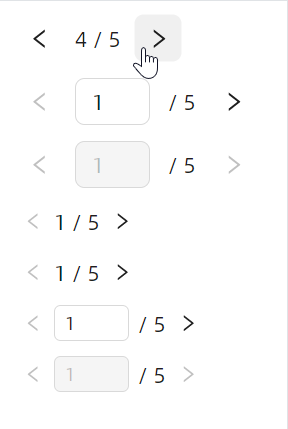

# 快速入门

### 基础配置条件

* Nuget安装Avalonia
* Nuget安装AtomUI

### 基础用法


```xaml
<atom:Pagination Total="50" CurrentPage="1" />
```

### 对齐方式


```xaml
<StackPanel Orientation="Vertical" Spacing="10">
    <atom:Pagination Total="50" CurrentPage="1" Align="Start" />
    <atom:Pagination Total="50" CurrentPage="1" Align="Center" />
    <atom:Pagination Total="50" CurrentPage="1" Align="End" />
</StackPanel>
```

### More更多


```xaml
<atom:Pagination Total="500" CurrentPage="6" IsShowSizeChanger="True" />
```

```xaml
<StackPanel Orientation="Vertical" Spacing="10">
    <atom:Pagination Total="500" CurrentPage="3" IsShowSizeChanger="True" IsShowQuickJumper="True" />
    <atom:Pagination Total="500" CurrentPage="3" IsShowSizeChanger="True" IsEnabled="False"
                     IsShowQuickJumper="True" />
</StackPanel>
```

### 小尺寸


```xaml
<StackPanel Orientation="Vertical" Spacing="10">
    <atom:Pagination Total="50" CurrentPage="1" SizeType="Small" />
    <atom:Pagination Total="50" CurrentPage="1" SizeType="Small" IsShowSizeChanger="True"
                     IsShowQuickJumper="True" />

    <atom:Pagination Total="50" IsShowTotalInfo="True" CurrentPage="1" SizeType="Small" />
    <atom:Pagination Total="50" IsShowTotalInfo="True" CurrentPage="1" SizeType="Small"
                     IsShowSizeChanger="True" IsShowQuickJumper="True" IsEnabled="False" />
</StackPanel>
```

### 总数


```xaml
<StackPanel Orientation="Vertical" Spacing="10">
    <atom:Pagination Total="85" CurrentPage="1" PageSize="20" IsShowSizeChanger="True" IsShowTotalInfo="True" />
    <atom:Pagination Total="85"
                     CurrentPage="1"
                     PageSize="20"
                     IsShowSizeChanger="True"
                     IsShowTotalInfo="True"
                     TotalInfoTemplate="${RangeStart}-${RangeEnd} of ${Total} items" />
</StackPanel>
```

### 简易模式



```xaml
<StackPanel Orientation="Vertical" Spacing="10">
    <atom:SimplePagination Total="50" CurrentPage="1"/>
    <atom:SimplePagination Total="50" CurrentPage="1" IsReadOnly="False"/>
    <atom:SimplePagination Total="50" CurrentPage="1" IsReadOnly="False" IsEnabled="False"/>

    <atom:SimplePagination Total="50" CurrentPage="1" SizeType="Small"/>
    <atom:SimplePagination Total="50" CurrentPage="1" SizeType="Small"/>
    <atom:SimplePagination Total="50" CurrentPage="1" IsReadOnly="False" SizeType="Small"/>
    <atom:SimplePagination Total="50" CurrentPage="1" IsReadOnly="False" IsEnabled="False" SizeType="Small"/>
</StackPanel>
```