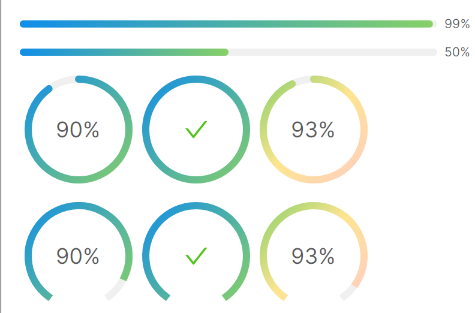

# 线条选项

### 线条端点
`StrokeLineCap` 属性可以用来设定线条两个端点的形状，默认是圆弧状，可以通过设定为Square变成矩形。


```xaml
<StackPanel Orientation="Vertical" Spacing="10">
    <atom:ProgressBar Value="75" Minimum="0" Maximum="100" StrokeLineCap="Square" />
    <WrapPanel Orientation="Horizontal">
        <atom:CircleProgress Value="75" Minimum="0" Maximum="100" StrokeLineCap="Square" />
        <atom:DashboardProgress Value="75" Minimum="0" Maximum="100" StrokeLineCap="Square" />
    </WrapPanel>
</StackPanel>
```

### 线条渐变

`StrokeBrush` 将两个颜色设定为渐变的开头与结束，比如下面的TwoStopsGradientStrokeColor值，具体数据参考view-model文件中的TwoStopsGradientStrokeColor属性。 



axaml文件：
```xaml
<StackPanel Orientation="Vertical" Spacing="10">
    <atom:ProgressBar Value="99" Minimum="0" Maximum="100"
                      StrokeBrush="{Binding TwoStopsGradientStrokeColor}" />
    <atom:ProgressBar Value="50" Minimum="0" Maximum="100"
                      StrokeBrush="{Binding TwoStopsGradientStrokeColor}" Status="Active" />
    <WrapPanel Orientation="Horizontal">
        <atom:CircleProgress Value="90" Minimum="0" Maximum="100"
                             StrokeBrush="{Binding TwoStopsGradientStrokeColor}" />
        <atom:CircleProgress Value="100" Minimum="0" Maximum="100"
                             StrokeBrush="{Binding TwoStopsGradientStrokeColor}" />
        <atom:CircleProgress Value="93" Minimum="0" Maximum="100"
                             StrokeBrush="{Binding ThreeStopsGradientStrokeColor}" />
    </WrapPanel>
    <WrapPanel Orientation="Horizontal">
        <atom:DashboardProgress Value="90" Minimum="0" Maximum="100" StrokeLineCap="Square"
                                StrokeBrush="{Binding TwoStopsGradientStrokeColor}" />
        <atom:DashboardProgress Value="100" Minimum="0" Maximum="100" StrokeLineCap="Square"
                                StrokeBrush="{Binding TwoStopsGradientStrokeColor}" />
        <atom:DashboardProgress Value="93" Minimum="0" Maximum="100" StrokeLineCap="Square"
                                StrokeBrush="{Binding ThreeStopsGradientStrokeColor}" />
    </WrapPanel>
</StackPanel>
```

view-model文件：
```csharp
using AtomUI.Controls;
using Avalonia.Media;
using ReactiveUI;

namespace AtomUIGallery.ShowCases.ViewModels;

public class ProgressBarViewModel : ReactiveObject, IRoutableViewModel
{
    public const string ID = "ProgressBar";
    
    public IScreen HostScreen { get; }
    
    public string UrlPathSegment { get; } = ID;
    
    private LinearGradientBrush _twoStopsGradientStrokeColor;

    public LinearGradientBrush TwoStopsGradientStrokeColor
    {
        get => _twoStopsGradientStrokeColor;
        set => this.RaiseAndSetIfChanged(ref _twoStopsGradientStrokeColor, value);
    }

    private LinearGradientBrush _threeStopsGradientStrokeColor;

    public LinearGradientBrush ThreeStopsGradientStrokeColor
    {
        get => _threeStopsGradientStrokeColor;
        set => this.RaiseAndSetIfChanged(ref _threeStopsGradientStrokeColor, value);
    }

    private List<IBrush> _stepsChunkBrushes;

    public List<IBrush> StepsChunkBrushes
    {
        get => _stepsChunkBrushes;
        set => this.RaiseAndSetIfChanged(ref _stepsChunkBrushes, value);
    }

    private PercentPosition _innerStartPercentPosition;

    public PercentPosition InnerStartPercentPosition
    {
        get => _innerStartPercentPosition;
        set => this.RaiseAndSetIfChanged(ref _innerStartPercentPosition, value);
    }

    private PercentPosition _innerCenterPercentPosition;

    public PercentPosition InnerCenterPercentPosition
    {
        get => _innerCenterPercentPosition;
        set => this.RaiseAndSetIfChanged(ref _innerCenterPercentPosition, value);
    }
    
    private PercentPosition _innerEndPercentPosition;

    public PercentPosition InnerEndPercentPosition
    {
        get => _innerEndPercentPosition;
        set => this.RaiseAndSetIfChanged(ref _innerEndPercentPosition, value);
    }

    private PercentPosition _outerStartPercentPosition;

    public PercentPosition OuterStartPercentPosition
    {
        get => _outerStartPercentPosition;
        set => this.RaiseAndSetIfChanged(ref _outerStartPercentPosition, value);
    }
    
    private PercentPosition _outerCenterPercentPosition;

    public PercentPosition OuterCenterPercentPosition
    {
        get => _outerCenterPercentPosition;
        set => this.RaiseAndSetIfChanged(ref _outerCenterPercentPosition, value);
    }
    
    private PercentPosition _outerEndPercentPosition;

    public PercentPosition OuterEndPercentPosition
    {
        get => _outerEndPercentPosition;
        set => this.RaiseAndSetIfChanged(ref _outerEndPercentPosition, value);
    }

    private double _progressValue = 30;

    public double ProgressValue
    {
        get => _progressValue;
        set => this.RaiseAndSetIfChanged(ref _progressValue, value);
    }

    private string? _toggleDisabledText;

    public string? ToggleDisabledText
    {
        get => _toggleDisabledText;
        set => this.RaiseAndSetIfChanged(ref _toggleDisabledText, value);
    }

    private bool _toggleStatus;

    public bool ToggleStatus
    {
        get => _toggleStatus;
        set => this.RaiseAndSetIfChanged(ref _toggleStatus, value);
    }

    public ProgressBarViewModel(IScreen screen)
    {
        HostScreen = screen;
        _twoStopsGradientStrokeColor = new LinearGradientBrush
        {
            GradientStops =
            {
                new GradientStop(Color.Parse("#108ee9"), 0),
                new GradientStop(Color.Parse("#87d068"), 1)
            }
        };
        _threeStopsGradientStrokeColor = new LinearGradientBrush
        {
            GradientStops =
            {
                new GradientStop(Color.Parse("#87d068"), 0),
                new GradientStop(Color.Parse("#ffe58f"), 0.5),
                new GradientStop(Color.Parse("#ffccc7"), 1)
            }
        };
        _stepsChunkBrushes = new List<IBrush>
        {
            new SolidColorBrush(Colors.Green),
            new SolidColorBrush(Colors.Green),
            new SolidColorBrush(Colors.Red)
        };

        _innerStartPercentPosition = new PercentPosition
        {
            IsInner   = true,
            Alignment = LinePercentAlignment.Start
        };
        _innerCenterPercentPosition = new PercentPosition
        {
            IsInner   = true,
            Alignment = LinePercentAlignment.Center
        };
        _innerEndPercentPosition = new PercentPosition
        {
            IsInner   = true,
            Alignment = LinePercentAlignment.End
        };

        _outerStartPercentPosition = new PercentPosition
        {
            IsInner   = false,
            Alignment = LinePercentAlignment.Start
        };
        _outerCenterPercentPosition = new PercentPosition
        {
            IsInner   = false,
            Alignment = LinePercentAlignment.Center
        };
        _outerEndPercentPosition = new PercentPosition
        {
            IsInner   = false,
            Alignment = LinePercentAlignment.End
        };
        _toggleStatus       = true;
        _toggleDisabledText = "Disable";
    }
    
    public void AddProgressValue()
    {
        var value = ProgressValue;
        value         += 10;
        ProgressValue =  Math.Min(value, 100);
    }

    public void SubProgressValue()
    {
        var value = ProgressValue;
        value         -= 10;
        ProgressValue =  Math.Max(value, 0);
    }

    public void ToggleEnabledStatus()
    {
        ToggleStatus = !ToggleStatus;
        if (ToggleStatus)
        {
            ToggleDisabledText = "Disable";
        }
        else
        {
            ToggleDisabledText = "Enable";
        }
    }
}
```