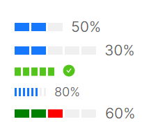

# Step进度条

`atom:ProgressBar` 是视觉上连续的不间断的进度条，而 `atom:StepsProgressBar` 则为带有隔断的进度条。

这个示例向开发者展示长条Step进度条与圆形Step进度条，这里需要额外提醒的一点是：Step进度条是优先保证视觉效果而采用了向上取整显示的进度。比如下面这个示例中，将 `Steps` 设定为3，整体进度为50%时，此时3个方块会由于向上取整会显示2个方块被占用，这是符合预期的。



```xaml
<StackPanel Orientation="Vertical" Spacing="5">
    <atom:StepsProgressBar Value="50" Minimum="0" Maximum="100" Steps="3" />
    <atom:StepsProgressBar Value="30" Minimum="0" Maximum="100" Steps="5" />
    <atom:StepsProgressBar Value="100" Minimum="0" Maximum="100" Steps="5" SizeType="Middle" />
    <atom:StepsProgressBar Value="80" Minimum="0" Maximum="100" Steps="8" SizeType="Small" />
    <atom:StepsProgressBar Value="60" Minimum="0" Maximum="100" Steps="5"
                           StepsStrokeBrush="{Binding StepsChunkBrushes}" />
</StackPanel>
```

下面示例是圆形Step进度条，圆形进度条分成 `CircleProgress` 与 `DashboardProgress` 两类，二者区别就是后者为了更像一个仪表盘，会在最下方缺少一节圆环。

要留意这两个关键属性：
* `StepCount`属性表示圆形进度条被分成了几块
* `StepGap`属性表示每个块之间的间距
* `SuccessThreshold` 属性用于设置成功状态的阈值
* `IndicatorThickness` 用于设定圆环的厚度

最后是 `CircleProgress` 与 `DashboardProgress` 两个子组件之间并没有继承关系，二者是完全相互独立的组件，二者共同继承的是 `AbstractCircleProgress` 类。


```xaml
<StackPanel Orientation="Vertical" Spacing="5">
    <WrapPanel Orientation="Horizontal">
        <atom:CircleProgress Value="50" Minimum="0" Maximum="100" StepCount="4" StepGap="8"
                             IndicatorThickness="20" />
        <atom:CircleProgress Value="100" Minimum="0" Maximum="100" StepCount="10" StepGap="8"
                             IndicatorThickness="20" />
        <atom:CircleProgress Value="77" Minimum="0" Maximum="100" StepCount="8" StepGap="10"
                             IndicatorThickness="20" Status="Exception" />
        <atom:CircleProgress Value="77" Minimum="0" Maximum="100" StepCount="8" StepGap="10"
                             IndicatorThickness="20"
                             SuccessThreshold="30" />
    </WrapPanel>
    <WrapPanel Orientation="Horizontal">
        <atom:DashboardProgress Value="50" Minimum="0" Maximum="100" StepCount="4" StepGap="8"
                                IndicatorThickness="20" />
        <atom:DashboardProgress Value="70" Minimum="0" Maximum="100" StepCount="10" StepGap="8"
                                IndicatorThickness="20" />
        <atom:DashboardProgress Value="77" Minimum="0" Maximum="100" StepCount="8" StepGap="10"
                                IndicatorThickness="20" Status="Exception" />
        <atom:DashboardProgress Value="77" Minimum="0" Maximum="100" StepCount="8" StepGap="10"
                                IndicatorThickness="20"
                                SuccessThreshold="30" />
    </WrapPanel>
</StackPanel>
```
