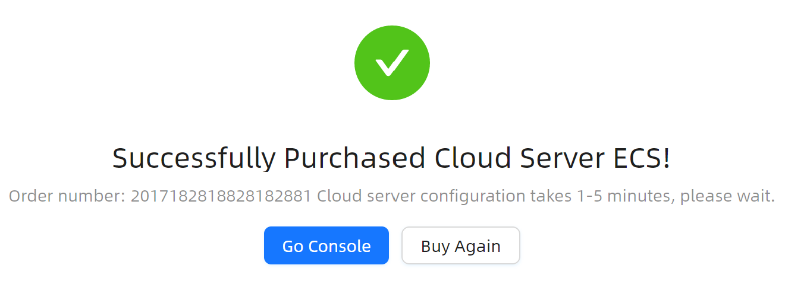
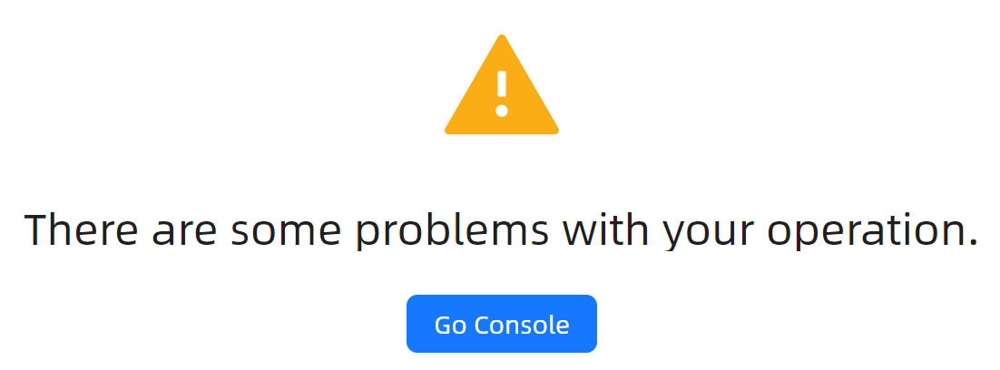
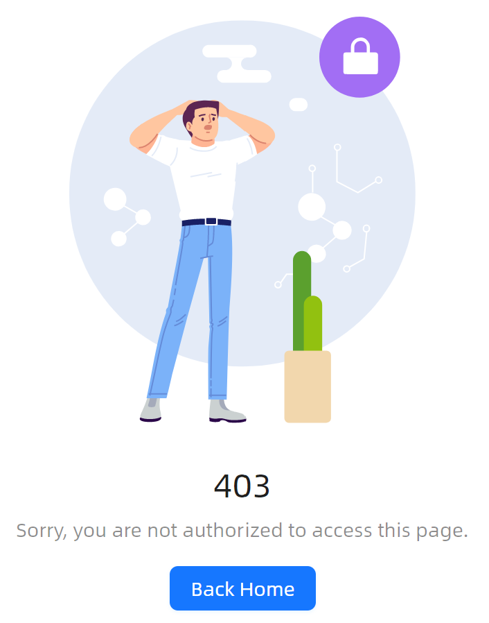
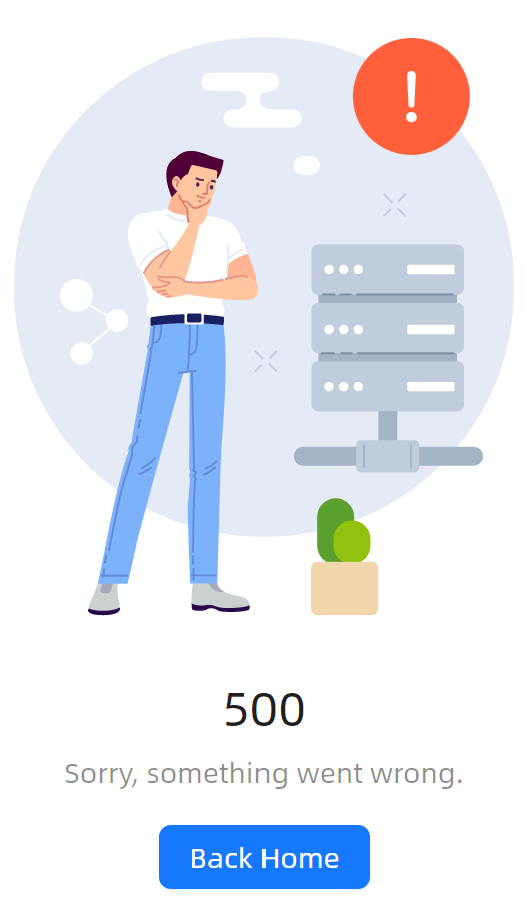
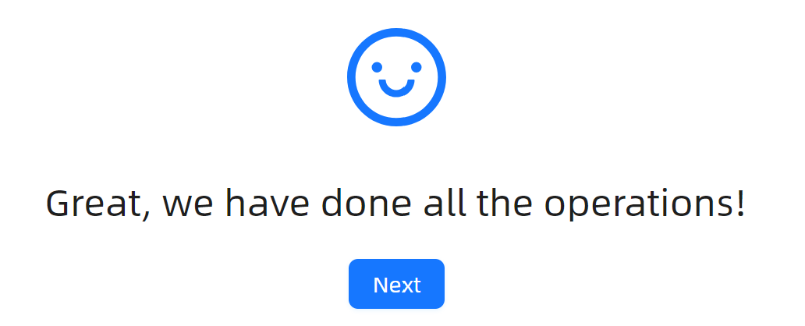

# Result 快速入门

### 基础配置条件

* Nuget安装Avalonia
* Nuget安装AtomUI

在下面的文档中，以不同业务场景作为分类，简单介绍如何使用 `Result` 组件。

### Success

一个典型的 `Result` 结构主要是由下面四个属性组成：
* `Status`: 状态。默认为 `Success`。
* `Header`: 标题。
* `SubHeader`: 子标题。
* `Extra`: 额外的内容。在Extra中，开发者可以塞入大量自定义的布局



```xaml
<atom:Result Status="Success"
             Header="Successfully Purchased Cloud Server ECS!"
             SubHeader="Order number: 2017182818828182881 Cloud server configuration takes 1-5 minutes, please wait.">
    <atom:Result.Extra>
        <StackPanel Orientation="Horizontal" Spacing="10">
            <atom:Button ButtonType="Primary">Go Console</atom:Button>
            <atom:Button>Buy Again</atom:Button>
        </StackPanel>
    </atom:Result.Extra>
</atom:Result>
```

### Info


```xaml
<atom:Result Status="Info"
             Header="Your operation has been executed.">
    <atom:Result.Extra>
        <atom:Button ButtonType="Primary">Go Console</atom:Button>
    </atom:Result.Extra>
</atom:Result>
```

### Warning



```xaml
<atom:Result Status="Warning"
             Header="There are some problems with your operation.">
    <atom:Result.Extra>
        <atom:Button ButtonType="Primary">Go Console</atom:Button>
    </atom:Result.Extra>
</atom:Result>
```

### HTTP 403/404/500






```xaml
<atom:Result Status="ErrorCode403"
             Header="403"
             SubHeader="Sorry, you are not authorized to access this page.">
    <atom:Result.Extra>
        <atom:Button ButtonType="Primary">Back Home</atom:Button>
    </atom:Result.Extra>
</atom:Result>

<atom:Result Status="ErrorCode404"
             Header="404"
             SubHeader="Sorry, the page you visited does not exist.">
    <atom:Result.Extra>
        <atom:Button ButtonType="Primary">Back Home</atom:Button>
    </atom:Result.Extra>
</atom:Result>

<atom:Result Status="ErrorCode500"
             Header="500"
             SubHeader="Sorry, something went wrong.">
    <atom:Result.Extra>
        <atom:Button ButtonType="Primary">Back Home</atom:Button>
    </atom:Result.Extra>
</atom:Result>
```

### Error


```xaml
<atom:Result Status="Error"
                         Header="Submission Failed"
                         SubHeader="Please check and modify the following information before resubmitting.">
    <atom:Result.Extra>
        <StackPanel Orientation="Horizontal" Spacing="10">
            <atom:Button ButtonType="Primary">Go Console</atom:Button>
            <atom:Button>Buy Again</atom:Button>
        </StackPanel>
    </atom:Result.Extra>
    <StackPanel Spacing="8">
        <TextBlock FontWeight="Bold" FontSize="16">
            The content you submitted has the following error:
        </TextBlock>

        <StackPanel Orientation="Horizontal" Spacing="8">
            <antdicons:CloseCircleOutlined Foreground="{DynamicResource {x:Static atom:SharedTokenKey.ColorError}}"/>
            <TextBlock>Your account has been frozen. </TextBlock>
            <TextBlock Foreground="{DynamicResource {x:Static atom:SharedTokenKey.ColorPrimary}}">Thaw immediately ></TextBlock>
        </StackPanel>

        <StackPanel Orientation="Horizontal" Spacing="8">
            <antdicons:CloseCircleOutlined Foreground="{DynamicResource {x:Static atom:SharedTokenKey.ColorError}}"/>
            <TextBlock>Your account is not yet eligible to apply. </TextBlock>
            <TextBlock Foreground="{DynamicResource {x:Static atom:SharedTokenKey.ColorPrimary}}">Apply Unlock ></TextBlock>
        </StackPanel>
    </StackPanel>
</atom:Result>
```

### Custom自定义图标

通过组件的 `Icon` 属性，开发者可以自定义图标，图标默认使用 `antdicons` 提供的图标库。



```xaml
<atom:Result Status="Info"
             Icon="{antdicons:AntDesignIconProvider SmileOutlined}"
             Header="Great, we have done all the operations!">
    <atom:Result.Extra>
        <atom:Button ButtonType="Primary">Next</atom:Button>
    </atom:Result.Extra>
</atom:Result>
```