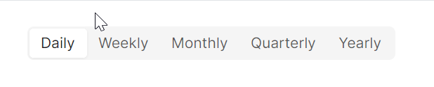
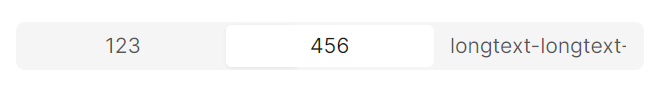
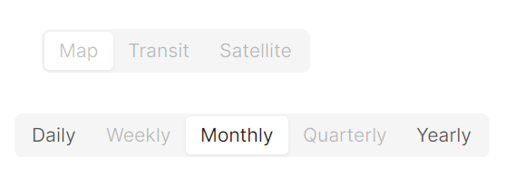

# Segmented 快速入门

### 基础配置条件

* Nuget安装Avalonia
* Nuget安装AtomUI

### 基础用法

`Segmented` 组件是由 `atom:Segmented` 包裹内部的 `atom:SegmentedItem` 组成。



```xaml
<StackPanel HorizontalAlignment="Left" Orientation="Vertical" Spacing="10">
    <atom:Segmented Margin="20">
        <atom:SegmentedItem>Daily</atom:SegmentedItem>
        <atom:SegmentedItem>Weekly</atom:SegmentedItem>
        <atom:SegmentedItem>Monthly</atom:SegmentedItem>
        <atom:SegmentedItem>Quarterly</atom:SegmentedItem>
        <atom:SegmentedItem>Yearly</atom:SegmentedItem>
    </atom:Segmented>
</StackPanel>
```

### Block

通过设置 `IsExpanding` 属性为True，让所有 `atom:SegmentedItem` 平均分配可用的水平空间，每个选项的宽度相等，整个控件占据父容器的完整宽度。



```xaml
<StackPanel HorizontalAlignment="Stretch" Orientation="Vertical">
    <atom:Segmented IsExpanding="True" Margin="20">
        <atom:SegmentedItem>123</atom:SegmentedItem>
        <atom:SegmentedItem>456</atom:SegmentedItem>
        <atom:SegmentedItem>longtext-longtext-longtext-longtext</atom:SegmentedItem>
    </atom:Segmented>
</StackPanel>
```

### 禁用

`IsEnabled` 属性用于设定控件禁用/启用状态。



```xaml
<StackPanel HorizontalAlignment="Stretch" Orientation="Vertical" Spacing="10">
    <atom:Segmented Margin="20">
        <atom:SegmentedItem IsEnabled="False">Map</atom:SegmentedItem>
        <atom:SegmentedItem IsEnabled="False">Transit</atom:SegmentedItem>
        <atom:SegmentedItem IsEnabled="False">Satellite</atom:SegmentedItem>
    </atom:Segmented>
    <atom:Segmented>
        <atom:SegmentedItem>Daily</atom:SegmentedItem>
        <atom:SegmentedItem IsEnabled="False">Weekly</atom:SegmentedItem>
        <atom:SegmentedItem>Monthly</atom:SegmentedItem>
        <atom:SegmentedItem IsEnabled="False">Quarterly</atom:SegmentedItem>
        <atom:SegmentedItem>Yearly</atom:SegmentedItem>
    </atom:Segmented>
</StackPanel>
```

### 尺寸大小

`SizeType` 属性用于设定控件的尺寸大小。


```xaml
<StackPanel HorizontalAlignment="Left" Orientation="Vertical" Spacing="10">
    <atom:Segmented SizeType="Large" Margin="20">
        <atom:SegmentedItem>Daily</atom:SegmentedItem>
        <atom:SegmentedItem>Weekly</atom:SegmentedItem>
        <atom:SegmentedItem>Monthly</atom:SegmentedItem>
        <atom:SegmentedItem>Quarterly</atom:SegmentedItem>
        <atom:SegmentedItem>Yearly</atom:SegmentedItem>
    </atom:Segmented>

    <atom:Segmented Margin="20">
        <atom:SegmentedItem>Daily</atom:SegmentedItem>
        <atom:SegmentedItem>Weekly</atom:SegmentedItem>
        <atom:SegmentedItem>Monthly</atom:SegmentedItem>
        <atom:SegmentedItem>Quarterly</atom:SegmentedItem>
        <atom:SegmentedItem>Yearly</atom:SegmentedItem>
    </atom:Segmented>

    <atom:Segmented SizeType="Small" Margin="20">
        <atom:SegmentedItem>Daily</atom:SegmentedItem>
        <atom:SegmentedItem>Weekly</atom:SegmentedItem>
        <atom:SegmentedItem>Monthly</atom:SegmentedItem>
        <atom:SegmentedItem>Quarterly</atom:SegmentedItem>
        <atom:SegmentedItem>Yearly</atom:SegmentedItem>
    </atom:Segmented>
</StackPanel>
```