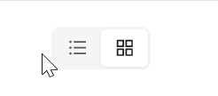

# 图标

### 只含图标

`Icon` 属性用于给每个Item设定一个图标，具体图标可以参考 `AtomUI` 图标库。



```xaml
<StackPanel HorizontalAlignment="Left" Orientation="Vertical" Spacing="10">
    <atom:Segmented Margin="20">
        <atom:SegmentedItem Icon="{atom:IconProvider Kind=BarsOutlined}" />
        <atom:SegmentedItem Icon="{atom:IconProvider Kind=AppstoreOutlined}" />
    </atom:Segmented>
</StackPanel>
```

### 图标文字混合

可以通过包裹文字的方式实现图标文字混合展示。


```xaml
<StackPanel HorizontalAlignment="Left" Orientation="Vertical" Spacing="10">
    <atom:Segmented Margin="20">
        <atom:SegmentedItem Icon="{atom:IconProvider Kind=BarsOutlined}">
            List
        </atom:SegmentedItem>
        <atom:SegmentedItem Content="Kanban" Icon="{atom:IconProvider Kind=AppstoreOutlined}" />
    </atom:Segmented>

    <atom:Segmented Margin="20">
        <atom:SegmentedItem Icon="{atom:IconProvider Kind=BarsOutlined}">
            Ava 牛逼
        </atom:SegmentedItem>
        <atom:SegmentedItem Content="群主牛逼" Icon="{atom:IconProvider Kind=WechatOutlined}" IsEnabled="False"/>

        <atom:SegmentedItem Content="微软牛逼"
                            Icon="{atom:IconProvider Kind=WindowsOutlined}" />

    </atom:Segmented>

    <atom:Segmented SizeType="Large" Margin="20">
        <atom:SegmentedItem Icon="{atom:IconProvider Kind=BarsOutlined}">
            Ava 牛逼
        </atom:SegmentedItem>
        <atom:SegmentedItem Content="群主牛逼" Icon="{atom:IconProvider Kind=WechatOutlined}" />

        <atom:SegmentedItem Content="微软牛逼"
                            Icon="{atom:IconProvider Kind=WindowsOutlined}" />

    </atom:Segmented>

</StackPanel>
```