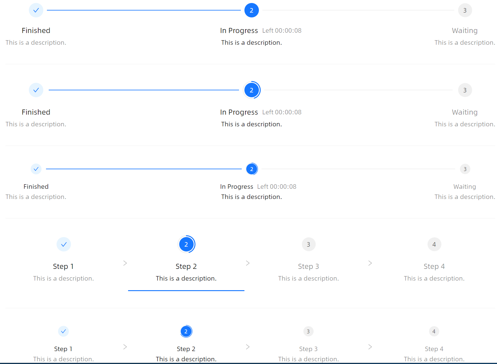

# 标签位置



```xaml
<StackPanel Orientation="Vertical" Spacing="20">
    <atom:Steps CurrentStep="1" LabelPlacement="Vertical">
        <atom:StepsItem Header="Finished" Description="This is a description." />
        <atom:StepsItem Header="In Progress" Description="This is a description." SubHeader="Left 00:00:08" />
        <atom:StepsItem Header="Waiting" Description="This is a description." />
    </atom:Steps>
    <atom:Separator />
    <atom:Steps CurrentStep="1" LabelPlacement="Vertical" ProgressValue="45" IsShowItemProgress="True">
        <atom:StepsItem Header="Finished" Description="This is a description." />
        <atom:StepsItem Header="In Progress" Description="This is a description." SubHeader="Left 00:00:08" />
        <atom:StepsItem Header="Waiting" Description="This is a description." />
    </atom:Steps>
    <atom:Separator />
    <atom:Steps CurrentStep="1" LabelPlacement="Vertical" ProgressValue="45" IsShowItemProgress="True" SizeType="Small">
        <atom:StepsItem Header="Finished" Description="This is a description." />
        <atom:StepsItem Header="In Progress" Description="This is a description." SubHeader="Left 00:00:08" />
        <atom:StepsItem Header="Waiting" Description="This is a description." />
    </atom:Steps>
    <atom:Separator />
    <atom:Steps CurrentStep="1" Style="Navigation" IsItemClickable="True" ProgressValue="45" IsShowItemProgress="True" LabelPlacement="Vertical">
        <atom:StepsItem Header="Step 1" Description="This is a description."/>
        <atom:StepsItem Header="Step 2" Description="This is a description."/>
        <atom:StepsItem Header="Step 3" Description="This is a description."/>
        <atom:StepsItem Header="Step 4" Description="This is a description."/>
    </atom:Steps>
    <atom:Separator />
    <atom:Steps CurrentStep="1" Style="Navigation" IsItemClickable="True" ProgressValue="67" IsShowItemProgress="True" LabelPlacement="Vertical" SizeType="Small">
        <atom:StepsItem Header="Step 1" Description="This is a description."/>
        <atom:StepsItem Header="Step 2" Description="This is a description."/>
        <atom:StepsItem Header="Step 3" Description="This is a description."/>
        <atom:StepsItem Header="Step 4" Description="This is a description."/>
    </atom:Steps>
</StackPanel>
```