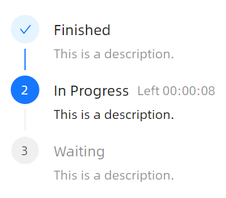
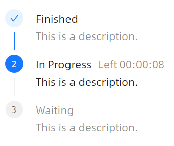

# 垂直步骤条

### 基础用法



```xaml
<atom:Steps CurrentStep="1" Orientation="Vertical">
    <atom:StepsItem Header="Finished" Description="This is a description." />
    <atom:StepsItem Header="In Progress" Description="This is a description." SubHeader="Left 00:00:08" />
    <atom:StepsItem Header="Waiting" Description="This is a description." />
</atom:Steps>
```

### Mini尺寸



```xaml
<atom:Steps CurrentStep="1" Orientation="Vertical" SizeType="Small">
    <atom:StepsItem Header="Finished" Description="This is a description." />
    <atom:StepsItem Header="In Progress" Description="This is a description." SubHeader="Left 00:00:08" />
    <atom:StepsItem Header="Waiting" Description="This is a description." />
</atom:Steps>
```
