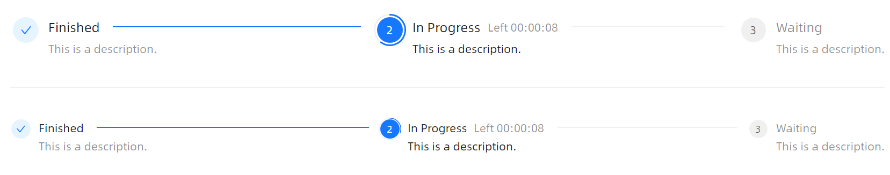

# 带有进度



```xaml
<StackPanel Orientation="Vertical" Spacing="20">
    <atom:Steps CurrentStep="1" ProgressValue="60" IsShowItemProgress="True">
        <atom:StepsItem Header="Finished" Description="This is a description." />
        <atom:StepsItem Header="In Progress" Description="This is a description." SubHeader="Left 00:00:08" />
        <atom:StepsItem Header="Waiting" Description="This is a description." />
    </atom:Steps>
    <atom:Separator/>
    <atom:Steps CurrentStep="1" ProgressValue="30" IsShowItemProgress="True" SizeType="Small">
        <atom:StepsItem Header="Finished" Description="This is a description." />
        <atom:StepsItem Header="In Progress" Description="This is a description." SubHeader="Left 00:00:08" />
        <atom:StepsItem Header="Waiting" Description="This is a description." />
    </atom:Steps>
</StackPanel>
```