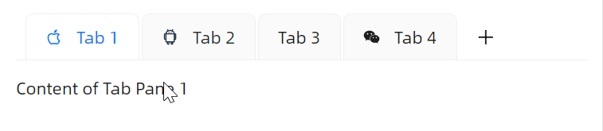

# 动态管理Tab

### 关闭tab

`IsTabClosable` 设定为True即可关闭tab。


```xaml
<StackPanel Orientation="Vertical" Spacing="20">
    <atom:CardTabControl IsTabClosable="True"
                         IsTabAutoHideCloseButton="True">
        <atom:TabItem Header="Tab 1" Icon="{atom:IconProvider Kind=AppleOutlined}">
            Content of Tab Pane 1
        </atom:TabItem>
        <atom:TabItem Header="Tab 2"
                      Icon="{atom:IconProvider Kind=AndroidOutlined}"
                      IsClosable="False">
            Content of Tab Pane 2
        </atom:TabItem>
        <atom:TabItem Header="Tab 3" Icon="{atom:IconProvider Kind=WechatOutlined}">
            Content of Tab Pane 3
        </atom:TabItem>
    </atom:CardTabControl>

    <atom:TabControl IsTabClosable="True"
                     IsTabAutoHideCloseButton="True">
        <atom:TabItem Header="Tab 1" Icon="{atom:IconProvider Kind=AppleOutlined}">
            Content of Tab Pane 1
        </atom:TabItem>
        <atom:TabItem Header="Tab 2"
                      Icon="{atom:IconProvider Kind=AndroidOutlined}"
                      IsClosable="False">
            Content of Tab Pane 2
        </atom:TabItem>
        <atom:TabItem Header="Tab 3" Icon="{atom:IconProvider Kind=WechatOutlined}">
            Content of Tab Pane 3
        </atom:TabItem>
    </atom:TabControl>
</StackPanel>
```

### 打开tab

如果业务场景中需要动态添加tab，可以将 `IsShowAddTabButton` 设定为True，这样即可根据业务动态添加新的Tab。



```xaml
<atom:CardTabControl IsShowAddTabButton="True" Name="AddTabDemoTabControl">
    <atom:TabItem Header="Tab 1" Icon="{atom:IconProvider Kind=AppleOutlined}">Content of Tab Pane 1</atom:TabItem>
    <atom:TabItem Header="Tab 2" Icon="{atom:IconProvider Kind=AndroidOutlined}">Content of Tab Pane 2</atom:TabItem>
    <atom:TabItem Header="Tab 3">Content of Tab Pane 3</atom:TabItem>
    <atom:TabItem Header="Tab 4" Icon="{atom:IconProvider Kind=WechatOutlined}">Content of Tab Pane 4</atom:TabItem>
</atom:CardTabControl>
```

