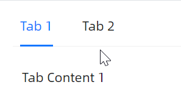

# 快速入门

### 基础配置条件

* Nuget安装Avalonia
* Nuget安装AtomUI

### 基础用法

一段最简单的示例代码展示给开发者们。


```xaml
<StackPanel Orientation="Vertical" Spacing="20">
    <atom:TabControl Name="TestControl">
        <atom:TabItem Header="Tab 1">Content of Tab Pane 1</atom:TabItem>
        <atom:TabItem Header="Tab 2">Content of Tab Pane 2</atom:TabItem>
        <atom:TabItem Header="Tab 3">Content of Tab Pane 3</atom:TabItem>
    </atom:TabControl>
</StackPanel>
```

### ItemsSource

使用 `ItemsSource` 属性才是开发者的日常。



```xaml
<StackPanel Orientation="Vertical" Spacing="20">
    <atom:TabControl ItemsSource="{Binding TabItemDataSource}">
        <atom:TabControl.ItemTemplate>
            <DataTemplate>
                <Border Padding="10">
                    <TextBlock Text="{Binding Content}" />
                </Border>
            </DataTemplate>
        </atom:TabControl.ItemTemplate>
    </atom:TabControl>
</StackPanel>
```

### 禁用

如果需要禁用单独的某个Tab，可以使用 `IsEnabled` 属性并就将其设定为False。


```xaml
<StackPanel Orientation="Vertical" Spacing="20">
    <atom:CardTabControl HeaderStartEdgePadding="">
        <atom:TabItem Header="Tab 1">Content of Tab Pane 1</atom:TabItem>
        <atom:TabItem Header="Tab 2" IsEnabled="False">Content of Tab Pane 2</atom:TabItem>
        <atom:TabItem Header="Tab 3">Content of Tab Pane 3</atom:TabItem>
    </atom:CardTabControl>

    <atom:TabControl>
        <atom:TabItem Header="Tab 1">Content of Tab Pane 1</atom:TabItem>
        <atom:TabItem Header="Tab 2" IsEnabled="False">Content of Tab Pane 2</atom:TabItem>
        <atom:TabItem Header="Tab 3">Content of Tab Pane 3</atom:TabItem>
    </atom:TabControl>
</StackPanel>
```

### 整体居中

将 `TabAlignmentCenter` 属性设置为True会将整个 `TabControl` 组件居中显示。


```xaml
<StackPanel Orientation="Vertical" Spacing="20">
    <atom:TabControl TabAlignmentCenter="True">
        <atom:TabItem Header="Tab 1">Content of Tab Pane 1</atom:TabItem>
        <atom:TabItem Header="Tab 2">Content of Tab Pane 2</atom:TabItem>
        <atom:TabItem Header="Tab 3">Content of Tab Pane 3</atom:TabItem>
    </atom:TabControl>

    <atom:CardTabControl TabAlignmentCenter="True">
        <atom:TabItem Header="Tab 1">Content of Tab Pane 1</atom:TabItem>
        <atom:TabItem Header="Tab 2">Content of Tab Pane 2</atom:TabItem>
        <atom:TabItem Header="Tab 3">Content of Tab Pane 3</atom:TabItem>
    </atom:CardTabControl>

</StackPanel>
```

### 带图标

`Icon` 属性是老面孔了，同样它的值也是老面孔，即 `atom:IconProvider`。


```xaml
<StackPanel Orientation="Vertical" Spacing="20">
    <atom:TabControl>
        <atom:TabItem Header="Tab 1" Icon="{atom:IconProvider Kind=AppleOutlined}">Content of Tab Pane 1</atom:TabItem>
        <atom:TabItem Header="Tab 2" Icon="{atom:IconProvider Kind=AndroidOutlined}">Content of Tab Pane 2</atom:TabItem>
        <atom:TabItem Header="Tab 3" Icon="{atom:IconProvider Kind=WechatOutlined}">Content of Tab Pane 3</atom:TabItem>
    </atom:TabControl>
</StackPanel>
```

### 大小尺寸

`SizeType` 属性可选值有Large、Middle、Small。


```xaml
<StackPanel Orientation="Vertical" Spacing="20">
    <StackPanel Orientation="Horizontal" Spacing="5">
        <atom:TextBlock VerticalAlignment="Center">Tab position:</atom:TextBlock>
        <atom:OptionButtonGroup ButtonStyle="Outline" Name="SizeTypeTabControlOptionGroup">
            <atom:OptionButton>Small</atom:OptionButton>
            <atom:OptionButton IsChecked="True">Middle</atom:OptionButton>
            <atom:OptionButton>Large</atom:OptionButton>
        </atom:OptionButtonGroup>
    </StackPanel>

    <atom:TabControl SizeType="{Binding SizeTypeTabControl}">
        <atom:TabItem Header="Tab 1" Icon="{atom:IconProvider Kind=AppleOutlined}">Content of Tab Pane 1</atom:TabItem>
        <atom:TabItem Header="Tab 2" Icon="{atom:IconProvider Kind=AndroidOutlined}">Content of Tab Pane 2</atom:TabItem>
        <atom:TabItem Header="Tab 3">Content of Tab Pane 3</atom:TabItem>
        <atom:TabItem Header="Tab 4" Icon="{atom:IconProvider Kind=WechatOutlined}">Content of Tab Pane 4</atom:TabItem>
    </atom:TabControl>

    <atom:CardTabControl SizeType="{Binding SizeTypeTabControl}">
        <atom:TabItem Header="Tab 1" Icon="{atom:IconProvider Kind=AppleOutlined}">Content of Tab Pane 1</atom:TabItem>
        <atom:TabItem Header="Tab 2" Icon="{atom:IconProvider Kind=AndroidOutlined}">Content of Tab Pane 2</atom:TabItem>
        <atom:TabItem Header="Tab 3">Content of Tab Pane 3</atom:TabItem>
        <atom:TabItem Header="Tab 4" Icon="{atom:IconProvider Kind=WechatOutlined}">Content of Tab Pane 4</atom:TabItem>
    </atom:CardTabControl>

</StackPanel>
```