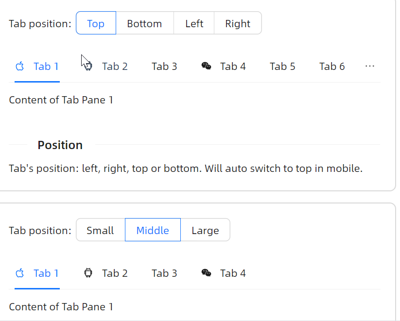

# 位置

通过 `TabStripPlacement` 属性设置tab的位置。在本示例中，通过一个 `OptionButton` 组件来修改设置tab的位置，本质上就是调整 `TabStripPlacement` 绑定的值。



```xaml
<StackPanel Orientation="Vertical" Spacing="20">
    <StackPanel Orientation="Horizontal" Spacing="5">
        <atom:TextBlock VerticalAlignment="Center">Tab position:</atom:TextBlock>
        <atom:OptionButtonGroup ButtonStyle="Outline" Name="PositionTabStripOptionGroup">
            <atom:OptionButton IsChecked="True">Top</atom:OptionButton>
            <atom:OptionButton>Bottom</atom:OptionButton>
            <atom:OptionButton>Left</atom:OptionButton>
            <atom:OptionButton>Right</atom:OptionButton>
        </atom:OptionButtonGroup>
    </StackPanel>

    <DockPanel Height="300">
        <atom:TabStrip Name="PositionTabStrip"
                       DockPanel.Dock="{Binding PositionTabStripPlacement}"
                       TabStripPlacement="{Binding PositionTabStripPlacement}">
            <atom:TabStripItem Icon="{atom:IconProvider Kind=AppleOutlined}">Tab 1</atom:TabStripItem>
            <atom:TabStripItem Icon="{atom:IconProvider Kind=AndroidOutlined}">Tab 2</atom:TabStripItem>
            <atom:TabStripItem>Tab 3</atom:TabStripItem>
            <atom:TabStripItem Icon="{atom:IconProvider Kind=GithubOutlined}" IsClosable="True">Tab 4</atom:TabStripItem>
            <atom:TabStripItem>Tab 5</atom:TabStripItem>
            <atom:TabStripItem>Tab 6</atom:TabStripItem>
            <atom:TabStripItem>Tab 7</atom:TabStripItem>
            <atom:TabStripItem>Tab 8</atom:TabStripItem>
            <atom:TabStripItem>Tab 9</atom:TabStripItem>
            <atom:TabStripItem>Tab 10</atom:TabStripItem>
            <atom:TabStripItem>Tab 11</atom:TabStripItem>
            <atom:TabStripItem>Tab 12</atom:TabStripItem>
            <atom:TabStripItem>Tab 13</atom:TabStripItem>
            <atom:TabStripItem>Tab 14</atom:TabStripItem>
        </atom:TabStrip>
        <Border HorizontalAlignment="Stretch" VerticalAlignment="Stretch"
                Background="{DynamicResource {x:Static atom:SharedTokenKey.ColorBgElevated}}">
            <TextBlock HorizontalAlignment="Center" VerticalAlignment="Center">Tab Content</TextBlock>
        </Border>
    </DockPanel>

</StackPanel>
```

卡片形式的Tab同样也支持上述位置设定。


```xaml
<StackPanel Orientation="Vertical" Spacing="20">
    <StackPanel Orientation="Horizontal" Spacing="5">
        <TextBlock VerticalAlignment="Center">Tab position:</TextBlock>
        <atom:OptionButtonGroup ButtonStyle="Outline" Name="PositionCardTabStripOptionGroup">
            <atom:OptionButton IsChecked="True">Top</atom:OptionButton>
            <atom:OptionButton>Bottom</atom:OptionButton>
            <atom:OptionButton>Left</atom:OptionButton>
            <atom:OptionButton>Right</atom:OptionButton>
        </atom:OptionButtonGroup>
    </StackPanel>

    <DockPanel Height="300">
        <atom:CardTabStrip Name="PositionCardTabStrip"
                           DockPanel.Dock="{Binding PositionCardTabStripPlacement}"
                           TabStripPlacement="{Binding PositionCardTabStripPlacement}"
                           IsShowAddTabButton="True">
            <atom:TabStripItem Icon="{atom:IconProvider Kind=AppleOutlined}">Tab 1</atom:TabStripItem>
            <atom:TabStripItem Icon="{atom:IconProvider Kind=AndroidOutlined}">Tab 2</atom:TabStripItem>
            <atom:TabStripItem>Tab 3</atom:TabStripItem>
            <atom:TabStripItem Icon="{atom:IconProvider Kind=GithubOutlined}" IsClosable="True">Tab 4</atom:TabStripItem>
        </atom:CardTabStrip>
        <Border HorizontalAlignment="Stretch" VerticalAlignment="Stretch"
                Background="{DynamicResource {x:Static atom:SharedTokenKey.ColorBgElevated}}">
            <TextBlock HorizontalAlignment="Center" VerticalAlignment="Center">Tab Content</TextBlock>
        </Border>
    </DockPanel>

</StackPanel>
```