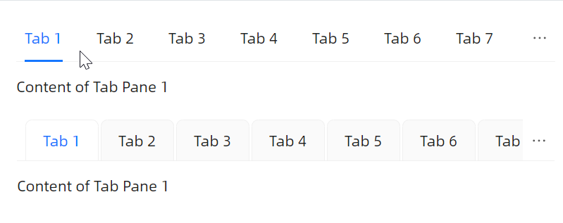

# 横向滑动

滑动特性是 `TabControl` 和 `CardTabControl` 的原生内置特性，不需要设置任何属性就可以直接使用。



```xaml
<StackPanel Orientation="Vertical" Spacing="20">
    <atom:TabControl>
        <atom:TabItem Header="Tab 1">Content of Tab Pane 1</atom:TabItem>
        <atom:TabItem Header="Tab 2">Content of Tab Pane 2</atom:TabItem>
        <atom:TabItem Header="Tab 3">Content of Tab Pane 3</atom:TabItem>
        <atom:TabItem Header="Tab 4">Content of Tab Pane 4</atom:TabItem>
        <atom:TabItem Header="Tab 5">Content of Tab Pane 5</atom:TabItem>
        <atom:TabItem Header="Tab 6">Content of Tab Pane 6</atom:TabItem>
        <atom:TabItem Header="Tab 7">Content of Tab Pane 7</atom:TabItem>
        <atom:TabItem Header="Tab 8">Content of Tab Pane 8</atom:TabItem>
        <atom:TabItem Header="Tab 9">Content of Tab Pane 9</atom:TabItem>
        <atom:TabItem Header="Tab 10">Content of Tab Pane 10</atom:TabItem>
        <atom:TabItem Header="Tab 11">Content of Tab Pane 11</atom:TabItem>
        <atom:TabItem Header="Tab 12">Content of Tab Pane 12</atom:TabItem>
        <atom:TabItem Header="Tab 13">Content of Tab Pane 13</atom:TabItem>
        <atom:TabItem Header="Tab 14">Content of Tab Pane 14</atom:TabItem>
        <atom:TabItem Header="Tab 15">Content of Tab Pane 15</atom:TabItem>
        <atom:TabItem Header="Tab 16">Content of Tab Pane 16</atom:TabItem>
        <atom:TabItem Header="Tab 17">Content of Tab Pane 17</atom:TabItem>
        <atom:TabItem Header="Tab 18">Content of Tab Pane 18</atom:TabItem>
        <atom:TabItem Header="Tab 19">Content of Tab Pane 19</atom:TabItem>
        <atom:TabItem Header="Tab 20">Content of Tab Pane 20</atom:TabItem>
    </atom:TabControl>

    <atom:CardTabControl>
        <atom:TabItem Header="Tab 1">Content of Tab Pane 1</atom:TabItem>
        <atom:TabItem Header="Tab 2">Content of Tab Pane 2</atom:TabItem>
        <atom:TabItem Header="Tab 3">Content of Tab Pane 3</atom:TabItem>
        <atom:TabItem Header="Tab 4">Content of Tab Pane 4</atom:TabItem>
        <atom:TabItem Header="Tab 5">Content of Tab Pane 5</atom:TabItem>
        <atom:TabItem Header="Tab 6">Content of Tab Pane 6</atom:TabItem>
        <atom:TabItem Header="Tab 7">Content of Tab Pane 7</atom:TabItem>
        <atom:TabItem Header="Tab 8">Content of Tab Pane 8</atom:TabItem>
        <atom:TabItem Header="Tab 9">Content of Tab Pane 9</atom:TabItem>
        <atom:TabItem Header="Tab 10">Content of Tab Pane 10</atom:TabItem>
        <atom:TabItem Header="Tab 11">Content of Tab Pane 11</atom:TabItem>
        <atom:TabItem Header="Tab 12">Content of Tab Pane 12</atom:TabItem>
        <atom:TabItem Header="Tab 13">Content of Tab Pane 13</atom:TabItem>
        <atom:TabItem Header="Tab 14">Content of Tab Pane 14</atom:TabItem>
        <atom:TabItem Header="Tab 15">Content of Tab Pane 15</atom:TabItem>
        <atom:TabItem Header="Tab 16">Content of Tab Pane 16</atom:TabItem>
        <atom:TabItem Header="Tab 17">Content of Tab Pane 17</atom:TabItem>
        <atom:TabItem Header="Tab 18">Content of Tab Pane 18</atom:TabItem>
        <atom:TabItem Header="Tab 19">Content of Tab Pane 19</atom:TabItem>
        <atom:TabItem Header="Tab 20">Content of Tab Pane 20</atom:TabItem>
    </atom:CardTabControl>
</StackPanel>
```
