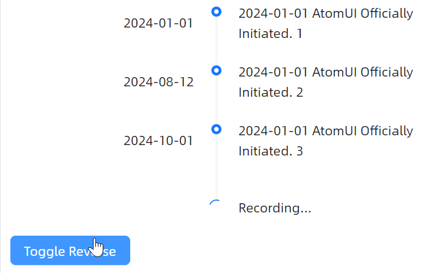

# 快速反转

当 `IsReverse` 为 `False` 时，时间线按正常时间顺序从上到下显示；当 `IsReverse` 为 `True` 时，时间线按相反顺序显示，最新的条目出现在顶部。具体参考code-behind代码是如何控制 `IsReverse` 属性的。



axaml文件：
```xaml
<StackPanel>
    <atom:Timeline
        Pending="Recording..."
        IsReverse="False"
        x:Name="ReverseTimeline">
        <atom:TimelineItem Label="2024-01-01">
            2024-01-01 AtomUI Officially Initiated. 1
        </atom:TimelineItem>
        <atom:TimelineItem Label="2024-08-12">
            2024-01-01 AtomUI Officially Initiated. 2
        </atom:TimelineItem>
        <atom:TimelineItem Label="2024-10-01">
            2024-01-01 AtomUI Officially Initiated. 3
        </atom:TimelineItem>
    </atom:Timeline>
    <DockPanel>
        <atom:Button ButtonType="Primary" x:Name="ReverseButton">Toggle Reverse</atom:Button>
    </DockPanel>
</StackPanel>
```

code-behind文件：
```csharp
using AtomUIGallery.ShowCases.ViewModels;
using Avalonia.ReactiveUI;
using ReactiveUI;
using AtomUI.Controls;
using Avalonia.Interactivity;
using RadioButton = Avalonia.Controls.RadioButton;
public partial class TimelineShowCase : ReactiveUserControl<TimelineViewModel>
{
    public TimelineShowCase()
    {
        this.WhenActivated(disposables => { });
        InitializeComponent();
        
        ModeLeft.IsCheckedChanged += ModeChecked;

        ModeRight.IsCheckedChanged += ModeChecked;

        ModeAlternate.IsCheckedChanged += ModeChecked;
        
        ReverseButton.Click += ReverseButtonClick;
    }
    
    private void ReverseButtonClick(object? sender, RoutedEventArgs e)
    {
        ReverseTimeline.IsReverse = !ReverseTimeline.IsReverse;
    }
    
    private void ModeChecked(object? sender, RoutedEventArgs e)
    {
        if (sender is RadioButton radioButton)
        {
            if (radioButton == ModeLeft && ModeLeft.IsChecked.HasValue && ModeLeft.IsChecked.Value)
            {
                LabelTimeline.Mode = TimeLineMode.Left;
            }
            else if (radioButton == ModeRight && ModeRight.IsChecked.HasValue && ModeRight.IsChecked.Value)
            {
                LabelTimeline.Mode = TimeLineMode.Right;
            }
            else if (radioButton == ModeAlternate && ModeAlternate.IsChecked.HasValue && ModeAlternate.IsChecked.Value)
            {
                LabelTimeline.Mode = TimeLineMode.Alternate;
            }
        }
    }

}
```

view-model文件：
```csharp
using ReactiveUI;
public class TimelineViewModel : ReactiveObject, IRoutableViewModel
{
    public const string ID = "Timeline";
    
    public IScreen HostScreen { get; }
    
    public string UrlPathSegment { get; } = ID;

    public TimelineViewModel(IScreen screen)
    {
        HostScreen = screen;
    }
}
```