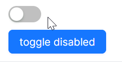

# 快速入门

### 基础配置条件

* Nuget安装Avalonia
* Nuget安装AtomUI

### 基础用法


```xaml
<atom:ToggleSwitch />
```

### 大小尺寸

通过 `SizeType` 属性设定组件大小，一共提供了三种尺寸：Large、Middle、Small。


```xaml
<StackPanel HorizontalAlignment="Left" Spacing="10" Orientation="Vertical">
    <atom:ToggleSwitch />
    <atom:ToggleSwitch SizeType="Small" />
</StackPanel>
```

### 禁用

下面示例中，通过一个 `atom:Button` 组件控制 `atom:ToggleSwitch` 的禁用/启用状态。本质上是通过控制 `IsEnabled` 属性，详情参考code-behind文件。



axaml文件：
```xaml
<StackPanel HorizontalAlignment="Left" Spacing="10" Orientation="Vertical">
    <atom:ToggleSwitch x:Name="ToggleDisabledSwitch" />
    <atom:Button ButtonType="Primary"
                 Command="{Binding $parent[showCase:ToggleSwitchShowCase].ToggleSwitchCommand}"
                 CommandParameter="{Binding ElementName=ToggleDisabledSwitch}"
                 >
        toggle disabled
    </atom:Button>
</StackPanel>
```

code-behind文件：
```csharp
using System.Reactive;
using AtomUIGallery.ShowCases.ViewModels;
using Avalonia.Controls;
using Avalonia.ReactiveUI;
using ReactiveUI;
using Button = AtomUI.Controls.Button;
using ToggleSwitch = AtomUI.Controls.ToggleSwitch;

public partial class ToggleSwitchShowCase : ReactiveUserControl<ToggleSwitchViewModel>
{
    public ReactiveCommand<object, Unit> ToggleSwitchCommand { get; private set; }
    
    public ToggleSwitchShowCase()
    {
        this.WhenActivated(disposables => { });
        ToggleSwitchCommand = ReactiveCommand.Create<object, Unit>(o =>
        {
            ToggleDisabledStatus(o);
            return Unit.Default;
        });
        InitializeComponent();
    }
    
    public static void ToggleDisabledStatus(object arg)
    {
        var switchBtn = (arg as ToggleSwitch)!;
        switchBtn.IsEnabled = !switchBtn.IsEnabled;
    }
    
    public static void ToggleLoadingStatus(object arg)
    {
        var btn                 = (arg as Button)!;
        var stackPanel          = btn.Parent as StackPanel;
        var toggleSwitchDefault = stackPanel?.Children[0] as ToggleSwitch;
        var toggleSwitchSmall   = stackPanel?.Children[1] as ToggleSwitch;
        if (toggleSwitchDefault is not null)
        {
            toggleSwitchDefault.IsLoading = !toggleSwitchDefault.IsLoading;
        }

        if (toggleSwitchSmall is not null)
        {
            toggleSwitchSmall.IsLoading = !toggleSwitchSmall.IsLoading;
        }
    }
}
```
