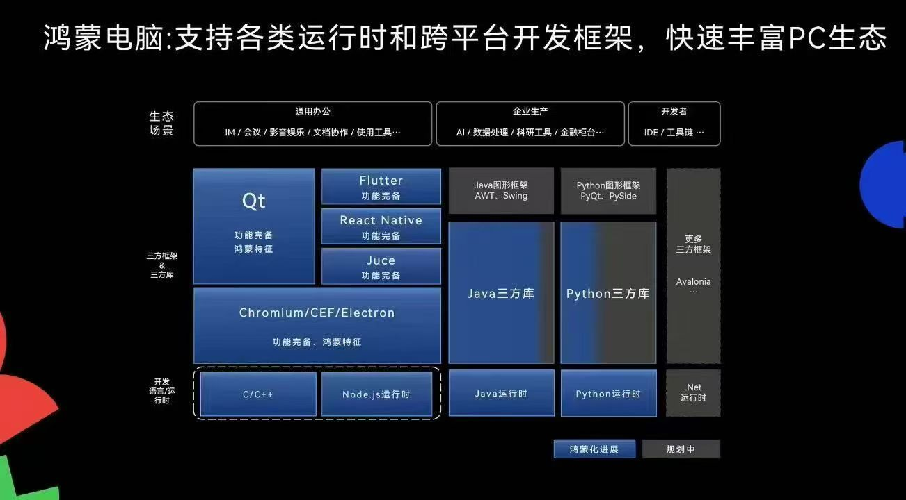

# 支持的平台

Avalonia 框架支持非常多的平台，如列表所示：

| 平台          | 是否支持 |
|-------------|------|
| Windows     | 支持   |
| macOS       | 支持   |
| Linux       | 支持   |
| iOS         | 支持   |
| Android     | 支持   |
| WebAssembly | 支持   |

但是 AtomUI 主要定位为跨平台桌面软件控件库，所以我们优先支持桌面端平台，目前我们支持以下平台

| 平台          | 是否支持 |
|-------------|------|
| Windows     | 支持   |
| macOS       | 支持   |
| Linux       | 初步支持 |
| iOS         | 不支持  |
| Android     | 不支持  |
| WebAssembly | 计划支持 |

## Windows
- Windows 10
- Windows 11

AtomUI 对 Windows 的支持最低版本为 Windows 10，再老的版本可能能运行，但是我们不做任何保证。

## macOS

- macOS 11 (Big Sur)
- macOS 12 (Monterey)
- macOS 13 (Ventura)
- macOS 14 (Sonoma)
- macOS 15 (Sequoia)

AtomUI 对 macOS 的支持最低版本为 macOS 11 (Big Sur)，再老的版本可能能运行，但是我们不做任何保证。

## Linux

- Ubuntu 24.04

目前我们初步支持 Ubuntu 系统，控件仅仅针对 Ubuntu 24.04 调优，后续会迭代支持更多的发行版。

## 鸿蒙 PC

等待 Avalonia 和 .NET 登陆鸿蒙 PC 平台，一旦完成适配，AtomUI 会第一时间跟进，2025 HDC 鸿蒙官方说会支持 .NET 平台，正在适配中。

