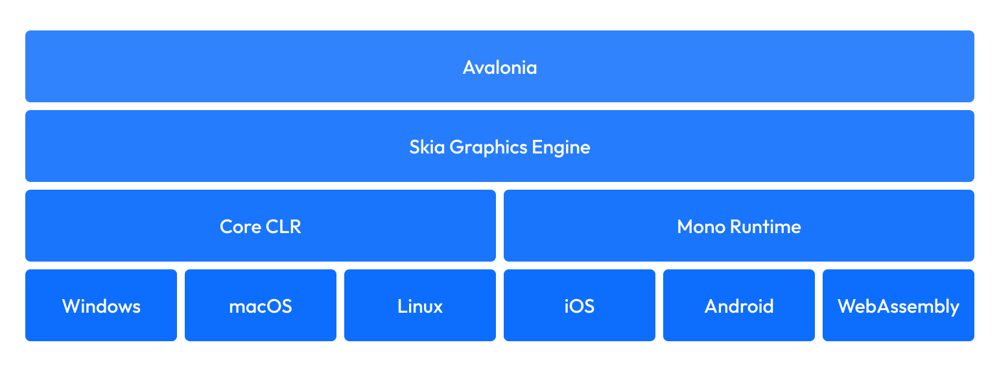

**Avalonia** 是一个开源的、跨平台的 UI 框架，它使开发者能够使用 .NET 为 Windows、macOS、Linux、iOS、Android 和 WebAssembly 创建应用程序。

它使用自己的渲染引擎绘制 UI 控件，确保所有支持平台上的**一致外观和行为**。开发者可以共享 UI 代码，无论目标平台如何都能保持统一体验。

#### Avalonia 适合谁？

适合希望实现以下目标的开发者：
- 使用 **XAML 和 C#** 编写跨平台应用（单一共享代码库）
- 在多个平台间共享 **UI/布局/设计**
- 跨平台共享**代码/测试/业务逻辑**

#### Avalonia 如何工作？

Avalonia 通过一种不同于传统跨平台框架的独特方法统一了桌面、移动和 Web 平台。Avalonia 并未封装原生 UI 控件，而是实现了自己的跨平台渲染引擎，确保所有支持平台上像素级的一致性。

#### 架构概述

构建在 **.NET Standard 2.0** 上，包含以下关键层：

##### 核心平台无关层

Avalonia 的大部分功能都位于一个与平台无关的核心层中，该层负责处理：
- UI 控件与布局
- 视觉树管理
- 样式系统
- 数据绑定
- 输入处理
- 动画框架
> 此核心层完全独立于平台，这意味着无论操作系统或设备如何，其行为都相同。

##### 渲染引擎

与依赖原生 UI 控件的框架不同，Avalonia 使用基于 Skia 或 Direct2D 的自有渲染引擎。这意味着：
- 应用程序跨平台的外观和行为完全相同
- 自定义控件和视觉效果只需实现一次，即可在任何地方使用
- 该框架不受特定平台 UI 功能的限制

##### 平台集成层
Avalonia 只需极少的平台专用代码即可与每个支持的平台集成。此层负责处理以下任务：
- 窗口管理
- 输入事件
- 剪贴板操作
- 原生对话框
- 硬件加速
- 平台特性集成

##### 运行时环境
Avalonia 应用程序运行在 .NET 运行时上，无论是 .NET Core 还是 Mono。

##### 与原生方法的比较
虽然 .NET MAUI 等框架对原生 UI 控件进行了抽象，但 Avalonia 采用了不同的方法：

#### 运行时环境
支持 **.NET Core/Mono** 运行时

#### 与原生框架对比

| 特性                | Avalonia                     | 传统框架(如MAUI)       |
|---------------------|-----------------------------|-----------------------|
| 渲染方式            | 自研渲染引擎                | 封装原生控件          |
| 一致性              | 像素级完美                  | 平台差异明显          |
| UI控制权            | 完全自主                    | 受限于原生能力        |
| 维护成本            | 较低                        | 较高                  |

#### 这种架构差异带来了诸多优势：

- 跨平台行为一致
- 像素级完美渲染
- 完全控制 UI 堆栈
- 简化平台支持
- 降低维护开销
- 在资源受限的设备上实现更佳性能

#### 与原生平台集成
Avalonia 虽然使用自带的渲染引擎，但仍能与原生平台无缝集成：

- Windows：支持 Win32 API 和现代 Windows 功能
- Linux：兼容 X11、Wayland 和帧缓冲渲染
- macOS：集成 Cocoa 和平台服务
- 移动：提供原生生命周期管理和平台集成
- Web：通过 WebAssembly 运行，并实现与浏览器的全面集成

#### 平台支持要求
Avalonia 的核心功能仅需两项基本功能即可支持新平台：

1. 在屏幕上绘制像素的能力
2. 接收输入事件的能力
正是这些最低要求使得 Avalonia 能够支持如此广泛的平台，从桌面操作系统到嵌入式设备，甚至像 VNC 服务器这样不常见的平台。

这种架构使 Avalonia 能够兑现其 “一个代码库，无限可能” 的承诺，同时在最重要的方面保持高性能和原生平台集成。