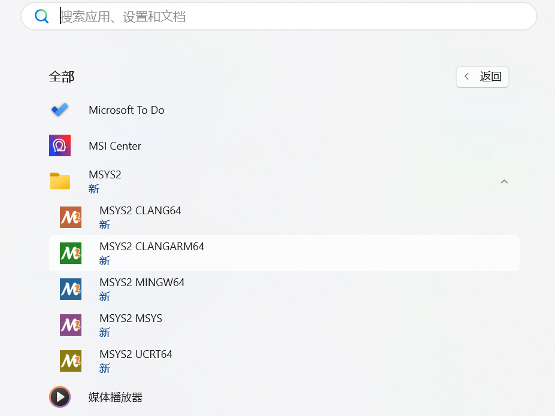
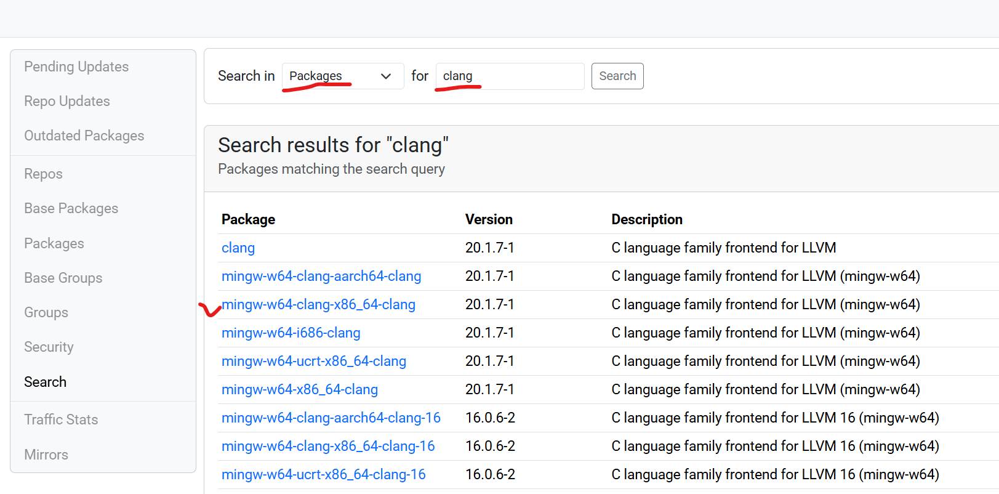
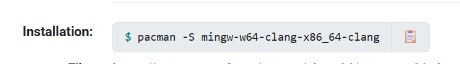
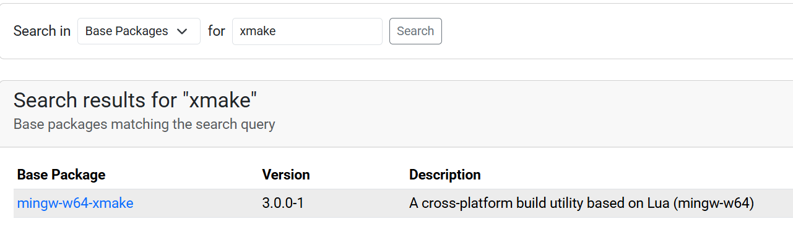

# 开发 AtomUI

如果你有兴趣一同参与AtomUI的开发与推进，需要在你的设备上搭建一套基础环境，下文将具体说明Windows/Linux平台上需要的基础配置。

## 前置准备

AtomUI 支持 Visual Studio、Rider 和 Visual Studio Code。但是如果您是进行跨平台软件的研发，推荐使用 Rider 和 Visual Studio
Code。

### .NET 版本

AtomUI 目前将最低的版本提升到 .NET 8，目前滚动的版本支持为 .NET 8 和 .NET 9，请确认您机器上的 .NET SDK 版本信息。Windows/Mac/Linux均可以通过dotnet --version命令来确认.NET版本。

### AtomUI 与 Avalonia 版本说明

目前 AtomUI 正在属于快速开发迭代阶段，所以每次小版本发布我们大概率会锚定 Avalonia 已经发布的最新的版本。目前 Avalonia
也没有发布长期支持版，所以这种策略是可以接受的。
> 比如 AtomUI 0.0.6-build.1 就锚定了 Avalonia 11.3.2 版本

> [!IMPORTANT]
> 因为 AtomUI 是基于 Avalonia 的深度定制，所以 AtomUI 跟 Avalonia 版本是一个强绑定，您在开发的时候需要主要，这样强绑定的好处可以用
> Avalonia 的内部接口和类，不足之处就是 AtomUI 无法同时多个版本，会导致使用 AtomUI 做开发的项目也会形成对 Avalonia
> 特定版本的绑定。
>
> 但是这个情况其实影响不大，因为 Avalonia 编成接口还是比较稳定，不同版本间只需要重新编译即可，一般不会涉及接口的调整。

## Windows系统

优先推荐Windows 11，如果是Windows 10理论上也没有任何问题。

1、安装最新版PowerShell：打开链接 https://aka.ms/powershell-release?tag=stable ，找到相应的msi安装包，下载安装即可

2、安装MSYS2：打开链接 https://www.msys2.org/ ，下载安装。小提示：MSYS2安装过程中可能下载基础软件的流程，Installing读条时间会稍微长一些，请耐心等待即可。
安装完毕后，在Windows的开始菜单中可以看到很多不同版本的MSYS2，我们只需要留意其中的MSYS2 CLANG64版本即可

3、安装clang：打开链接 https://packages.msys2.org/search ，首先在Search in的下拉菜单中选择“Packages”，其次在搜索框中输入clang，搜索即可。结果如下图：

注意在搜索结果中，一定要选对平台。对于我个人而言，选择图中x86 64位版本即可，点击进入详情页面，找到下图：

将Installation中的pacman安装命令复制一下，打开第3步中的MSYS2 CLANG64终端，粘贴进去后回车执行安装即可。

4、安装xmake：首先在Search in的下拉菜单中选择“Base Packages”，其次在搜索框中输入xmake，搜索即可。结果如下图：

点击进去详情页后，找到mingw-w64-clang-x86_64-xmake 3.0以及3.0以上的版本（即与clang对应的版本）后点击进入详情页，和第3步一样，将Installation中的
pacman安装命令复制到MSYS2 CLANG64终端后，回车执行安装即可。

5、配置系统环境变量：找到Windows系统配置环境变量的管理窗口，找到Path环境变量（至于是用户级Path还是系统级Path，可自行选择），双击
修改Path系统变量。在打开的新窗口中找到第2步中MSYS2的安装目录，再进一步找到clang64目录，再进一步选择bin目录，点击确定后添加到Path
环境变量中。

6、fork && clone项目：打开链接 https://github.com/chinware/AtomUI.ControlGallery ，执行fork操作，将fork后的项目clone到本地；打开链接 https://github.com/chinware/AtomUI ，执行fork操作，将fork后的项目clone到本地。
打开AtomUI.ControlGallery项目所在的目录，找到.gitmodules文件并打开，将其中的url后的值修改为“AtomUI的fork git地址”（就是将AtomUI fork操作后的git地址）。

在终端窗口中打开AtomUI.ControlGallery项目所在的目录，执行git submodule update --init --recursive命令，将AtomUI.ControlGallery的子模块AtomUI从github上拉到本地。关于git的submodule知识，自行搜索学习。

7、运行与开发：使用Rider或Visual Studio等IDE打开AtomUI.ControlGallery项目，可以尝试Run运行查看AtomUI.ControllGalley的最终效果；打开packages/AtomUI目录，可以对AtomUI项目源码进行修改，修改后可以再次Run运行AtomUI.ControlGallery
项目查看修改

## Linux系统