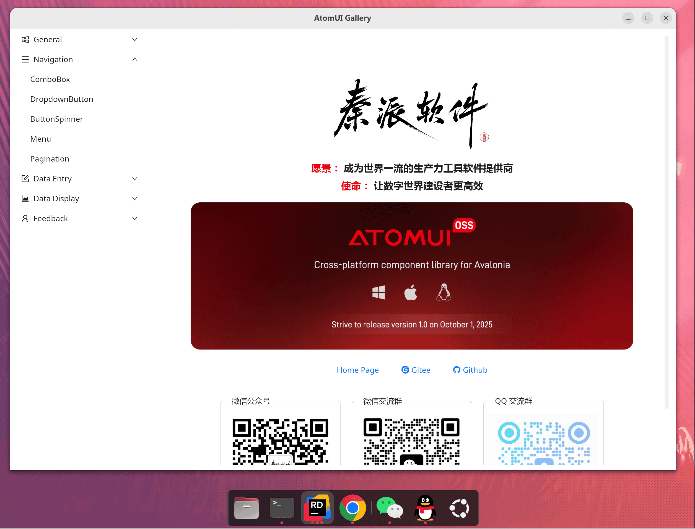
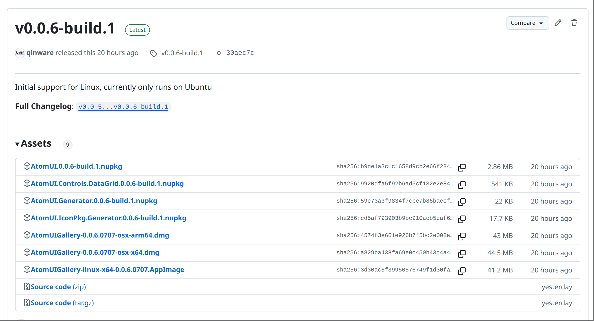

# AtomUI Gallery 控件库程序

为了大家快速体验 AtomUI OSS 里面的控件，我们在发布 AtomUI OSS 新版本的时候会一起发布一个对应版本的 AtomUI Gallery 程序。目前 AtomUI Gallery 支持在 Windows、macOS 和 Linux (Ubuntu) 上进行体验。



## 下载体验包

AtomUI 每次版本发布都会在 Github 和 Gitee 上创建版本发布，大家自行去下载即可

> [Gitee releases 下载链接](https://gitee.com/chinware/atomui/releases)
> 
> [Github release 下载链接](https://github.com/chinware/AtomUI/releases)



# Ubuntu 系统体验

AtomUI Gallery 在 Ubuntu 发行版上的体验包采用了 AppImage， 这个包格式作为体验程序非常合适。

## AppImage 介绍
AppImage 是一种跨平台的软件打包格式，旨在简化 Linux 上的应用程序分发和运行。其主要优点包括： 

### 无需安装，开箱即用
AppImage 将应用及其依赖打包为单个可执行文件，用户无需安装或管理员权限，双击即可运行，避免污染系统目录。

### 跨发行版兼容
基于通用运行时（如 Glibc），一个 AppImage 可在大多数 Linux 发行版（Ubuntu、Fedora、Arch 等）上运行，解决依赖冲突问题。

### 便携性与隔离性
应用数据通常存储在用户目录中，删除 AppImage 文件即可“卸载”，不留残留。同时，通过容器化技术（如 Firejail）实现部分隔离，增强安全性。

### 简化开发和分发
开发者只需打包一次，无需为不同发行版构建多个版本，降低维护成本。用户也无需添加 PPA 或编译源码。

在 Ubuntu 24.04 下体验需要您再安装一个依赖包

```bash
sudo apt update
sudo apt install fuse libfuse2
```

安装完成之后就可以直接在终端输入命令运行 AtomUI Gallery 程序了，我们这里以 AtomUIGallery-linux-x64-0.0.6.0707.AppImage 为例，不同的版本请根据情况进行调整

```bash
./AtomUIGallery-linux-x64-0.0.6.0707.AppImage
```

