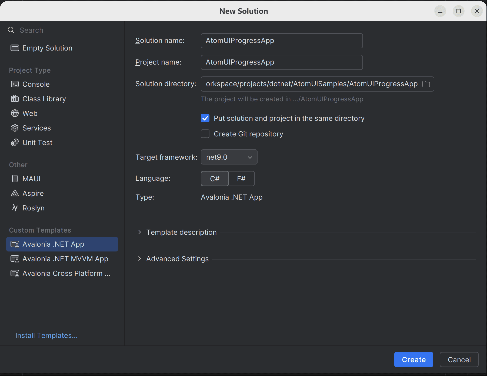
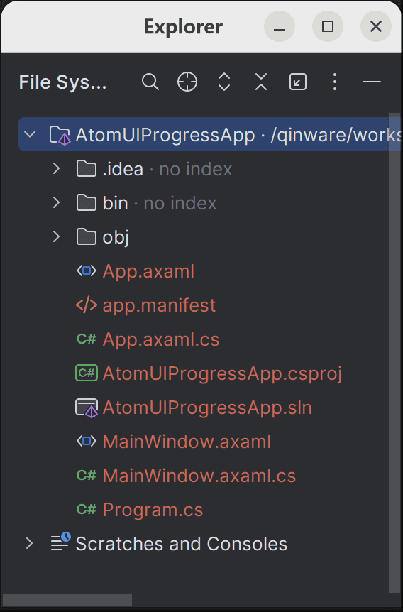
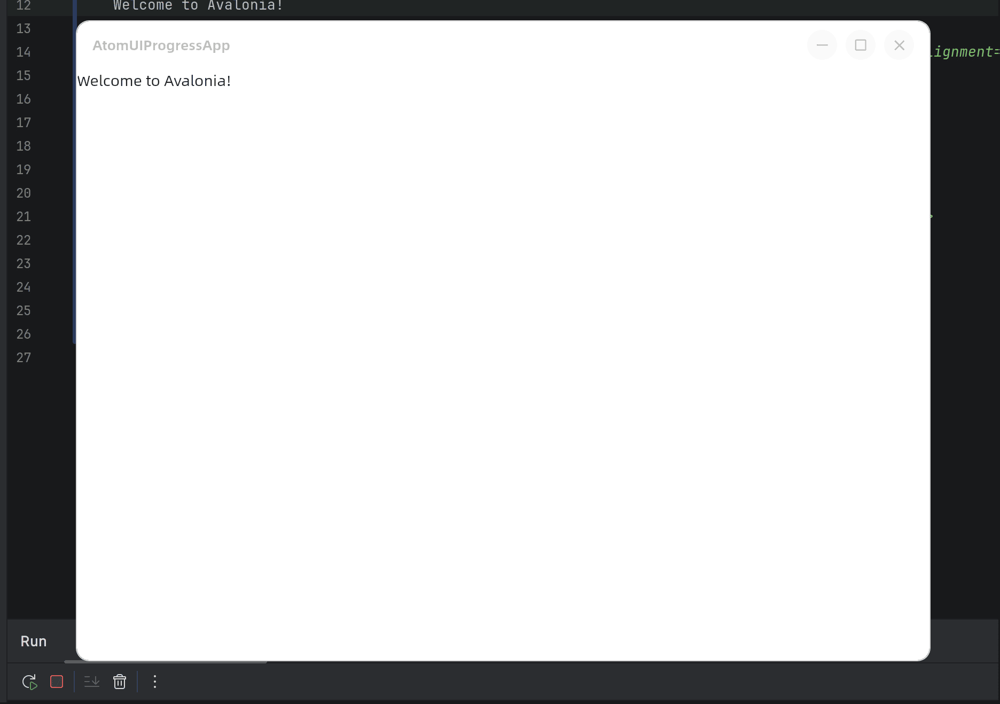

# 创建您的第一个 AtomUI 项目

> [!NOTE]
> 本教程的源码可以在我们示例库找到 [Samples/AtomUIProgressApp](https://github.com/chinware/AtomUI.Samples/tree/develop/AtomUIProgressApp)

1. 在 Rider 启动屏幕上，选择“新建解决方案”以打开“新建解决方案向导”。如果您已安装 Avalonia 模板，则会看到三个选项。

- Avalonia .NET 应用：适用于使用代码隐藏而非 MVVM 的桌面应用（Windows、macOS 和 Linux）的模板。
- Avalonia .NET MVVM 应用：适用于使用 MVVM（RxUI 默认使用）的桌面应用（Windows、macOS 和 Linux）的模板。
- Avalonia 跨平台应用程序：适用于所有受支持平台（Windows、macOS、Linux、iOS、Android 和 WASM）的模板。此模板需要额外的工作负载。

2. 在侧边栏中，向下滚动并选择 “Avalonia .NET App 应用”

3. 在解决方案名称字段中输入 `AtomUIProgressApp`
4. 点击 Create，创建项目

该模板将创建一个新的解决方案和项目，文件夹结构如下图：

点击运行，rider 会进行编译，成功之后您就能看到应用的默认窗体了

